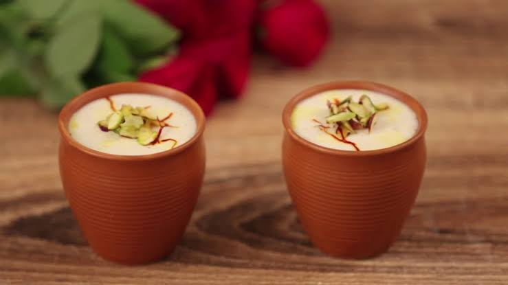

# Mishti Doi

*Bengali caramelised sweet yogurt: milk reduced and stirred with caramelised jaggery, set with a spoon of live yogurt overnight in a clay pot until thick, tangy and rich.*

**Serves:** 6

**Prep Time:** 20 minutes

**Cook Time:** 40 minutes (plus 8 to 12 hours setting)

## Overview
Mishti doi is the Bengali signature dessert: not a yogurt with sugar stirred in, but a properly engineered set sweet curd in which the milk is reduced, the sugar is caramelised in the pot until it goes nutty-brown, and the milk is set with a small spoon of mother yogurt then left undisturbed for half a day in a warm place. The final texture is much firmer than ordinary yogurt; you should be able to invert the bowl without the doi sliding out. The flavour reads tangy and intensely milky, with a deep caramel undertone from the burnt sugar. Traditionally set in unglazed clay pots (the matka or bhaad) which wick moisture out and concentrate the doi further. Found in every Bengali sweet shop in Dhaka and Kolkata alike.

## Ingredients

- 1.5 litres full-fat milk
- 150 g jaggery (gur), grated (or 120 g brown sugar)
- 3 tbsp plain live yogurt (the starter; must be active culture, room-temperature)
- Optional: 50 ml double cream (for an extra rich version)

## Method

### Stage 1 - Reduce the milk
1. Pour the milk into a heavy-based wide pot.
2. Bring to a simmer over medium heat, stirring often so the bottom doesn't catch.
3. Reduce by a third (until you have about 1 litre); this takes 25 to 30 minutes of gentle simmer.
4. Stir down any skin that forms on top.

### Stage 2 - Caramelise the jaggery
1. In a small dry pan, melt 100 g of the jaggery over low heat until it turns liquid and goes a shade darker; do not let it burn.
2. Pour the liquid jaggery in a thin stream into the hot reducing milk, stirring constantly.
3. Stir in the remaining 50 g jaggery uncooked.
4. Cook another 5 minutes until fully dissolved and the milk turns a uniform light caramel colour.
5. If using double cream, stir it in now.
6. Take the pot off the heat; let cool until just warm to the inside of your wrist (about 40 to 42 degrees C, no hotter).

### Stage 3 - Set the doi
1. Whisk the starter yogurt in a small bowl until smooth.
2. Add 2 ladlefuls of the warm sweetened milk to the yogurt; whisk to combine.
3. Pour this mixture back into the milk pot; stir gently to distribute.
4. Pour the lot into 6 small clay pots or ramekins.
5. Cover with a clean cloth; place in a warm spot (an oven with the light on, or a closed cupboard with a hot water bottle nearby).
6. Leave undisturbed for 8 to 12 hours, until the doi sets firm.
7. Refrigerate at least 4 hours before serving (the chill firms it further).

## Notes
- **Live starter culture only.** Set yogurt from a sealed tub at the shop, fresh, with no flavourings. Long-life or sweetened yogurt will not set.
- **Temperature check is critical.** Too hot kills the culture, too cool and the doi will not set. The wrist test (just warm, not hot) is the home check.
- **Clay pots wick moisture.** Real mishti doi in Bengal is set in unglazed clay matka pots which absorb the whey; ramekins work but the doi will be slightly softer.
- **Reduce the milk properly.** Skipping the 30-minute reduction gives a thin, ordinary yogurt. The reduction is what gives mishti doi its trademark thickness.
- **Jaggery, not just sugar.** Date palm jaggery (nolen gur) gives the most authentic flavour; cane jaggery is the substitute; brown sugar is the last resort.

## Variations
- **Nolen gur mishti doi:** use date palm jaggery (winter-only specialty); the flavour is smokier and more complex.
- **With saffron:** bloom a pinch of saffron in 2 tbsp warm milk; stir into Stage 2 before the culture goes in.
- **With cardamom:** crush 4 green cardamom pods; infuse in the milk during Stage 1.
- **With pistachios:** scatter chopped pistachios on top once set.
- **Mango mishti doi:** stir 100 g sweet mango pulp into the warm milk before culturing for a summer variant.

## Serving
Eat chilled, in the small clay pot or ramekin · a dust of cardamom on top · a teaspoon of crushed pistachios

## Storage
- Refrigerate up to 4 days; firmness increases slightly over time
- Does not freeze (the texture breaks down on thaw)
- The whey may pool slightly after day 2; this is normal and harmless, pour it off if it bothers you
