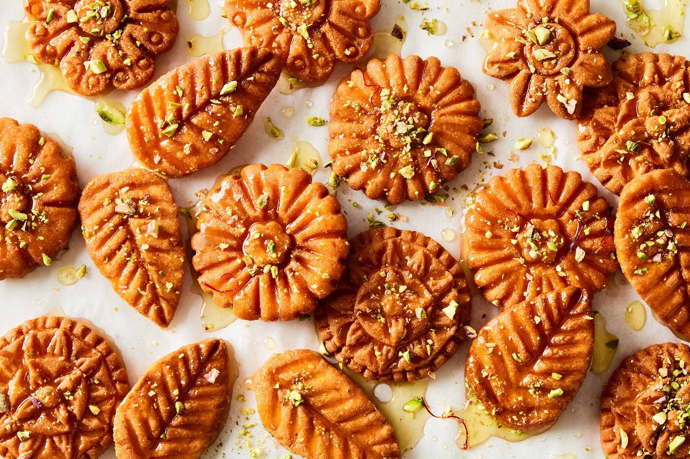

# Pitha (Puli Pitha)

*Bangladeshi rice flour dumplings: thin rice flour shells folded around a sweet coconut and date palm jaggery filling, then simmered in cardamom-spiced milk or fried until crisp.*

**Serves:** 6 (makes about 18 dumplings)

**Prep Time:** 1 hour

**Cook Time:** 30 minutes

## Overview
Pitha is the whole family of Bengali rice flour cakes and dumplings, cooked across the winter months and especially around the harvest festival of Nabanno. There are dozens (steamed bhapa pitha, fried teler pitha, layered chitoi pitha) but the version that travels best is the puli pitha: half-moon dumplings of rice flour dough stuffed with a sweet filling of freshly grated coconut and date palm jaggery, fragrant with cardamom. Once shaped, they can be simmered in milk (dudh puli pitha) for a rich pudding-like dessert or shallow-fried in ghee for a crisp street snack. The dough is fiddly and the shape is fingertip-formed; a Bangladeshi grandmother can make these by the hundred in an afternoon while talking to anyone who walks past the kitchen.

## Ingredients

### Filling
- 200 g freshly grated coconut (or frozen grated, thawed)
- 150 g date palm jaggery (nolen gur), grated (or regular jaggery, or 120 g brown sugar)
- 4 green cardamom pods, seeds crushed
- 2 tbsp milk

### Dough
- 250 g rice flour
- 350 ml just-boiled water
- ½ tsp salt
- 1 tbsp ghee, for greasing

### To simmer (for dudh puli)
- 1 litre full-fat milk
- 100 g sugar
- 4 green cardamom pods, lightly bruised
- 2 bay leaves
- A pinch of saffron threads

## Method

### Stage 1 - Make the filling
1. In a heavy pan, combine the coconut, jaggery and cardamom seeds with the 2 tbsp milk.
2. Cook over medium heat, stirring constantly, for 6 to 8 minutes until the jaggery melts, the coconut absorbs the liquid, and the mixture holds its shape when you push it into a small mound with a spoon.
3. Tip onto a plate; cool completely.

### Stage 2 - Make the dough
1. Bring the 350 ml water to a hard boil with the salt.
2. Off the heat, tip in the rice flour all at once and stir hard with a wooden spoon.
3. Cover; rest 5 minutes (the rice flour absorbs the water and cooks slightly).
4. Tip onto a board, lightly greased with ghee.
5. Knead while still warm (use the heel of your hand; the dough will be hot but workable). Knead for 5 minutes until smooth and pliable. If it cracks, work in a little extra hot water; if too soft, work in a touch more rice flour.

### Stage 3 - Shape the pithas
1. Divide the dough into 18 even balls (about 25 g each).
2. Keep the rest under a damp cloth as you work.
3. Take a ball; press it flat between your palms or roll it into a disc 7 cm wide.
4. Place 1 tsp of cool filling in the centre.
5. Fold the disc in half over the filling to make a half-moon.
6. Pinch the edges tight; press them into a tidy ridged seam (Bangladeshi cooks crimp this with their thumbnails).
7. Repeat with the rest of the dough.

### Stage 4 - Simmer in milk (for dudh puli)
1. Bring the milk, sugar, cardamom, bay and saffron to a gentle simmer in a wide pan.
2. Slip the puli pithas in carefully in a single layer (work in batches if needed).
3. Simmer very gently for 15 minutes, basting with the milk; the dumplings turn pale and the milk thickens slightly.
4. Off the heat; let sit 15 minutes for the dumplings to absorb the milk and the flavours to settle.
5. Serve warm or chilled.

## Notes
- **Just-boiled water for the dough.** Cold water will not cook the rice flour and the dough cracks; boiling water is essential.
- **Knead while warm.** The dough firms as it cools; you have a 5-minute window to make it smooth.
- **Seal tightly.** Any gap and the filling leaks into the milk during simmer.
- **Nolen gur is the proper jaggery.** Date palm jaggery (a winter specialty in Bengal) gives the smoky depth that ordinary cane jaggery does not.
- **Coconut should be moist.** Dried desiccated coconut will not work; use fresh or frozen freshly grated.

## Variations
- **Teler pitha (fried):** instead of simmering, shallow-fry the formed pithas in 1 cm of ghee for 2 minutes per side until golden and crisp; serve dusted with extra jaggery.
- **Bhapa pitha (steamed):** make the dough into small balls, hide a chunk of jaggery and coconut inside, steam over a perforated lid for 8 minutes.
- **Chitoi pitha:** instead of dumplings, make thick rice flour pancakes in small individual moulds.
- **With khoya:** stir 50 g khoya (reduced milk solids) into the filling for richness.
- **Savoury filling:** swap the filling for spiced minced lamb and serve with curry; the savoury pitha cousin.

## Serving
- Warm in a small bowl, with extra warm cardamom milk poured over · a few saffron threads on top · a teaspoon of toasted pistachios

## Storage
- Dudh puli pithas keep 2 days refrigerated; the dumplings firm up but reheat fine
- Fried pithas eat best the day they're made; they soften by day 2
- Do not freeze; the dough turns chalky on thaw
- Reheat dudh puli gently with extra warm milk; do not boil
