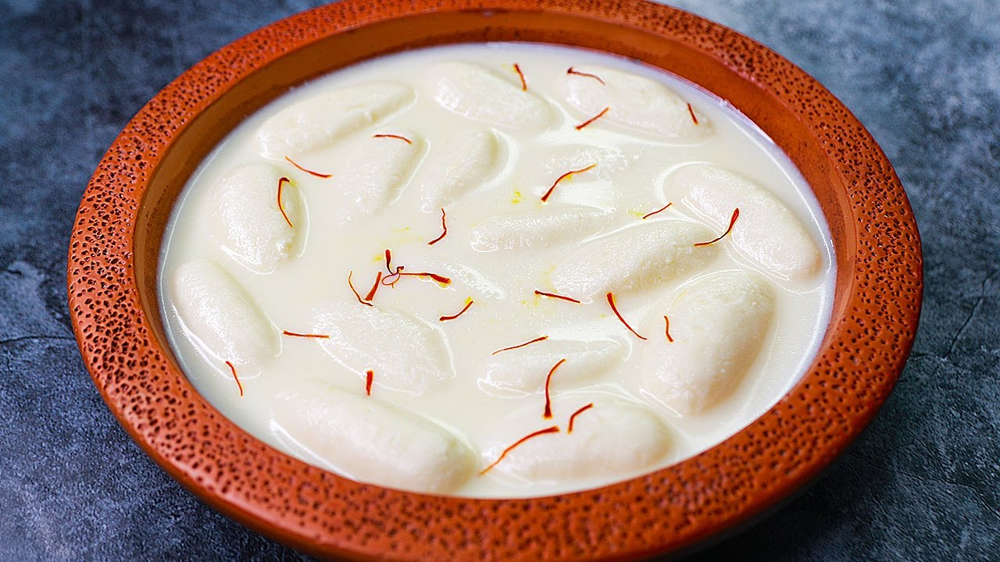

# Rasmalai

*Bengali cottage cheese dumplings: soft chenna patties simmered in sugar syrup, then steeped in saffron-cardamom-pistachio thickened milk, served cold from the fridge.*

**Serves:** 6 (makes about 12 patties)

**Prep Time:** 30 minutes

**Cook Time:** 50 minutes (plus 4 hours chilling)

## Overview
Rasmalai is the second of the great Bengali milk-sweet duo (alongside rasgulla), and arguably the more elegant of the two: chenna (fresh-pressed milk curds, kneaded into a dough) is shaped into flat patties, simmered in light sugar syrup until they puff up and triple in size, then transferred to a bath of sweetened reduced milk infused with saffron, green cardamom and pistachio. The patties soak up the perfumed milk, the milk in turn picks up sweetness from the syrup, and the whole thing is served cold. Bengali sweet-makers (the moira) in Dhaka have made rasmalai since the 19th century; the dish is found across Bangladesh, West Bengal and now everywhere South Asian people gather. Comilla in eastern Bangladesh is particularly famous for its rasmalai shops.

## Ingredients

### Chenna
- 2 litres full-fat milk
- 4 tbsp white vinegar or lemon juice (mixed with 4 tbsp water)
- Plenty of ice cubes (1 small bowl)

### Sugar syrup
- 200 g caster sugar
- 1 litre water
- 4 green cardamom pods, lightly crushed

### Rabri (thickened milk)
- 1 litre full-fat milk
- 100 g caster sugar
- A generous pinch of saffron threads
- 6 green cardamom pods, lightly crushed
- 30 g pistachios, chopped
- 30 g almonds, blanched and slivered
- 1 tsp rosewater or kewra water (optional)

## Method

### Stage 1 - Make the chenna
1. Bring the 2 litres milk to a gentle boil in a heavy-based pan, stirring to prevent the bottom catching.
2. As soon as it boils, take off the heat and drop in 4 ice cubes (this drops the temperature; the chenna comes out softer).
3. Add the diluted vinegar a tablespoon at a time, stirring gently, until the milk splits into curds and a clear yellow-green whey.
4. Stop adding acid the moment the split is complete.
5. Line a colander with muslin; pour the curds through; rinse the chenna under cold water for 30 seconds (this removes the vinegar taste).
6. Gather the muslin corners; squeeze gently to remove excess water; hang for 15 minutes (do not press hard or the chenna goes dry).

### Stage 2 - Knead the chenna
1. Tip the drained chenna onto a clean board.
2. Knead with the heel of your hand for 6 to 8 minutes until it goes smooth, the fat releases, and the dough holds together when you press it.
3. The chenna is ready when you can roll a small ball that does not crack.

### Stage 3 - Shape the patties
1. Divide the chenna into 12 even balls (about 25 g each).
2. Roll each into a smooth ball; flatten gently between your palms into a thick disc 5 cm wide and 1.5 cm thick.
3. Press the edges smooth so they do not crack during simmering.

### Stage 4 - Simmer in syrup
1. Bring the sugar, water and cardamom to a rolling boil in a wide pot with a tight lid.
2. Slip the patties in carefully; cover immediately.
3. Boil hard for 12 minutes; do not lift the lid (the steam is what makes the patties puff).
4. After 12 minutes, lift the lid; the patties should have doubled in size and float on the syrup.
5. Off the heat; let cool in the syrup for 10 minutes.

### Stage 5 - Make the rabri
1. While the patties simmer, bring the 1 litre milk to a gentle simmer in a wide pan.
2. Reduce by a third over 25 minutes, stirring often; scrape any skin from the sides back into the pot.
3. Stir in the sugar, saffron and cardamom; simmer 3 more minutes.
4. Off the heat, stir in the rosewater if using.
5. Let cool to lukewarm.

### Stage 6 - Combine and chill
1. Gently lift the patties from the syrup; squeeze each one very gently between your palms to remove excess syrup (do not crush).
2. Submerge them in the rabri.
3. Scatter the pistachios and almonds over the top.
4. Refrigerate at least 4 hours, ideally overnight.

## Notes
- **Full-fat milk only.** Skimmed or semi-skimmed milk yields a tight, rubbery chenna; full-fat gives the soft melt-in-the-mouth texture.
- **Do not press the chenna dry.** Soft chenna is the secret to soft rasmalai; the chenna should still be moist when you start kneading.
- **Knead until smooth.** Under-kneaded chenna cracks during simmering; over-kneaded goes dense. The 6-to-8-minute window is the right zone.
- **The lid stays on.** During the 12-minute simmer in syrup, the lid must stay shut or the patties collapse.
- **Squeeze syrup out, soak in milk.** This double-step is what separates rasmalai from rasgulla; otherwise the patties carry too much sweetness.

## Variations
- **Mango rasmalai:** stir 100 g sweet mango pulp into the rabri after Stage 5; a summer favourite.
- **Pistachio paste:** grind 30 g pistachios with 2 tbsp milk; stir into the rabri for a deep green colour and intense pistachio nose.
- **Chocolate rasmalai:** drizzle melted dark chocolate over the chilled patties as a modern twist.
- **Mini rasmalai:** divide the chenna into 24 smaller patties; reduce simmer time to 8 minutes.
- **Rasmalai with cardamom-cream rabri:** stir 100 ml double cream into the rabri at Stage 5 for an extra rich version.

## Serving
Cold from the fridge in a shallow bowl with the rabri spooned over · a scatter of pistachio and almond · a few saffron threads

## Storage
- Refrigerate up to 4 days
- Does not freeze; the chenna texture breaks down on thaw
- Serve very cold; the rabri firms slightly and tastes best chilled
