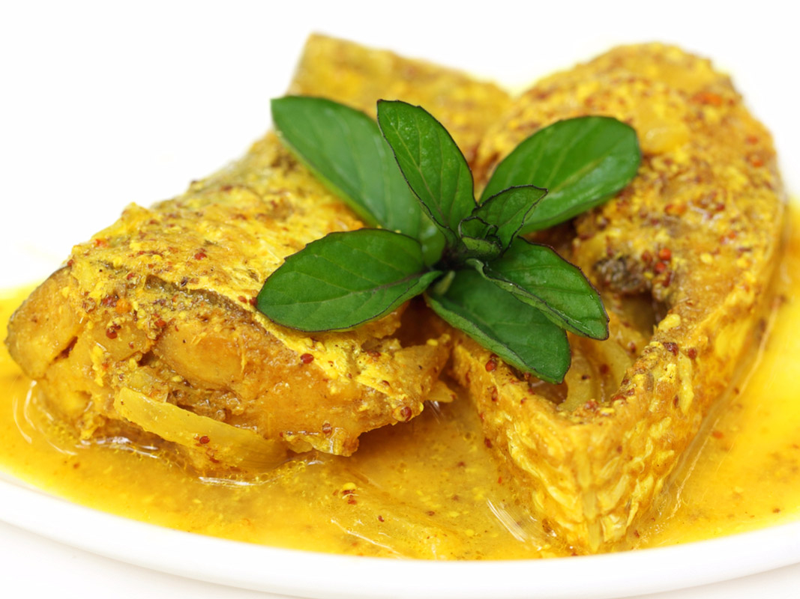

# Hilsa Fish Curry

*Bangladeshi everyday hilsa curry: thick steaks of ilish simmered in a turmeric-stained onion gravy with green chillies and a finishing splash of mustard oil, served straight over plain rice.*

**Serves:** 4

**Prep Time:** 15 minutes

**Cook Time:** 25 minutes

## Overview
Hilsa (ilish) is the national fish of Bangladesh, pulled in shoals from the Padma during the late-monsoon run and treated with the kind of reverence other cuisines reserve for truffles. This is the everyday version of hilsa curry, not the high-celebration shorshe ilish but the weekday onion-and-turmeric gravy that lands on family tables across Dhaka and Chittagong. Thick cross-cut steaks are dusted with turmeric and salt, fried briefly in mustard oil, then simmered in a thin onion-tomato sauce sharpened with slit green chillies. The fish gives up its oils into the gravy as it cooks; the bones perfume it further. Eat over plain steamed rice with the fingers, pulling the flesh from the spine with your thumb.

## Ingredients

- 600 g hilsa steaks (4 thick cross-cut pieces, scaled but bone-in)
- 1 tsp turmeric powder, plus more for dusting
- 1 tsp fine salt, plus more to taste
- 4 tbsp mustard oil
- 2 medium onions, finely sliced
- 2 cm fresh ginger, finely grated
- 3 garlic cloves, finely grated
- 1 medium tomato, finely chopped
- 1 tsp chilli powder (Kashmiri-style for colour, less heat)
- 1 tsp ground cumin
- 4 to 6 green chillies, slit lengthways
- 350 ml warm water
- 1 tbsp mustard oil, raw, to finish
- A small handful of fresh coriander, chopped

## Method

### Stage 1 - Prep the fish
1. Pat the hilsa steaks dry with kitchen paper.
2. Dust both sides with a pinch of turmeric and a pinch of salt; let sit 10 minutes.

### Stage 2 - Fry the fish briefly
1. Heat 3 tablespoons of mustard oil in a wide pan until it smokes lightly, then let it cool for 30 seconds (this kills the raw bite).
2. Slip the hilsa steaks in carefully; fry 90 seconds per side, just to set the surface, not to cook through.
3. Lift the fish out onto a plate; leave the perfumed oil in the pan.

### Stage 3 - Build the gravy
1. Add the remaining tablespoon of mustard oil to the pan; tip in the sliced onions and a pinch of salt.
2. Cook over medium heat for 8 minutes until soft and pale gold.
3. Stir in the ginger and garlic; cook 1 minute.
4. Add the chopped tomato; cook 4 minutes until it breaks down.
5. Stir in the turmeric, chilli powder, cumin and remaining salt; fry 30 seconds.
6. Pour in the warm water; bring to a low simmer.

### Stage 4 - Finish the fish in the gravy
1. Slide the hilsa steaks back into the pan with any resting juices.
2. Tuck the slit green chillies around the fish.
3. Simmer gently for 8 to 10 minutes, spooning gravy over the fish, until just cooked through. Do not stir hard; the steaks break easily.
4. Off the heat, drizzle the raw mustard oil over the top and scatter with coriander.
5. Rest 5 minutes before serving.

## Notes
- **Mustard oil twice.** Cooked mustard oil for frying (its raw pungency softens once heated), raw mustard oil at the finish for the proper Bangladeshi nose-hair sharpness.
- **Bone-in steaks only.** Hilsa is famously bony; cooks pick the flesh off with their fingers. Boneless fillets lose the gravy-perfuming benefit of the bones.
- **Do not overcook.** Hilsa flesh is delicate; 8 to 10 minutes in gentle simmer is plenty. Boiled hilsa goes chalky.
- **If hilsa is not available,** shad is the nearest substitute (close cousin); failing that, mackerel steaks give a similar oily, bone-in eating experience.
- **Salt levels are quiet.** This is a homestyle curry, not a restaurant one; restraint on salt lets the fish lead.

## Variations
- **With aubergine:** add 1 small aubergine (cubed, fried separately) to the gravy in Stage 3 for a beguni-ilish style.
- **With potato:** add 2 small potatoes (peeled, quartered, par-boiled) to the gravy.
- **Sour with kalo jeera:** add 1 tsp nigella seeds (kalo jeera) at the start of Stage 3 with the onions; a common Dhaka touch.
- **With more heat:** double the slit green chillies and add a pinch of black pepper at the finish.
- **Dryer style:** reduce water to 200 ml for a thicker gravy that clings to the fish.

## Serving
- Plain steamed rice (white, fluffy, no flavour additions) · slit green chilli on the side · wedges of lime · a small bowl of dal alongside

## Storage
- Refrigerate up to 24 hours; flavour deepens overnight
- Reheat very gently, covered, with a splash of water; do not microwave hard or the fish dries out
- Does not freeze well; the flesh goes mushy on thaw
