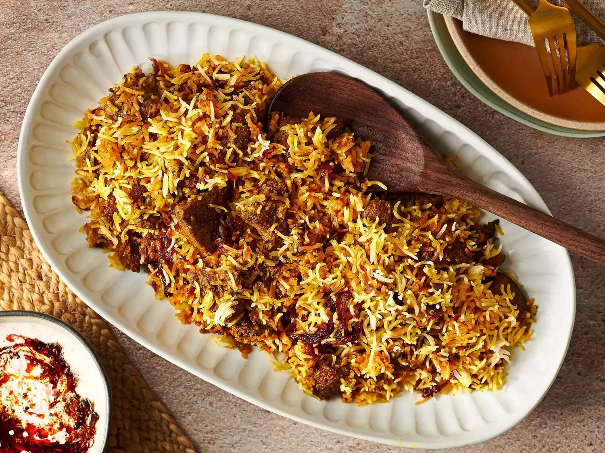

# Kachi Biryani

*Dhaka-style mutton biryani: raw-marinated goat layered with par-cooked basmati and saffron milk, sealed under a dough lid and dum-cooked so meat and rice finish together.*

**Serves:** 8

**Prep Time:** 1 hour (plus 4 hours marination)

**Cook Time:** 2 hours

## Overview
Kacchi biryani (kachi meaning "raw") is the Dhaka wedding dish, a post-Mughal showpiece in which the meat goes into the pot uncooked, marinated in yogurt, ginger, garlic and ground spices, then layered under half-cooked rice with ghee, saffron milk, fried onions and a paste of mint and coriander. The pot is sealed with a strip of dough around the lid, set over a low flame on a flat iron tawa to diffuse the heat, and steamed for 90 minutes. Done right, the goat is fork-tender and the rice is fluffy and stained in patches with saffron and yellow turmeric. Cooks in Old Dhaka have been making this for generations; you will see them slit the dough seal at the table with theatrical care.

## Ingredients

### Mutton marinade
- 1.5 kg mutton (goat shoulder), bone-in, in 5 cm chunks
- 500 g thick yogurt
- 4 cm fresh ginger, paste
- 10 garlic cloves, paste
- 2 tsp salt
- 2 tsp chilli powder
- 1 tbsp coriander powder
- 1 tsp turmeric powder
- 2 tsp biryani garam masala (cinnamon, clove, black and green cardamom, mace ground together)
- 100 ml mustard oil

### Fried onions and aromatics
- 4 large onions, finely sliced
- 200 ml ghee
- 6 small potatoes, peeled and whole
- 100 g cashew nuts
- 50 g raisins

### Rice
- 1 kg basmati rice (long-grain, aged for preference)
- 3 litres water
- 2 tbsp salt
- 4 green cardamoms
- 1 cinnamon stick
- 4 cloves
- 2 bay leaves

### Saffron milk and finish
- A generous pinch of saffron threads
- 100 ml warm milk
- 4 tbsp ghee
- 4 tbsp rosewater or kewra water
- A small bunch of fresh mint, chopped
- A small bunch of fresh coriander, chopped
- 6 green chillies, slit
- Plain flour and water for the dough seal

## Method

### Stage 1 - Marinate the mutton
1. Combine all marinade ingredients in a large bowl; rub thoroughly into the mutton chunks.
2. Cover and refrigerate at least 4 hours, ideally overnight.

### Stage 2 - Crisp the onions, par-cook the potatoes
1. Heat the ghee in a wide pan; fry the sliced onions in batches over medium heat for 12 to 15 minutes until deep brown and crisp. Lift onto kitchen paper.
2. In the same ghee, fry the whole potatoes for 5 minutes until lightly browned all over; lift out. Fry the cashews 1 minute, then the raisins 30 seconds; lift out.
3. Set aside two-thirds of the fried onions for layering; reserve the rest for the marinade boost.
4. Crush the reserved third into the marinated mutton along with 2 tbsp of the ghee.

### Stage 3 - Par-cook the rice
1. Rinse the basmati in cold water until it runs clear; soak 30 minutes; drain.
2. Bring 3 litres water to a rolling boil with the salt, cardamoms, cinnamon, cloves and bay.
3. Tip in the rice; cook 4 to 5 minutes only, until the grains are 60 percent done (still firm in the centre when you press one between your fingers).
4. Drain immediately through a colander; spread on a tray to stop the cooking.

### Stage 4 - Build the saffron milk
1. Bloom the saffron in the warm milk for 5 minutes.

### Stage 5 - Layer the biryani
1. Tip the marinated mutton into the base of a heavy-based wide pot in an even layer. Tuck the par-fried potatoes in among the meat.
2. Scatter half the fried onions, half the mint, half the coriander and 3 of the slit chillies over the meat.
3. Top with all the par-cooked rice in an even layer.
4. Drizzle the remaining ghee over the rice in zigzags.
5. Pour the saffron milk in lines across the top so it stains the rice in patches.
6. Sprinkle the rosewater (or kewra water).
7. Scatter the remaining onions, mint, coriander and chillies, plus the cashews and raisins.

### Stage 6 - Seal and dum
1. Mix plain flour with just enough water to make a stiff dough rope; press it around the rim of the pot.
2. Press the lid on firmly so the dough seals it shut.
3. Set the pot over high heat for 5 minutes to drive the moisture inside up to steam.
4. Place a flat iron tawa or heat diffuser under the pot; reduce heat to the lowest setting.
5. Dum for 90 minutes without lifting the lid.
6. Off the heat, let the pot rest 15 minutes more.

### Stage 7 - Serve
1. Crack the dough seal at the table.
2. Lift the lid and let the steam escape.
3. Scoop down to the base so each portion has rice, mutton and a potato.

## Notes
- **Kacchi versus pakki.** This is the kacchi method (raw meat layered under rice). The pakki method, more common in Hyderabad, pre-cooks the meat. Bangladeshis prize kacchi for the way the meat juices flavour the rice during dum.
- **The seal matters.** Without the dough rope the steam escapes and the rice undercooks; if you do not want to make a dough seal, use a tight-fitting lid plus a folded tea towel under the lid.
- **The heat diffuser.** Dum cannot be done directly on a gas flame for 90 minutes without burning the base. The flat iron tawa beneath the pot is the traditional fix.
- **Aged basmati.** Newer rice (under 1 year) breaks more easily; properly aged basmati holds its grain through the long dum.
- **Mutton not lamb.** Goat is the standard; lamb works but needs only 60 minutes of dum or it overcooks.

## Variations
- **Chicken kachi biryani:** swap goat for bone-in chicken thighs; reduce dum to 45 minutes.
- **Beef kachi biryani:** use beef shoulder; extend dum to 2 hours.
- **Add prunes:** 100 g pitted prunes layered with the meat is a sweet-savoury Old Dhaka touch.
- **More saffron, less colour:** swap the chilli powder for paprika if you want a paler dish.
- **One-pot quick version:** use a pressure cooker for the meat (20 minutes), then layer with rice on the hob; not authentic but cuts hours.

## Serving
Borhani (savoury yogurt drink, the traditional partner) · raita with cucumber and mint · slit green chillies · a small bowl of salad (onion, cucumber, tomato, lime)

## Storage
- Refrigerate up to 3 days; the rice firms up but reheats well
- Freezes 2 months; thaw fully, then steam to revive
- Reheat in a covered pan with 2 tbsp water sprinkled over; warm 10 minutes over low heat
