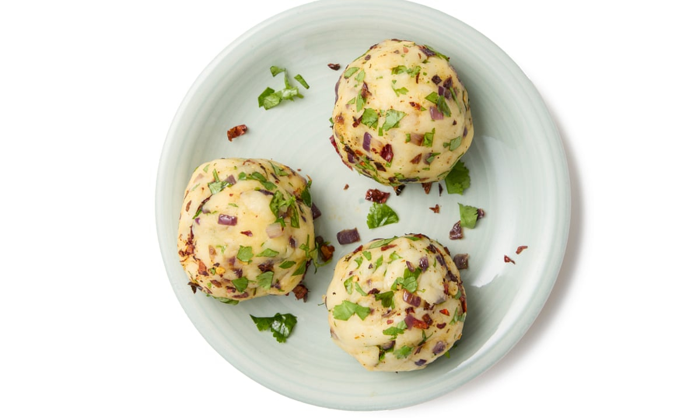

# Aloo Bhorta

*Bangladeshi mashed potato side: boiled potatoes crushed with raw mustard oil, finely sliced onion, slit green chilli and a fistful of coriander, eaten with rice and dal.*

**Serves:** 4

**Prep Time:** 10 minutes

**Cook Time:** 20 minutes

## Overview
Bhortas (or bhartas) are one of the foundational Bangladeshi side categories: anything mashed (potato, aubergine, dal, dried fish, prawn) with mustard oil, raw onion, chilli and salt. Aloo bhorta is the everyday workhorse, sitting on the rice plate at lunchtimes across Bangladesh next to a thin dal and whatever the cook has at hand. The potatoes are boiled in their skins so they don't waterlog, peeled while still warm, then crushed coarsely with the fingertips and combined with finely sliced onion, slit green chilli, raw mustard oil, salt and a handful of coriander. No spice powders, no cooking, no fuss; the heat comes from the chilli and the punch comes from the mustard oil. The texture should be coarse, not smooth.

## Ingredients

- 600 g floury potatoes (Maris Piper, King Edward, russet)
- 1 small red onion, very finely sliced
- 2 green chillies, very finely chopped
- 3 tbsp raw mustard oil
- 1 tsp fine salt, plus more to taste
- A small handful of fresh coriander, chopped
- 1 tbsp fresh lime juice (optional, to brighten)

### Optional additions
- 1 garlic clove, finely grated
- 1 tbsp dried red chilli flakes, dry-roasted

## Method

### Stage 1 - Boil the potatoes
1. Scrub the potatoes; leave the skins on.
2. Put them in a pot with cold salted water; bring to a boil.
3. Simmer 18 to 20 minutes until a knife slides through easily.
4. Drain; let cool just enough to handle.

### Stage 2 - Prep the onion and chilli
1. Slice the onion as thinly as possible; sprinkle with a pinch of salt and squeeze gently with your fingers to take the raw bite out. Rinse in cold water if it reads too sharp; pat dry.
2. Finely chop the green chillies (keep the seeds if you want heat).

### Stage 3 - Mash and dress
1. Peel the warm potatoes; the skins should slip off easily.
2. Drop them into a wide bowl; crush with the back of a fork or with clean fingertips to a coarse, lumpy mash. Do not over-mash; texture is the point.
3. Add the onion, green chilli, mustard oil, salt and coriander.
4. Mix with your fingers (a fork compacts the potato; fingertips keep it fluffy).
5. Taste; add salt or a squeeze of lime if needed.

## Notes
- **Skins on for boiling.** Peeled potatoes absorb water and the bhorta turns gluey; skin-on boiling, then warm peeling, is the right sequence.
- **Mustard oil is raw.** This is one of the few Bengali dishes where the oil is not bloomed or cooked first; the raw sharpness is the signature. Use proper Bengali mustard oil, not American "ground mustard" oil.
- **Crush, do not puree.** The bhorta should have rough lumps; smooth mash is the wrong texture.
- **Onion sliced fine.** Big onion chunks dominate; very thin slices melt into the mash.
- **Salt last.** Mustard oil already brings sharpness; oversalting flattens it.

## Variations
- **With dried red chilli flakes:** dry-roast 1 tbsp dried chilli flakes for 30 seconds, crush coarsely, work into the bhorta in Stage 3 for smoky heat.
- **With fried onion:** fry half the onion crisp in mustard oil; reserve half raw; mix both into the bhorta.
- **With ilish bhorta blend:** flake 100 g cooked hilsa into the potato for a fish-bhorta variant.
- **With dried prawn:** dry-roast and crush 30 g dried prawn; fold through.
- **With nigella seeds:** add 1 tsp dry-roasted kalo jeera for a Dhaka-style twist.

## Serving
A heaped spoonful next to plain rice and a thin dal · slit chilli · lime wedge

## Storage
- Eats best the day it is made
- Refrigerate up to 24 hours; the texture firms and the chilli flavour intensifies overnight
- Do not freeze; the potato turns watery on thaw
