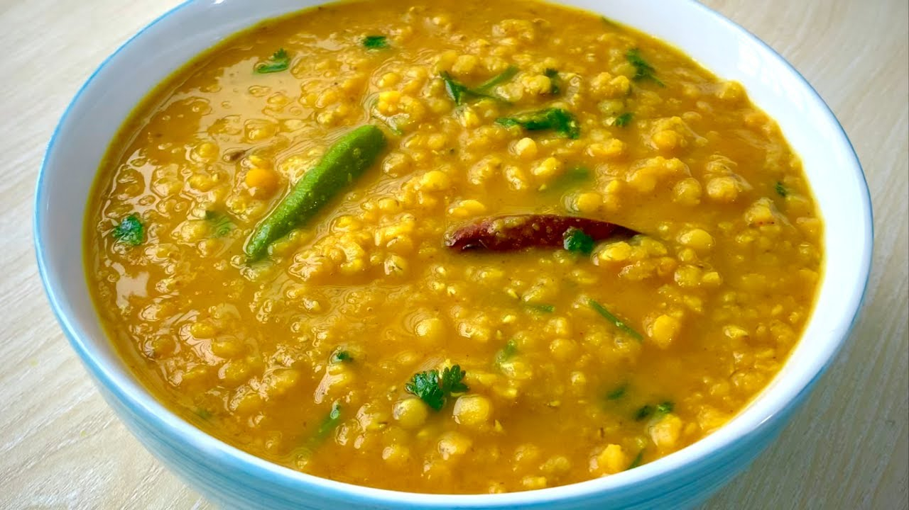

# Dal Bhuna

*Bangladeshi thick fried-style red lentils: masoor dal cooked down hard, then hit with a heavy onion, garlic and panch phoron tempering in mustard oil, eaten with rice or porota.*

**Serves:** 6

**Prep Time:** 10 minutes

**Cook Time:** 45 minutes

## Overview
Dal in Bangladesh exists in two main styles: the thin pourable everyday dal that sits in a small bowl next to rice, and the thick, glossy, intensely flavoured dal bhuna, which is closer to a dry curry than a soup. Red lentils (masoor) are cooked to falling-apart, then drained slightly and bhuna'd: the lentils go into a heavy onion-garlic-ginger tempering in mustard oil with panch phoron (the Bengali five-seed mix), turmeric, chilli and cumin, then stirred until the oil splits out and the texture goes thick and glossy. The result is rich, savoury and almost gravy-like; eaten with porota on a Friday morning, with bhuna khichuri at lunch, or with steamed rice as a side. The tempering is fierce: do not undertemper.

## Ingredients

### The dal base
- 400 g red lentils (masoor dal)
- 1.2 litres water
- 1 tsp turmeric powder
- 1 tsp fine salt
- 2 green chillies, slit

### The tempering (bhuna)
- 5 tbsp mustard oil
- 1 tsp panch phoron (cumin, fennel, fenugreek, nigella, black mustard seed in equal parts)
- 2 medium onions, finely sliced
- 6 garlic cloves, finely chopped
- 2 cm fresh ginger, finely grated
- 2 dried red chillies, broken
- 1 tsp chilli powder
- 1 tsp ground cumin
- 1 tsp ground coriander
- 1 tsp salt, plus more to taste
- 1 medium tomato, finely chopped
- 1 tsp garam masala
- A small handful of fresh coriander, chopped

## Method

### Stage 1 - Cook the lentils
1. Pick over the lentils for stones; rinse until the water runs clear.
2. Tip into a pot with the water, turmeric, salt and slit chillies.
3. Bring to a boil; skim the foam that rises.
4. Reduce to a simmer; cook uncovered for 20 to 25 minutes, stirring occasionally, until the lentils break down into a thick puree.
5. If it looks too thin, simmer 5 minutes more uncovered to reduce. The texture should be like a thick custard.

### Stage 2 - The tempering
1. Heat the mustard oil in a wide heavy pan until it shimmers and starts to smoke; cool 30 seconds.
2. Drop in the panch phoron; sizzle 30 seconds until aromatic.
3. Add the sliced onions and dried chillies; cook over medium heat for 10 minutes until the onions are deep golden brown.
4. Add the garlic and ginger; cook 1 minute.
5. Stir in the chilli powder, cumin, coriander and salt; fry 30 seconds with a splash of water to stop the spices burning.
6. Add the chopped tomato; cook 4 minutes until it breaks down.

### Stage 3 - Bhuna the dal
1. Tip the cooked dal into the tempering pan; stir hard to combine.
2. Cook over medium heat for 8 to 10 minutes, stirring often, until the mixture thickens further, darkens, and the oil starts to pool at the edges.
3. Stir in the garam masala in the last 30 seconds.
4. Off the heat, scatter with chopped coriander.

## Notes
- **The oil split tells you when it's done.** Bhuna dal is finished when you see mustard oil rising to the surface at the edges of the pot; this is the visible test.
- **Panch phoron is required.** This five-seed Bengali blend is the dal bhuna signature; if you don't have it, mix cumin, fennel, fenugreek, nigella and black mustard seeds in equal parts.
- **Thicker than ordinary dal.** Restaurant dal bhuna stands up on a spoon; it's not a pouring dal.
- **Mustard oil for proper Bangladeshi flavour.** Neutral oil works but the result reads flat.
- **Salt twice.** Once in the lentils, once in the tempering; check the final balance at the end.

## Variations
- **With chana dal:** swap half the masoor for chana dal (Bengal gram split); soak chana dal 3 hours first; this is the West Bengali variant.
- **With moong dal:** use 200 g masoor and 200 g moong dal; lighter texture.
- **With dried fish (shutki maach):** dry-roast and crush 30 g shutki; stir into the tempering for the Chittagong version.
- **With curry leaves:** add 12 curry leaves with the panch phoron for a South-Indian crossover.
- **Spicier:** double the dried chillies and add 1 finely chopped green chilli at the end.

## Serving
- Porota, plain rice or bhuna khichuri · slit raw onion with lime · slit green chillies · a wedge of lime

## Storage
- Refrigerate up to 4 days; flavour deepens significantly overnight
- Freezes 3 months in portioned containers
- Reheat with 2 to 3 tbsp water to loosen; warm slowly on the hob, stirring
