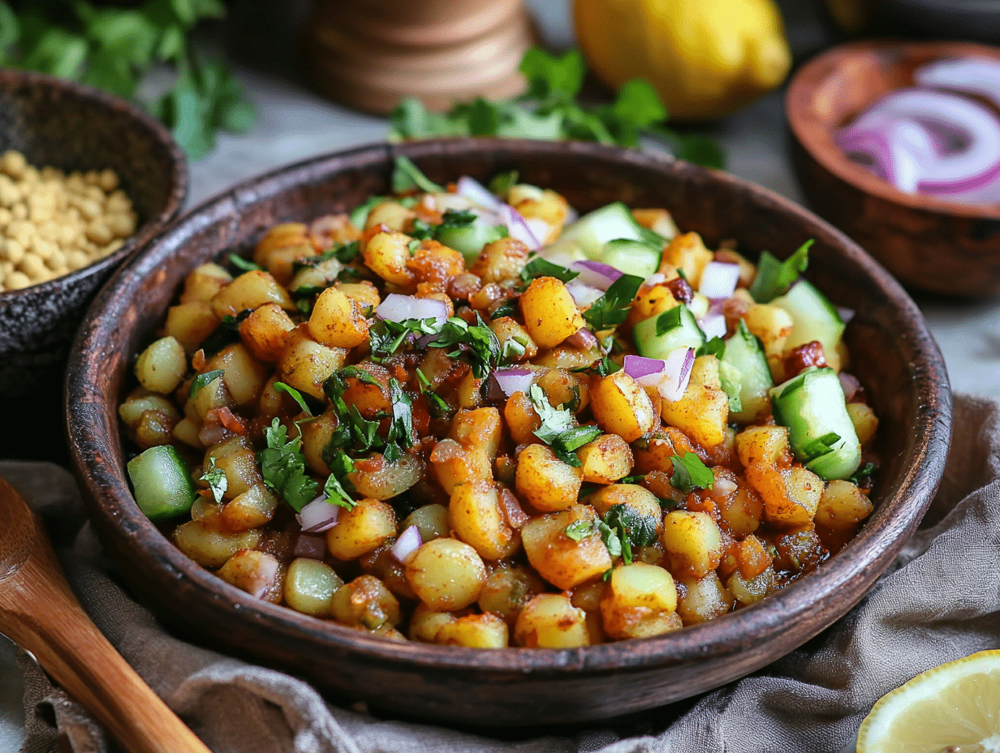

# Chotpoti

*Dhaka street-bowl: chickpeas and diced potato in a tart tamarind broth, topped with chopped boiled egg, raw onion, slit chilli, coriander and a hard hit of bhuna chaat masala.*

**Serves:** 4

**Prep Time:** 15 minutes (plus 8 hours soak for the chickpeas)

**Cook Time:** 1 hour

## Overview
Chotpoti is the small-bowl street snack of Bangladesh, sold from glass-fronted carts in Dhanmondi, Gulshan and around every university campus. The base is white chickpeas (or sometimes dried yellow peas) slow-cooked until tender with potato, then dressed at the moment of serving with a tart tamarind broth, finely chopped raw onion, slit green chilli, a fistful of coriander, chopped boiled egg, and the all-important bhuna chaat masala (toasted cumin and coriander seeds ground with black salt and chilli). The result is sharp, sour, hot, savoury and slightly soupy; eaten with a small spoon from a paper bowl, ideally on a kerb with a friend, ideally in the late afternoon. Often sold alongside fuchka (the Bangladeshi pani puri) at the same cart.

## Ingredients

### Chickpea base
- 250 g white chickpeas, soaked overnight
- 300 g potatoes, peeled and diced (1 cm cubes)
- 1.2 litres water
- 1 tsp turmeric powder
- 1 tsp fine salt, plus more to taste

### Tamarind sauce
- 60 g tamarind pulp (block tamarind)
- 250 ml hot water
- 1 tsp roasted cumin powder (see Stage 2)
- 1 tsp jaggery or brown sugar
- ½ tsp black salt (kala namak)
- ½ tsp fine salt

### Bhuna chaat masala
- 1 tbsp cumin seeds
- 1 tbsp coriander seeds
- 4 dried red chillies
- 1 tsp black salt
- ½ tsp ground ginger
- ½ tsp ground black pepper

### Toppings
- 4 hard-boiled eggs, peeled and roughly chopped
- 1 small red onion, finely chopped
- 2 green chillies, finely chopped
- A small bunch of fresh coriander, chopped
- 1 lime, cut in wedges
- Optional: a small handful of crisp puffed fuchka shells, broken

## Method

### Stage 1 - Cook the chickpea base
1. Drain the soaked chickpeas; tip into a pot with the potatoes, water, turmeric and salt.
2. Bring to a boil; skim any foam.
3. Reduce to a simmer; cook for 45 to 60 minutes until the chickpeas are very tender but holding shape, and the potatoes are tender (add more water if needed; the base should stay slightly soupy).
4. Taste; adjust salt.

### Stage 2 - Roast and grind the bhuna chaat masala
1. Dry-roast the cumin seeds, coriander seeds and broken dried chillies in a small heavy pan over medium heat for 2 minutes, shaking the pan, until they smell strongly toasty.
2. Tip onto a plate to cool.
3. Grind in a spice grinder or pestle and mortar to a coarse powder.
4. Stir in the black salt, ground ginger and pepper.

### Stage 3 - Make the tamarind sauce
1. Soak the tamarind in the 250 ml hot water for 15 minutes; mash with a fork; pass through a sieve, pressing the pulp through; discard the fibres and stones.
2. Stir in 1 tsp of the bhuna chaat masala, jaggery, black salt and fine salt.
3. Taste; the sauce should read sharp, sour, salty and faintly sweet.

### Stage 4 - Assemble
1. Ladle the warm chickpea-potato base into 4 small bowls.
2. Spoon 3 to 4 tablespoons of the tamarind sauce into each (taste as you go; some want it sharper).
3. Sprinkle 1 tsp of the bhuna chaat masala over each bowl.
4. Top with chopped boiled egg, chopped onion, green chilli, coriander.
5. If using, scatter crushed fuchka shells over the top.
6. Squeeze a wedge of lime over the lot just before eating.

## Notes
- **The base is loose, not dry.** Chotpoti is closer to a soup-stew than a salad; keep about 200 ml of cooking liquid in the pot when it's ready.
- **Roast the masala fresh.** Bhuna chaat masala loses its punch within a week; make it in small batches.
- **Soaked chickpeas only.** Tinned chickpeas turn to mush; the overnight soak plus slow simmer is what gives the chickpeas their proper chotpoti texture.
- **Tamarind block, not concentrate.** The bottled tamarind concentrate tastes one-note; soaking real tamarind block gives the proper sour-fruity depth.
- **Adjust at the bowl, not in the pot.** Each diner sweetens, sours and spices their own chotpoti to taste.

## Variations
- **With white peas:** swap chickpeas for dried white peas (matar) for the Old Dhaka version.
- **With masoor dal:** add 50 g masoor dal to the chickpea pot in Stage 1; gives a thicker, creamier base.
- **With sliced cucumber:** add finely diced cucumber for crunch.
- **With sweet yogurt drizzle:** drizzle 2 tbsp thick yogurt sweetened with a pinch of sugar over each bowl as a creamy counter.
- **Spicier:** double the dried chillies in the bhuna chaat masala; add 1 sliced bird's-eye chilli to each bowl.

## Serving
Hot or warm in a small bowl with a small spoon · lime wedge · slit chilli · a side bowl of fuchka if you have them · a glass of borhani alongside

## Storage
- Chickpea base keeps 3 days refrigerated
- Tamarind sauce keeps a week
- Bhuna chaat masala keeps 2 weeks in a sealed jar
- Assemble only at the moment of serving
- Do not freeze the assembled dish
