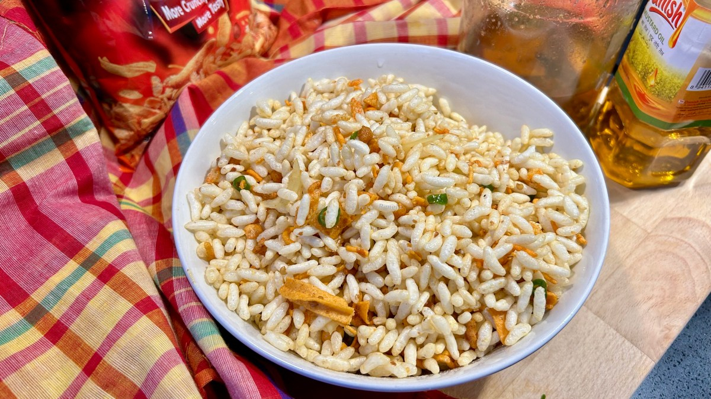

# Jhal Muri

*Bengali street snack of puffed rice tossed with raw mustard oil, finely sliced onion, green chilli, peanuts, chickpeas and a fistful of coriander, served in a cone of newspaper.*

**Serves:** 4

**Prep Time:** 15 minutes

**Cook Time:** 5 minutes

## Overview
Jhal muri is the after-school, before-dinner, riding-the-train Bengali street snack: muri (puffed rice) tossed with the contents of a roadside vendor's box. Every vendor has their own mix, but the spine is always the same: raw mustard oil, a fistful of very finely sliced raw onion, slit green chilli, roasted peanuts, fried chickpeas (chola), chopped tomato, coriander, salt, a sprinkle of bhuna chaat masala, and a final squeeze of lime. It must be assembled the second before you eat it; if the muri sits in the dressing for more than three minutes it goes soggy. The Bengali street version is sharper and oilier than the West Bengali cousin; in Dhaka it's served in a cone of folded newspaper or torn-out exercise-book pages.

## Ingredients

### The base
- 200 g puffed rice (muri)
- 50 g roasted peanuts
- 50 g crisp roasted chickpeas (chola)
- 50 g sev or thin Bombay mix

### The dressing
- 1 small red onion, very finely sliced
- 2 green chillies, very finely chopped
- 1 small tomato, finely diced
- 1 small green mango (or cucumber), finely diced
- A small handful of fresh coriander, chopped
- 2 tbsp raw mustard oil
- 1 tsp chaat masala
- ½ tsp fine salt, plus more to taste
- 1 tbsp lime juice
- A small piece of fresh coconut, slivered (optional but traditional)
- 1 boiled potato, peeled and diced small (optional)

## Method

### Stage 1 - Toast the muri
1. Heat a dry wide pan over medium heat.
2. Tip in the puffed rice; toast for 3 to 4 minutes, shaking the pan, until the muri smells nuttier and feels properly crisp (it loses crispness in storage and benefits from a refresh).
3. Tip onto a plate to cool.

### Stage 2 - Prep the bits
1. Slice the onion as fine as possible; chop the chillies; dice the tomato and green mango (or cucumber).
2. Chop the coriander.
3. Have the chaat masala, salt and lime juice ready at the bench.

### Stage 3 - Toss and serve straight away
1. Tip the cooled muri into a wide mixing bowl.
2. Add the peanuts, chickpeas, sev, onion, chilli, tomato, mango or cucumber, coriander, mustard oil, chaat masala and salt.
3. Squeeze the lime juice over the top.
4. Toss with clean hands for 30 seconds (hands distribute the dressing better than a spoon).
5. Tip into four small bowls, paper cones, or folded newspaper.
6. Eat at once.

## Notes
- **Toast the muri.** Even fresh muri benefits from 4 minutes in a dry pan; it deepens the nuttiness and ensures crispness.
- **Mustard oil raw.** This is one of the dishes where raw, unheated mustard oil is the right call; the sharpness defines the snack.
- **Assemble at the last moment.** Within 2 to 3 minutes of mixing, the muri starts going soft. Mix in front of the people who are eating it.
- **Hand-toss, do not spoon-mix.** Street vendors use their hands or a metal scoop in a wide tin; this distributes the dressing without crushing the muri.
- **Adjust for crowd:** for a bigger party, bowl the muri and dressing components separately; mix as people arrive.

## Variations
- **With dahi:** drizzle 4 tbsp thick yogurt and a teaspoon of tamarind chutney over the top for a dahi-jhal-muri.
- **Spicier:** add 4 dried red chillies, dry-roasted and crumbled, to the toasting muri.
- **With prawn:** street vendors sometimes add 30 g dried prawn (shutki), dry-roasted; intense and seafood-forward.
- **Without nuts:** skip the peanuts and chickpeas for a lighter version that's all about the chilli and mustard oil.
- **Sweet-sour variant:** add 1 tsp tamarind paste and 1 tsp sugar to the dressing for the West Bengali touch.

## Serving
A paper cone or small bowl, eaten with the fingers · a slit green chilli on the side · a cup of cha alongside

## Storage
- Does not store; eat the moment it's made
- The dry components (toasted muri, peanuts, sev) keep 2 weeks in an airtight tin; mix only when serving
- Refrigerate the chopped onion, tomato, chilli and coriander for up to 4 hours if prepping ahead
