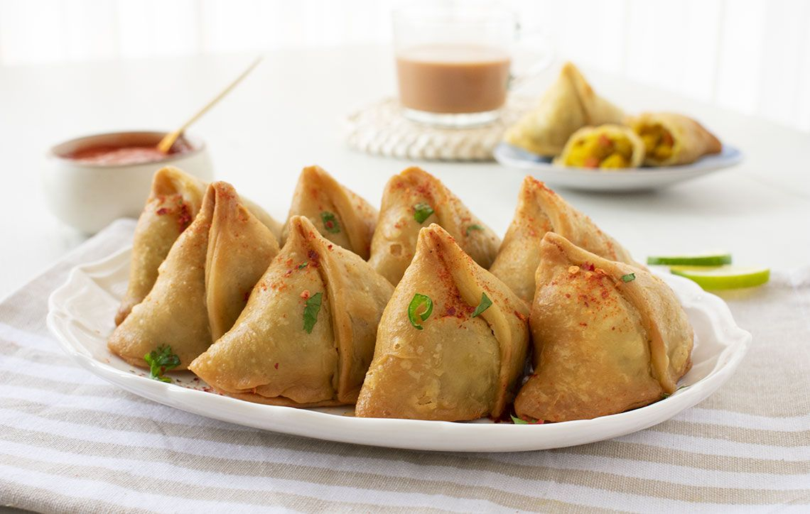

# Singara

*Bangladeshi savoury pastry: pyramidal flour-and-ghee shells filled with cumin-spiced potato, peanuts, raisins and ginger, deep-fried until shatteringly crisp.*

**Serves:** 6 (makes 12 singaras)

**Prep Time:** 45 minutes

**Cook Time:** 30 minutes

## Overview
The singara is the Bangladeshi cousin of the Indian samosa, but distinct enough to defend its own name: the pastry is shorter and crisper (made with ghee or vanaspati rubbed into plain flour, not oil), the shape is more sharply pyramidal, and the filling typically includes peanuts and raisins alongside the standard potato. The shell shatters like shortcrust when you bite in; the filling is spiced with cumin, fennel, ginger and a touch of chilli, with a hint of sweetness from the raisins. Sold in every Dhaka tea shop, every Old Town bakery, every train platform, eaten at 4 pm with a cup of cha for the standard afternoon stop. The pastry rest and the low-then-high frying sequence are the technical points that lift a homemade singara to street-vendor quality.

## Ingredients

### Pastry
- 300 g plain flour
- 1 tsp ajwain (carom seeds), lightly crushed
- ½ tsp fine salt
- 60 g ghee (or unsalted butter)
- 130 ml cold water (approximately)

### Filling
- 500 g floury potatoes (Maris Piper or similar)
- 2 tbsp mustard oil
- 1 tsp cumin seeds
- ½ tsp fennel seeds
- 1 small onion, finely chopped
- 2 cm fresh ginger, finely chopped
- 1 green chilli, finely chopped
- 1 tsp ground coriander
- ½ tsp turmeric powder
- ½ tsp chilli powder
- 1 tsp salt, plus more to taste
- 50 g roasted peanuts
- 30 g raisins
- 1 tsp garam masala
- 1 tbsp lime juice
- A small handful of fresh coriander, chopped

### For frying
- 800 ml vegetable oil (for deep-frying)

### To seal
- 2 tbsp plain flour mixed with 2 tbsp water (paste)

## Method

### Stage 1 - Pastry
1. Sift the flour into a wide bowl; stir in the crushed ajwain and salt.
2. Rub the ghee in with your fingertips until the mixture looks like coarse breadcrumbs (5 minutes).
3. Add the cold water a tablespoon at a time, gathering the dough until it just comes together. The dough should be firm, not soft.
4. Knead lightly for 1 minute; cover with a damp cloth; rest 30 minutes.

### Stage 2 - Filling
1. Boil the potatoes in their skins for 20 minutes until tender; cool slightly; peel and dice into 1 cm cubes.
2. Heat the mustard oil in a pan until it shimmers; cool 30 seconds.
3. Add the cumin and fennel seeds; sizzle 20 seconds.
4. Add the chopped onion; cook 4 minutes until soft.
5. Add the ginger and green chilli; cook 1 minute.
6. Stir in the coriander, turmeric, chilli powder and salt; fry 30 seconds.
7. Tip in the potato cubes, peanuts and raisins; stir gently for 3 minutes, breaking some potato but leaving most chunky.
8. Off the heat, stir in the garam masala, lime juice and fresh coriander.
9. Cool fully (hot filling steams the pastry from the inside and weakens the seal).

### Stage 3 - Shape the singaras
1. Divide the rested pastry into 6 balls.
2. Roll each ball into a thin oval (about 14 by 18 cm); cut the oval in half across the middle to make two half-moons.
3. Take a half-moon: brush the straight edge with flour paste, fold the half-moon in half and press the straight edges together to make a cone (the singara pyramid base).
4. Hold the cone open and spoon in 1.5 tbsp of cooled filling.
5. Brush the top edge with flour paste; pinch the seam closed firmly. Press into a sharp pyramid shape.
6. Repeat for all 12 singaras.

### Stage 4 - Fry low, then hot
1. Heat the oil in a deep heavy pan to 150 degrees C (a piece of dough should sizzle gently and rise slowly).
2. Slide 4 singaras in carefully; fry 8 minutes at this low temperature; the pastry sets and goes a pale gold.
3. Lift out onto kitchen paper; let cool 5 minutes.
4. Bring the oil up to 180 degrees C.
5. Fry the singaras a second time, 4 at a time, for 2 minutes until deep golden brown and shatteringly crisp.
6. Drain on kitchen paper.

## Notes
- **Pastry rest is essential.** 30 minutes lets the gluten relax and the ajwain perfume the dough; skipping this gives a tough shell.
- **Cold filling, hot pastry.** The filling must be fully cool when it goes into raw pastry, otherwise the seal weakens and the singaras burst during frying.
- **Double-fry is the Bangladeshi trick.** Low and slow first cooks the pastry through without colouring; hot and fast second gives the deep golden shell.
- **Pyramid shape, not flat triangle.** Bangladeshi singaras stand up on three points; this is the visual cue.
- **Seal hard.** Any gap in the seam and the filling leaks and the singara collapses in the oil.

## Variations
- **With chickpeas:** add 100 g cooked black chickpeas to the filling for the Old Dhaka version.
- **With cauliflower:** swap half the potato for cauliflower florets, par-boiled.
- **With minced lamb (kheema singara):** swap the potato for spiced cooked minced lamb; richer, more festival-style.
- **With dried prawn:** add 30 g dry-roasted dried prawn (shutki) to the filling for a Chittagong twist.
- **Baked, not fried:** brush with oil and bake at 200 degrees C for 25 minutes; less authentic but lighter.

## Serving
Hot, with tamarind chutney and a small ramekin of green chutney · a cup of cha alongside · a wedge of lime

## Storage
- Eats best straight from the oil
- Refrigerate cooked singaras up to 2 days; reheat in a 180 degree C oven for 8 minutes
- Freeze uncooked (shaped, but not fried) on a tray; bag once solid; fry from frozen at 160 degrees C for 12 minutes
