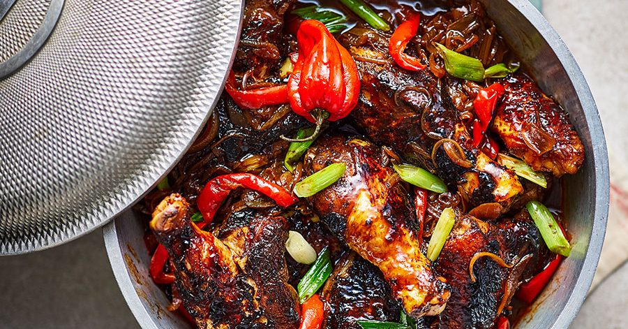

# Bajan Stew Chicken (Stewed Chicken in Browning)

*Barbados's Sunday-lunch dish: bone-in chicken marinated in Bajan green seasoning, browned hard with caramelised sugar (browning), then slow-stewed in tomato, onion and pepper into a glossy mahogany gravy.*

**Serves:** 6

**Prep Time:** 30 minutes (plus overnight marinating)

**Cook Time:** 1 hour 15 minutes

## Overview
Bajan stew chicken is the dish that anchors the traditional Bajan Sunday-lunch plate. Bone-in chicken pieces marinate overnight in a paste of Bajan green seasoning, lime, Scotch bonnet and ketchup so the flavour reaches the bone. The browning sauce is what gives the stew its identity: a dark caramelised sugar syrup (sold bottled as "browning" in every Caribbean shop) added at the start to give the gravy its characteristic mahogany colour. Outside the Caribbean, two tablespoons of dark brown sugar caramelised in a dry pan till deep amber and dissolved with water substitutes. The chicken browns hard in the pot to develop both colour and fond, then onion, green pepper, tomato, chopped Scotch bonnet, thyme and chicken stock go in; the stew simmers covered for forty-five minutes till the chicken is fork-tender and the gravy reduces to a glossy deep-brown sauce. Eat over rice and peas with macaroni pie alongside and fried plantain, the full Bajan plate.

## Ingredients

### The chicken
- 1 whole chicken (1.6-1.8 kg), cut into 8 pieces (or 8 large bone-in pieces, thighs, drumsticks, breast quarters)
- 4 tablespoons Bajan green seasoning (see [Cou-cou and flying fish](cou-cou-and-flying-fish.md))
- 2 tablespoons fresh lime juice
- 2 tablespoons tomato ketchup
- 1 Scotch bonnet pepper, deseeded and finely chopped
- 2 cloves garlic, finely grated
- 2 teaspoons salt
- 1 teaspoon black pepper
- 1 teaspoon paprika

### The stew base
- 3 tablespoons sunflower oil
- 2 tablespoons "browning sauce" (Grace Browning or similar Caribbean brand; substitute: 2 tbsp dark brown sugar caramelised in a dry pan till deep amber + 2 tbsp water)
- 1 large onion, finely chopped
- 1 large green bell pepper, finely chopped
- 1 small red bell pepper, finely chopped (for colour)
- 4 cloves garlic, finely chopped
- 2 ripe tomatoes, finely chopped (or 200 g canned chopped tomatoes)
- 2 tablespoons tomato paste
- 1 Scotch bonnet pepper, deseeded and finely chopped (or whole, for less heat, leave in to flavour and remove at end)
- 2 tablespoons Bajan green seasoning (additional, beyond the marinade)
- 1 tablespoon fresh thyme leaves (or 1 teaspoon dried)
- 2 bay leaves
- 4 whole allspice berries
- 500 ml chicken stock
- 100 ml coconut milk (optional; gives extra richness)
- 1 tablespoon dark soy sauce OR Worcestershire (adds depth)
- Salt and pepper

### To finish
- 1 small bunch fresh flat-leaf parsley OR culantro (chadon beni), chopped
- 2 stalks scallion, sliced
- A small dash of Bajan pepper sauce (Scotch bonnet hot sauce)

### To serve (the traditional Bajan Sunday plate)
- 1 batch Bajan macaroni pie (see [Macaroni Pie](macaroni-pie.md))
- 1 batch Bajan rice and peas (pigeon peas + coconut milk + thyme)
- Fried plantain (sweet ripe plantain, sliced and pan-fried)
- A simple green salad
- Cold Banks lager

## Method

### Stage 1 - Marinate the chicken (overnight)
1. In a large bowl, combine the chicken pieces with the 4 tablespoons green seasoning, lime juice, ketchup, chopped Scotch bonnet, grated garlic, salt, pepper and paprika.
2. Massage the marinade into every piece, getting under the skin where possible.
3. Cover with cling film.
4. Refrigerate overnight (or at least 4 hours; overnight is dramatically better).

### Stage 2 - Brown the chicken (the Bajan "burning")
1. Heat the sunflower oil in a heavy Dutch oven (or wide deep pot) over medium-high heat.
2. Add the browning sauce; let it sizzle 10-15 seconds.
3. Take the marinated chicken pieces from the fridge; wipe off any excess marinade (saves it for later).
4. Add the chicken pieces to the pot in a single layer (work in 2 batches if needed).
5. Brown 4-5 minutes per side till the chicken has a deep mahogany crust.
6. Transfer to a plate as you go.

### Stage 3 - Sweat the aromatics
1. Reduce heat to medium.
2. Add the chopped onion to the same pot.
3. Sweat 5-6 minutes till softened.
4. Add the chopped green and red peppers; cook 3-4 minutes.
5. Add the chopped garlic, ginger and chopped Scotch bonnet; cook 1 minute.

### Stage 4 - Build the stew
1. Stir in the chopped tomatoes and tomato paste; cook 3-4 minutes till the tomato breaks down.
2. Add the 2 tablespoons of additional Bajan green seasoning, thyme, bay leaves and allspice berries.
3. Pour in the chicken stock.
4. Add the reserved marinade (it's been in raw chicken; a long simmer cooks it through).
5. Add the soy sauce / Worcestershire.
6. Bring to a gentle simmer.

### Stage 5 - Return the chicken
1. Nestle the browned chicken pieces back into the simmering gravy.
2. Add any juices from the plate.
3. Cover loosely; reduce heat to a low simmer.

### Stage 6 - Slow simmer
1. Cook 40-50 minutes till the chicken is fork-tender (a fork goes in easily and the meat starts pulling away from the bones).
2. Stir gently every 15 minutes; don't break the chicken pieces.
3. If using, stir in the coconut milk in the last 10 minutes (for extra richness).
4. The gravy should reduce to a glossy thick sauce.
5. Taste; adjust salt, pepper.

### Stage 7 - Finish
1. Stir in the chopped parsley (or culantro) and sliced scallion.
2. Fish out the bay leaves and whole allspice berries.
3. Optional: add a small dash of pepper sauce for extra heat.

### Stage 8 - Plate
1. Spoon a portion of rice and peas onto each warm plate.
2. Place a chicken piece (or two) on top.
3. Ladle generous gravy over.
4. Add a square of macaroni pie and 2-3 slices of fried plantain alongside.
5. A small handful of green salad.

### Stage 9 - Serve
1. Eat hot; the traditional Bajan Sunday plate.
2. Bajan pepper sauce on the table for extra heat.
3. Cold Banks lager alongside.

## Notes
- **Overnight marinate:** non-negotiable. The green seasoning needs time to penetrate.
- **Browning sauce is the traditional Bajan signature:** the mahogany colour is what makes this Bajan rather than generic stewed chicken. Source from a Caribbean shop or make the substitute.
- **Brown the chicken hard:** the dark crust + the fond at the bottom of the pot are half the flavour.
- **Slow simmer:** 40-50 minutes covered on low. High heat dries out the chicken before the gravy thickens.
- **Coconut milk is optional but adds richness:** the standard Bajan home version uses stock only; modern restaurants often add coconut milk.
- **The Bajan Sunday plate:** stew chicken alone is incomplete. Serve with rice and peas + macaroni pie + fried plantain, the traditional full plate.

## Variations
**Bajan stew chicken with okra:** add 200 g sliced okra in the last 15 minutes, the rural Bajan variant.
**Bajan stew oxtail (the celebratory variant):** swap chicken for 1.5 kg oxtail pieces; brown hard; simmer 3 hours; the same gravy.
**Curry chicken Bajan style:** add 2 tablespoons Caribbean curry powder to the marinade; an Indian-Caribbean variant.
**Pepper-chicken (extra spicy):** double the Scotch bonnet; the heat-lovers' variant.
**Coconut stew chicken:** add the full 400 ml of coconut milk; reduces to a creamier gravy, the festive Caribbean variant.
**Slow-cooker Bajan stew chicken:** brown the chicken in a pan; transfer to a slow cooker with the rest; low for 6 hours.
**Stew pork (Bajan):** same method with pork shoulder cubes; 90 minutes braising time.
**Vegetarian stew "chicken" (jackfruit):** swap chicken for canned green jackfruit; same marinade and gravy.

## Serving
At a Bajan Sunday lunch (the traditional setting; the most-defining Bajan family meal) · at a Bajan Independence Day (30 November) celebration · at a Bajan family birthday party · at a Bajan wedding lunch · at a Bajan church potluck · at a Bajan rum-shop on Sunday afternoons · at home as the traditional Bajan-themed Sunday dinner · paired with macaroni pie, rice and peas, fried plantain, and cold beer.

## Storage
- Refrigerates 4 days; reheats well on the stovetop with a small splash of stock or water.
- Freezes 3 months in airtight containers; defrost overnight in the fridge.
- The flavours marry overnight, day-2 stew chicken is often better than fresh.
- The marinade keeps refrigerated 24 hours before adding chicken.
- The Bajan green seasoning is the make-ahead component; keeps 2 weeks refrigerated.
- Leftover chicken stripped from the bones and stirred into a stew or curry the next day is the classic Bajan home use-up.
