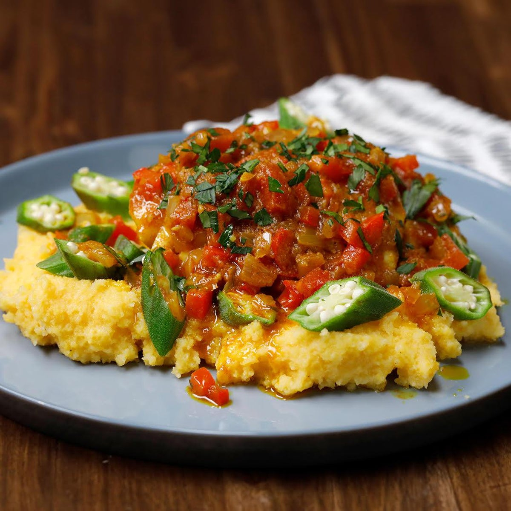

# Cou-Cou and Flying Fish (Bajan National Dish)

*Barbados's national plate: a buttery mound of cou-cou (a cornmeal-and-okra mush) served with steamed flying fish fillets in a herb-and-tomato gravy. The fish appears on the Bajan coat of arms; the dish defines the island.*

**Serves:** 4

**Prep Time:** 25 minutes

**Cook Time:** 40 minutes

## Overview
Cou-cou and flying fish is Barbados's most identity-defining dish, the country's national plate. The cou-cou is yellow cornmeal cooked with finely sliced okra in salted water, stirred with a flat wooden paddle (a "cou-cou stick") till it becomes a thick glossy almost-elastic mound. The texture sits between Italian polenta and West African fufu; the okra is what makes it cou-cou rather than polenta, giving the mush its distinctive stretchy character. The flying fish are small Caribbean fish with wing-like pectoral fins that migrate past Barbados in dense schools from November to June; outside the island, sardines or mackerel fillets substitute. The fillets steam gently on top of a fragrant gravy of onion, sweet pepper, Scotch bonnet, tomato and Bajan green seasoning. Plated with the cou-cou mounded in the centre, the fish fillets fanned on top, gravy ladled over and around. The dish is so woven into Bajan life that "cou-cou Friday" is traditional family-dinner day, and the flying fish appears on the national coat of arms.

## Ingredients

### The Bajan green seasoning (makes about 200 g; keeps refrigerated 2 weeks)
- 2 large bunches green onions / scallions (about 200 g), chopped
- 1 small bunch parsley, chopped (about 40 g)
- 1 small bunch fresh thyme, leaves picked
- 1 small bunch fresh chives, chopped
- 4 cloves garlic
- 1 Scotch bonnet OR habanero chilli, deseeded (or with seeds for heat)
- 1 tablespoon black pepper
- 1 teaspoon salt
- 2 tablespoons sunflower oil OR olive oil
- 2 tablespoons fresh lime juice
- (Blend everything in a food processor till a coarse paste)

### The cou-cou
- 250 g yellow cornmeal (medium-grind; not instant)
- 200 g fresh okra, sliced into 4 mm rounds (or 180 g frozen sliced okra)
- 1 litre water + extra for adjusting
- 2 teaspoons salt
- 60 g unsalted butter (added at the end)
- A cou-cou stick / wooden paddle / sturdy wooden spoon

### The flying fish (traditional) OR substitute
- 4 large flying-fish fillets (about 100 g each) - sold at Bajan / Caribbean markets, frozen in some specialty shops
- OR 8 small whole sardines, gutted (substitute)
- OR 4 small mackerel fillets (substitute)
- 3 tablespoons Bajan green seasoning (recipe above)
- 1 tablespoon fresh lime juice
- 1/2 teaspoon salt
- 1/2 teaspoon black pepper

### The gravy
- 2 tablespoons sunflower oil
- 1 medium onion, finely chopped
- 1 medium green bell pepper, finely chopped
- 1 medium tomato, chopped (or 200 g canned chopped tomatoes)
- 2 tablespoons Bajan green seasoning
- 1 small Scotch bonnet pepper, finely chopped (or 1/2 teaspoon Scotch bonnet pepper sauce)
- 1 teaspoon dried thyme
- 1 tablespoon tomato ketchup (gives gloss and a touch of sweetness)
- 250 ml fish stock OR water
- Salt and pepper

### To serve
- Lime wedges
- A small dish of Bajan pepper sauce (Scotch bonnet hot sauce) for those who want extra heat
- A cold Caribbean lager (Banks) OR a glass of cold mauby

## Method

### Stage 1 - Make the Bajan green seasoning
1. Combine all the green seasoning ingredients in a food processor.
2. Pulse to a coarse paste; some texture should remain (not pure-purée smooth).
3. Refrigerate in a sealed jar.

### Stage 2 - Marinate the fish
1. In a wide dish, combine 3 tablespoons of green seasoning with the lime juice, salt and pepper.
2. Add the fish fillets; turn to coat.
3. Refrigerate at least 20 minutes (or up to 2 hours).

### Stage 3 - Make the gravy
1. Heat the oil in a wide deep pan over medium heat.
2. Add the chopped onion; sweat 5 minutes till translucent.
3. Add the chopped green pepper; sweat 4 more minutes.
4. Add the tomato (or canned tomato); cook 3-4 minutes till it breaks down.
5. Stir in the 2 tablespoons green seasoning, chopped Scotch bonnet, thyme, ketchup.
6. Pour in the fish stock; bring to a gentle simmer.
7. Reduce heat to low; cover loosely; let the gravy bubble gently while you make the cou-cou (10-12 minutes; the flavours marry).
8. Taste; adjust salt and pepper.

### Stage 4 - Make the cou-cou
1. In a large heavy pot, bring 700 ml of water to a boil with the salt.
2. Add the sliced okra; simmer 5 minutes till tender and the water is slightly slimy from the okra.
3. Slowly whisk in the cornmeal in a steady stream while stirring constantly.
4. Reduce heat to medium-low.
5. Continue stirring vigorously with the cou-cou stick / paddle / wooden spoon for 10-12 minutes - the cou-cou should be thick, glossy, and pulling away from the sides of the pot.
6. Add 200-300 ml more hot water as needed (the cou-cou should be wet enough to be stir-able but firm enough to hold its shape).
7. The okra should have fully broken down into the cou-cou; small visible pieces are OK.
8. Stir in the 60 g butter till fully melted.
9. Taste; adjust salt.

### Stage 5 - Add the fish to the gravy
1. Once the cou-cou is at the 5-minute-stage of stirring, raise the gravy heat to medium.
2. Lay the marinated fish fillets gently on top of the gravy.
3. Cover the pan; steam the fish in the gravy 5-7 minutes till just cooked through (the fish flakes gently with a fork; internal 60°C).

### Stage 6 - Plate
1. Wet a small bowl with cold water (helps the cou-cou release cleanly).
2. Spoon a generous mound of cou-cou into the bowl, press to compact, then invert onto each warm dinner plate - you should have a smooth dome of cou-cou in the centre.
3. Lay 1 (or 2 small) flying fish fillet on top of the cou-cou dome.
4. Spoon the gravy generously over the fish and around the cou-cou.
5. Add a lime wedge.

### Stage 7 - Serve immediately
1. Eat hot - cou-cou and flying fish is at its peak straight from the stove.
2. The diner squeezes lime over the fish, breaks the cou-cou with the fork, mixes some cou-cou into the gravy with each bite.

## Notes
- **Bajan green seasoning is the foundation:** this paste shows up in EVERY Bajan dish from cou-cou to fried chicken to stew. Make a batch; keep in the fridge.
- **Stir the cou-cou vigorously:** the constant stirring + folding motion is what gives the proper glossy elastic texture. A passive stir gives lumpy cou-cou.
- **Okra is essential:** the mucilage from the okra is what makes cou-cou cou-cou. Without okra, you've made polenta.
- **Don't overcook the fish:** 5-7 minutes is enough. Past 10 minutes the flying fish goes dry.
- **Friday is traditional:** in Barbados, cou-cou and flying fish is the Friday family-dinner standard. Sundays are different (stew chicken or fried chicken); Saturdays are pudding-and-souse.
- **Substitute for flying fish outside Barbados:** small whole sardines, small mackerel fillets, or any small firm-fleshed white fish. The seasoning makes it Bajan even if the fish is different.

## Variations
**Cou-cou and saltfish:** swap the fresh flying fish for soaked-and-flaked salt cod - the alternative Bajan traditional.
**Cou-cou and stewed fish:** instead of steamed fish on the gravy, stewed fish in a richer gravy with okra chunks - the Sunday variant.
**Coconut cou-cou:** swap 200 ml of the water for coconut milk - the upscale variant.
**Vegetarian cou-cou:** just the cornmeal-and-okra mound; serve with the gravy alone, or with stewed pumpkin.
**Pumpkin cou-cou:** add 200 g grated pumpkin to the cornmeal-and-okra cook - the modern variant.
**Cou-cou cakes (next-day):** form cold leftover cou-cou into small patties; pan-fry till golden on both sides - the Bajan breakfast hack.
**Bajan cou-cou with pickled fish:** instead of fresh flying fish, use pickled fish in a vinegar-and-pepper brine - the older traditional variant.

## Serving
At a Bajan Friday-night family dinner (the traditional setting) · at a Bajan rum-shop on a Friday afternoon · at the Oistins Fish Fry (the famous Friday-night Bajan fish festival in Christ Church) · at a Bajan Independence Day (30 November) celebration · at any Bajan home for the traditional national-dish dinner · paired with a glass of cold Banks lager, mauby, or sorrel.

## Storage
- Cou-cou is best eaten fresh from the pot. Refrigerated cou-cou firms into a sliceable cake; pan-fry next-day slices in butter till crisp.
- Refrigerates 3 days; freezes 1 month (texture suffers slightly).
- The Bajan green seasoning refrigerates 2 weeks; freezes 3 months.
- The gravy refrigerates 4 days; reheats well.
- The flying fish (raw) freezes 3 months; cooked fish refrigerates 2 days.
- Leftover gravy on toast for breakfast is the traditional Bajan day-after.
