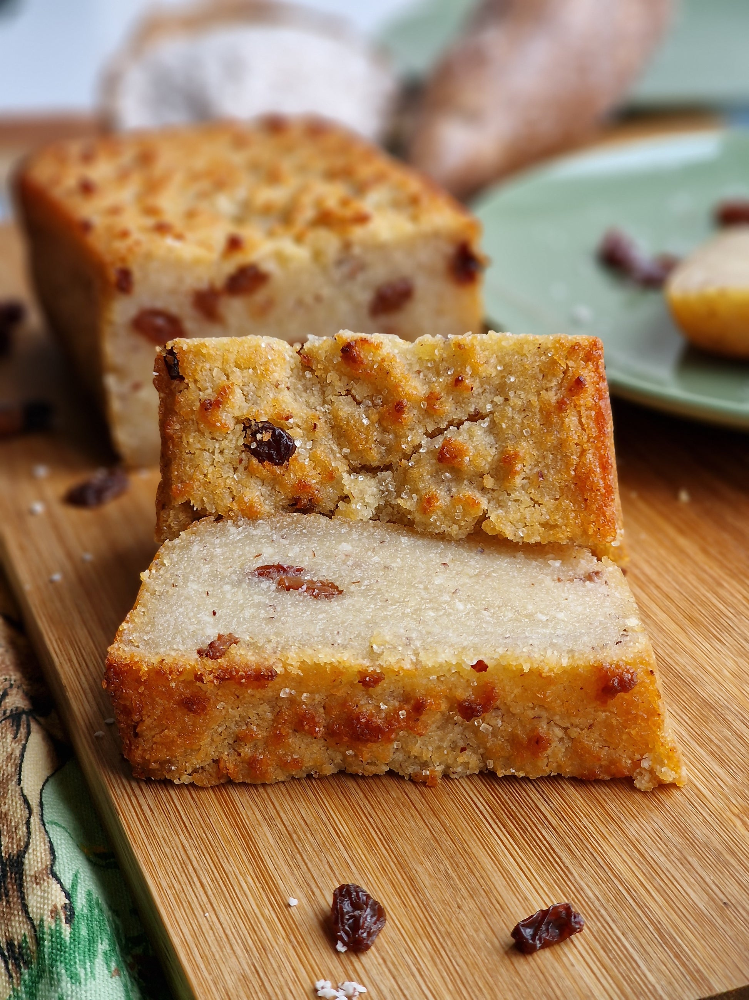

# Cassava Pone (Bajan Cassava-Coconut Pudding)

*Barbados's most identity-defining traditional sweet: a dense baked pudding of grated cassava, coconut and sweet potato bound with brown sugar, butter and warm spices, baked till the top forms a deep mahogany crust.*

**Serves:** 12 squares

**Prep Time:** 30 minutes

**Cook Time:** 1 hour 15 minutes

## Overview
Cassava pone is one of the oldest and most-loved Caribbean sweets, with roots going back to the 17th century when Bajan slaves combined indigenous Caribbean cassava with grated coconut, sugar and spices brought from West African and European trade. The base is a canonical Bajan trio of grated cassava, fresh coconut and grated sweet potato (or pumpkin), bound with soft brown sugar, butter, eggs and warm spices (cinnamon, nutmeg, mixed spice, vanilla). The cassava is the technical centre: peeled and grated fine, with the released liquid squeezed out before baking. Fresh cassava is canonical, but frozen grated cassava from a Latin American shop works well. Baked in a wide tin at 180 °C for over an hour till the top is deeply mahogany and slightly crackled, the interior dense, chewy and almost slightly translucent. Cut into hefty squares; eaten as a tea-cake or dessert with a cup of strong Bajan tea or a glass of cold cocoa.

## Ingredients

### The pone base
- 600 g fresh cassava, peeled and finely grated (squeeze out and discard the watery liquid) - OR 500 g frozen grated cassava, defrosted, drained
- 300 g fresh sweet potato (orange-fleshed), peeled and finely grated
- 200 g fresh grated coconut (or 150 g unsweetened desiccated coconut + 50 ml coconut milk for moisture)
- 100 g pumpkin OR butternut squash, peeled and finely grated (optional but canonical)

### The flavourings
- 300 g soft dark brown sugar (or muscovado)
- 100 g unsalted butter, melted
- 200 ml coconut milk (full-fat)
- 3 large eggs, lightly beaten
- 1 tablespoon vanilla extract
- 2 teaspoons ground cinnamon
- 1 teaspoon freshly grated nutmeg
- 1 teaspoon ground mixed spice (or allspice)
- 1 teaspoon salt
- Finely grated zest of 1 lime (the Bajan citrus touch)
- 50 g raisins (optional but very canonical)

### To finish
- 30 g unsalted butter, in small dabs (for the top)
- 1 teaspoon ground cinnamon, for dusting

### Equipment
- A 23 × 23 cm square baking tin, well-buttered (or lined with parchment)

### To serve
- A cup of strong Bajan tea (Mauby's or a local Caribbean black tea)
- A glass of cold cocoa milk
- A scoop of vanilla ice cream (modern variant)

## Method

### Stage 1 - Prep the cassava
1. If using fresh cassava: peel (remove the thick brown outer skin AND the thin pink layer underneath), then grate finely.
2. Place the grated cassava on a clean tea towel; gather the corners and SQUEEZE OUT as much liquid as possible. The squeezed cassava should feel slightly damp but not wet.
3. If using frozen grated cassava: defrost; drain thoroughly in a sieve.

### Stage 2 - Mix the base
1. In a very large mixing bowl, combine the squeezed cassava, grated sweet potato, grated coconut, and grated pumpkin (if using).
2. Stir to mix evenly.

### Stage 3 - Add the wet and spice
1. Sprinkle the brown sugar over the grated mixture.
2. Add the melted butter, coconut milk, beaten eggs, vanilla, cinnamon, nutmeg, mixed spice, salt and lime zest.
3. Fold in the raisins.
4. Mix thoroughly - the batter should be thick, wet, and uniformly seasoned.

### Stage 4 - Assemble
1. Heat the oven to 180°C (160°C fan).
2. Butter the baking tin generously (or line with parchment for easy lift-out).
3. Tip the batter into the tin; smooth the top with a spatula.
4. Dot the surface with small dabs of butter (about 30 g total).
5. Dust the top with a small amount of ground cinnamon.

### Stage 5 - Bake
1. Bake on the middle shelf of the oven for 70-80 minutes.
2. The pone is done when:
   - The top is deep mahogany-brown (almost black at the corners; this is correct)
   - A skewer inserted into the centre comes out with just a few moist crumbs (not wet batter)
   - The edges have slightly pulled away from the tin
3. If the top browns too fast in the first 30 minutes, cover loosely with foil for the rest of the bake.

### Stage 6 - Cool fully
1. Lift the tin out of the oven.
2. Cool in the tin at room temperature 1 hour (the pone firms as it cools - DO NOT cut warm; the texture will be sloppy).
3. For the cleanest cuts, refrigerate at least 1 more hour before cutting.

### Stage 7 - Cut and serve
1. Lift the slab from the tin (using the parchment if used; or invert).
2. Cut into 12 hefty squares with a sharp knife.
3. Serve at room temperature with a cup of strong Bajan tea, or with a scoop of vanilla ice cream.

## Notes
- **Squeeze the cassava:** raw cassava is wet; squeezing out the liquid is the canonical Caribbean technique. Helps the texture and removes any residual cyanogenic compounds.
- **Fresh grated coconut is dramatically better than desiccated:** but desiccated works in a pinch (add 50 ml coconut milk for moisture).
- **Bake till deeply mahogany:** a pale crust is under-baked. The dark colour is part of the canonical Bajan look and flavour.
- **Cool fully before cutting:** warm pone is sloppy. 1 hour minimum; refrigerated cuts cleanest.
- **The dense gummy texture is correct:** cassava pone is NOT a fluffy cake. It's a dense, chewy pudding-cake, somewhere between a tart and a baked custard.
- **Lime zest is the Bajan signature:** distinguishes this from a generic Caribbean pone.

## Variations
**Pumpkin pone (skip the cassava):** swap all the cassava for grated pumpkin - lighter, more savoury Sunday-tea variant.
**Corn pone (Native American / Southern American cousin):** swap the cassava for cornmeal; same coconut + sugar + spice base; the African-American Southern variant.
**Cassava pone with chocolate:** add 100 g of chopped dark chocolate to the batter - the modern Bajan variant.
**Pone with sultanas and currants:** add 80 g sultanas + 50 g currants (instead of just raisins) - the festive variant.
**Vegan cassava pone:** swap eggs for 4 tablespoons aquafaba + 2 tablespoons milled flax + 2 tablespoons water; swap butter for coconut oil; the dish is essentially vegan otherwise.
**Mini cassava pones (cupcake-style):** divide the batter into a 12-cup muffin tin; bake 35-40 minutes - the canapé / individual portions.
**Sweeter pone (modern):** add 50 g sugar - for those who find the traditional version not sweet enough.

## Serving
At a Bajan family Sunday tea (the canonical setting) · at a Bajan church fundraiser bake sale · at a Bajan Christmas tea table · at a Caribbean-themed afternoon tea · at a Bajan Independence Day buffet · at home as the canonical Caribbean tea-cake · paired with strong Bajan tea, mauby, cold cocoa, or vanilla ice cream.

## Storage
- Stores 5 days at room temperature in an airtight container.
- Refrigerates 1 week (the texture firms further in the fridge; bring to room temperature for the best texture).
- Freezes 3 months wrapped tight; defrost at room temperature for 2 hours.
- Improves with a day of resting - the spices marry and the texture firms.
- Day-old cassava pone toasted lightly in a hot pan with butter is the Bajan day-after breakfast.
- The raw batter can be made 12 hours ahead and refrigerated; bring to room temperature for 30 minutes before baking.
