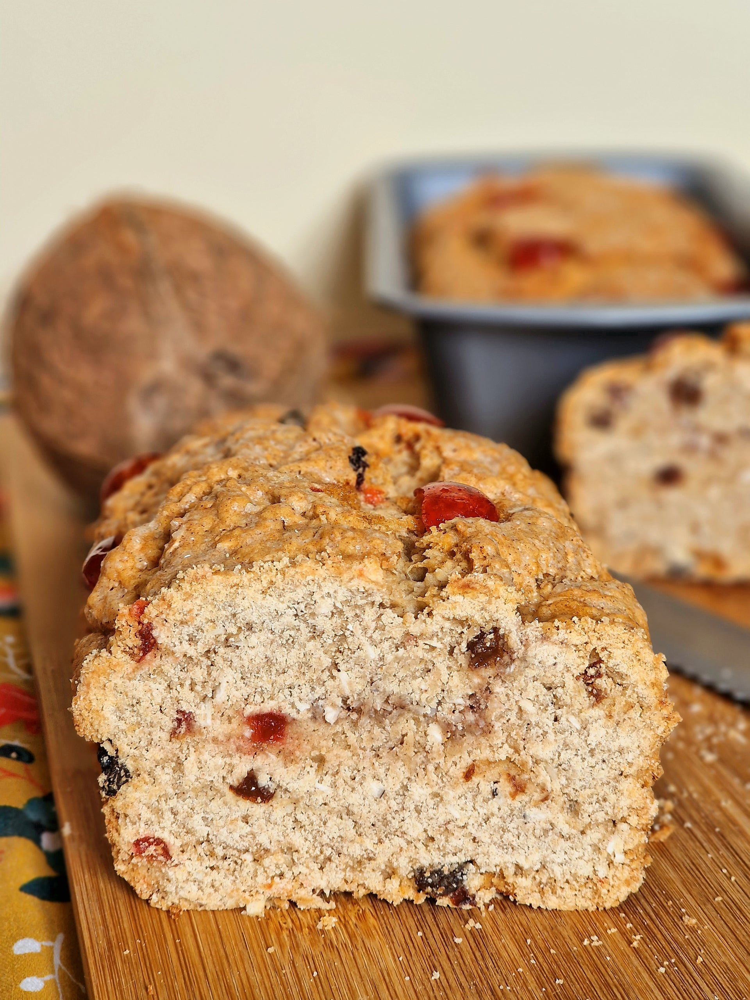

# Bajan Coconut Bread (Sweet Coconut Loaf)

*Barbados's most-loved tea-loaf: a moist sweet bread of grated fresh coconut, brown sugar, butter, eggs and fresh thyme (the canonical Bajan addition), baked till deep golden.*

**Serves:** 1 large loaf, 12 slices

**Prep Time:** 25 minutes

**Cook Time:** 1 hour 10 minutes

## Overview
Bajan coconut bread is the Caribbean tea-loaf that defines island home baking. Despite the name, it's closer to a banana bread or a quick-loaf cake than a yeasted bread, dense and sweet with a deeply coconut-fragrant crumb. Fresh grated coconut is canonical: Bajan home cooks crack a fresh coconut and grate the flesh on a box grater, and desiccated unsweetened coconut works as a substitute but is less juicy and fragrant. The Bajan signatures are what mark it apart from generic Jamaican or Trinidadian coconut breads: fresh thyme leaves (a tablespoon, picked from the stem), a grating of lime zest, and a teaspoon of mixed spice. Baked in a loaf tin at 170 °C till deep golden, with foil over the top for the last twenty minutes if browning too fast. Sliced thick, spread with butter, eaten with strong Bajan tea or a cold glass of mauby.

## Ingredients

### The dry mix
- 350 g plain flour
- 2 teaspoons baking powder
- 1/2 teaspoon bicarbonate of soda
- 1/2 teaspoon salt
- 1 teaspoon ground cinnamon
- 1 teaspoon ground mixed spice (or allspice)
- 1/2 teaspoon freshly grated nutmeg

### The wet mix
- 200 g unsalted butter, soft (room temperature)
- 200 g soft dark brown sugar
- 100 g caster sugar
- 3 large eggs, lightly beaten
- 1 tablespoon vanilla extract
- 250 ml coconut milk (full-fat)
- 1 tablespoon fresh lime juice
- Finely grated zest of 1 lime

### The coconut and herbs
- 300 g fresh grated coconut (or 200 g unsweetened desiccated coconut + 50 ml extra coconut milk)
- 2 tablespoons fresh thyme leaves (picked from stems)
- 100 g raisins (optional but canonical)
- 50 g chopped dried cherries or dried cranberries (optional)

### For the topping
- 2 tablespoons demerara sugar (for sprinkling)
- A small extra grating of nutmeg

### Equipment
- A 1 kg (23 × 13 × 7 cm) loaf tin, well-buttered AND lined with parchment (allows clean lift-out)

## Method

### Stage 1 - Prep and prep the oven
1. Heat the oven to 170°C (150°C fan).
2. Butter the loaf tin generously; line with parchment, leaving overhang on the long sides for easy lift-out.

### Stage 2 - Whisk the dry ingredients
1. In a large bowl, whisk together the flour, baking powder, bicarbonate of soda, salt, cinnamon, mixed spice and nutmeg.

### Stage 3 - Cream the butter and sugar
1. In a separate large bowl (or stand mixer with paddle), beat the soft butter with the brown and caster sugars 3-4 minutes till pale and fluffy.

### Stage 4 - Add the eggs and liquids
1. Beat in the eggs one at a time.
2. Add the vanilla extract.
3. With the mixer on low, alternate adding the dry mix and the coconut milk in 3 batches (start and end with dry).
4. Mix till just combined - don't overmix.

### Stage 5 - Fold in the coconut and herbs
1. Stir in the grated coconut, thyme leaves, lime juice and zest.
2. Fold in the raisins and (optional) dried cherries.
3. The batter should be thick, almost like a stiff cake batter.

### Stage 6 - Assemble and bake
1. Tip the batter into the prepared tin; smooth the top with a spatula.
2. Sprinkle with the demerara sugar and a small grating of fresh nutmeg.
3. Bake on the middle shelf for 50-60 minutes.
4. After 35 minutes, if the top is browning too fast, cover loosely with foil.
5. The loaf is done when:
   - The top is deep mahogany
   - A skewer inserted into the centre comes out with a few moist crumbs (not wet batter)
   - The loaf has slightly pulled away from the tin edges

### Stage 7 - Cool fully
1. Lift onto a wire rack.
2. Cool in the tin 10 minutes.
3. Lift out using the parchment overhang.
4. Cool fully on a wire rack (about 1 hour) before slicing.

### Stage 8 - Slice and serve
1. Slice into thick (2 cm) slabs with a serrated knife.
2. Serve at room temperature, with butter spread thickly.
3. A cup of strong Bajan tea or a glass of cold mauby alongside.

## Notes
- **Fresh grated coconut is dramatically better than desiccated:** worth cracking a fresh coconut if you can find one. Desiccated works in a pinch with extra coconut milk for moisture.
- **Fresh thyme leaves are the Bajan signature:** the herb gives a savoury edge to the sweetness that distinguishes this from a generic coconut bread.
- **Don't overmix:** stir just till combined. Overmixed batter gives a tough crumb.
- **Bake fully:** a wobble at the centre means under-baked. A skewer should come out with just a few moist crumbs.
- **Cool fully before slicing:** warm loaf slices messily. 1 hour minimum.
- **Improves with a day:** the flavours marry overnight. The loaf is even better on day 2.

## Variations
**Coconut bread with rum-soaked raisins:** soak the raisins in 60 ml of Bajan rum for 1 hour; drain; add to the batter - the boozy variant.
**Pineapple-coconut bread:** add 200 g of chopped fresh or canned pineapple (well-drained) to the batter - the tropical variant.
**Chocolate-chip coconut bread:** add 150 g dark chocolate chips - the modern variant.
**Banana-coconut bread:** swap 200 ml of the coconut milk for 2 mashed ripe bananas - the Caribbean banana-bread crossover.
**Vegan coconut bread:** swap eggs for 6 tablespoons aquafaba + 3 tablespoons milled flax + 3 tablespoons water; butter for vegan block butter; otherwise the recipe is vegan-friendly.
**Mini coconut breads (cupcake-format):** divide the batter into a 12-cup muffin tin; bake 28-32 minutes - the lunchbox variant.
**Coconut-spice loaf (festive Christmas variant):** double the spices; add 100 g chopped dates - the Bajan Christmas variant.

## Serving
At a Bajan Sunday tea (the canonical setting) · at a Bajan church social · at a Bajan Christmas tea-table · at a Bajan Independence Day reception · at a Caribbean tea-room · at home as a make-ahead Sunday-tea bake · paired with strong Bajan tea, mauby, cocoa-tea, or vanilla ice cream.

## Storage
- Stores 5 days at room temperature wrapped tight (or in a tin with a tight lid).
- Refrigerates 1 week (the texture firms slightly; bring to room temperature for the best texture).
- Freezes 3 months wrapped tight; defrost at room temperature for 2 hours.
- Improves with a day's resting - the flavours marry; the crumb settles.
- Day-old coconut bread sliced and toasted till golden, then spread with butter and a smear of guava jam, is a Bajan breakfast classic.
- The raw batter doesn't keep - bake the same day.
