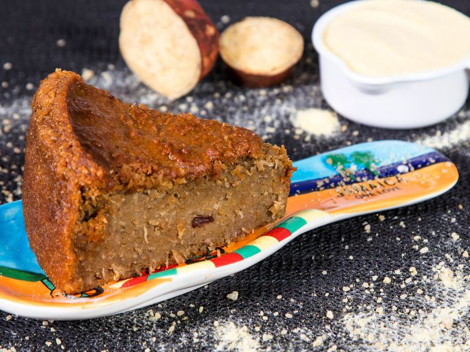

# Bajan Sweet Potato Pudding (Steamed Spiced Pudding)

*Barbados's other classical pudding (alongside cassava pone): grated orange sweet potato baked with coconut, brown sugar, raisins, warm spices and a splash of dark Bajan rum till the top forms a deep mahogany crust.*

**Serves:** 12 squares

**Prep Time:** 25 minutes

**Cook Time:** 1 hour 10 minutes

## Overview
Bajan sweet potato pudding is the orange-fleshed Caribbean cousin of cassava pone: similar baking technique, similar dense-pudding texture, but with sweet potato as the primary grated starch instead of cassava. Orange-fleshed Caribbean sweet potato finely grated on a box grater gives the pudding its deep orange-amber colour and slightly stringy-tender texture (American sweet potato substitutes). A generous splash of dark Bajan rum (Mount Gay or Cockspur are the traditional choices) brings warmth and a faint molasses-aged depth; some Bajan home cooks skip it for children's portions, but the adult version always includes it. The spice profile is the Caribbean Christmas-spice line: a generous hand of cinnamon, nutmeg, allspice and a small touch of ginger, deeper than American pumpkin pie spice. Baked in a wide tin at 170 °C for over an hour till the top forms a deep mahogany crust. Cut into hefty squares, eaten at room temperature with strong Bajan tea, or warm with thick pouring custard.

## Ingredients

### The pudding base
- 1 kg orange-fleshed sweet potato (camote / orange yam), peeled and grated coarsely
- 200 g fresh grated coconut (or 150 g unsweetened desiccated + 50 ml extra coconut milk)
- 200 g soft dark brown sugar (or muscovado)
- 100 g unsalted butter, melted
- 200 ml coconut milk (full-fat)
- 3 large eggs, lightly beaten
- 60 ml dark Bajan rum (or aged dark rum)
- 1 tablespoon vanilla extract

### The spice mix
- 2 teaspoons ground cinnamon
- 1 teaspoon freshly grated nutmeg
- 1 teaspoon ground mixed spice (or allspice)
- 1/2 teaspoon ground ginger
- 1 teaspoon salt

### The Bajan flourishes
- 1 tablespoon fresh thyme leaves
- Finely grated zest of 1 lime
- 100 g raisins
- 50 g chopped dried cherries or dried cranberries (optional)
- 50 g chopped pecans or walnuts (optional)

### For the topping
- 2 tablespoons demerara sugar
- 1 teaspoon ground cinnamon
- 2 tablespoons unsalted butter, in small dabs

### Equipment
- A 23 × 23 cm baking tin, well-buttered (or lined with parchment)

### To serve
- A cup of strong Bajan tea OR a thick pouring custard
- A small drizzle of extra rum (for the adult portion)

## Method

### Stage 1 - Prep
1. Heat the oven to 170°C (150°C fan).
2. Butter the baking tin generously (or line with parchment).
3. Peel and coarsely grate the sweet potato on a box grater (or in a food processor with a grater attachment).

### Stage 2 - Combine the wet
1. In a large mixing bowl, whisk together the melted butter, brown sugar, coconut milk, eggs, rum and vanilla.

### Stage 3 - Combine the dry and spices
1. Whisk in the spice mix (cinnamon, nutmeg, mixed spice, ginger, salt) and the grated lime zest.

### Stage 4 - Fold in the grated ingredients
1. Add the grated sweet potato and grated coconut.
2. Add the thyme leaves and raisins (and optional dried cherries and nuts).
3. Mix thoroughly with a wooden spoon till everything is uniformly combined.
4. The mixture should be thick, wet, and uniformly spiced.

### Stage 5 - Assemble
1. Tip the mixture into the prepared tin.
2. Smooth the top with a spatula.
3. Mix the demerara sugar with the 1 teaspoon cinnamon; sprinkle over the top.
4. Dot the surface with small dabs of butter.

### Stage 6 - Bake
1. Bake on the middle shelf for 65-75 minutes.
2. The pudding is done when:
   - The top is deeply mahogany-brown
   - A skewer inserted into the centre comes out with just a few moist crumbs (not wet batter)
   - The edges have pulled slightly away from the tin

### Stage 7 - Cool fully
1. Lift onto a wire rack.
2. Cool in the tin at room temperature 1 hour.
3. For the cleanest cuts, refrigerate at least 30 minutes before slicing.

### Stage 8 - Cut and serve
1. Lift the slab from the tin.
2. Cut into 12 hefty squares with a sharp knife (dip in hot water and wipe dry between cuts for sharp edges).
3. Serve at room temperature with a cup of strong Bajan tea.
4. For an adult dessert, warm slightly and drizzle a small additional splash of dark rum over each square.

## Notes
- **Orange sweet potato:** the deep-orange Caribbean variety is traditional. White-fleshed yams give a paler, drier pudding.
- **Coarse grate:** the texture matters. A coarse grate (box grater largest holes) keeps the pudding interesting; a fine grate mushes it together.
- **Rum is traditional for the adult version:** the boozy backbone is part of the Bajan identity. Children's portions can skip it.
- **Bake till deeply mahogany:** a pale crust is under-baked. The dark colour develops the deep caramelised flavour.
- **Cool fully before slicing:** warm pudding cuts messily. 1 hour minimum.
- **Improves with a day's rest:** the flavours marry overnight; the spices deepen.

## Variations
**Pudding without rum:** for children or non-drinkers - skip the rum; the dish is still excellent.
**Pudding with extra ginger (warming variant):** double the ground ginger and add 2 tablespoons of finely grated fresh ginger - the spicier variant.
**Pudding with coconut crust:** scatter 80 g additional grated coconut over the top before baking - the modern variant with extra coconut flavour.
**Chocolate sweet potato pudding:** add 100 g cocoa powder to the dry mix; reduce the spice slightly - the modern Bajan variant.
**Banana sweet potato pudding:** swap 200 g of the sweet potato for 2 mashed ripe bananas - the modern fruit variant.
**Vegan sweet potato pudding:** swap eggs for 6 tablespoons aquafaba + 3 tablespoons milled flax + 3 tablespoons water; butter for coconut oil; otherwise the recipe is essentially vegan.
**Mini sweet potato puddings (individual):** divide the batter into 12 ramekins; bake 35-40 minutes.

## Serving
At a Bajan Sunday tea (the traditional setting; alongside cassava pone or coconut bread) · at a Bajan Christmas spread · at a Bajan Independence Day buffet · at a Caribbean tea-room · at a Bajan church bake sale · at home as a make-ahead Sunday-tea pudding · paired with strong Bajan tea, mauby, hot custard, or vanilla ice cream.

## Storage
- Stores 5 days at room temperature in an airtight container.
- Refrigerates 1 week (the texture firms; bring to room temperature for the best texture).
- Freezes 3 months wrapped tight; defrost at room temperature for 2 hours.
- Improves with 1-2 days resting.
- Day-old sweet potato pudding sliced thin and pan-fried in butter till crisp on both sides is the Bajan day-after breakfast.
- The raw batter can be made up to 12 hours ahead and refrigerated; let stand at room temperature 30 minutes before baking.
