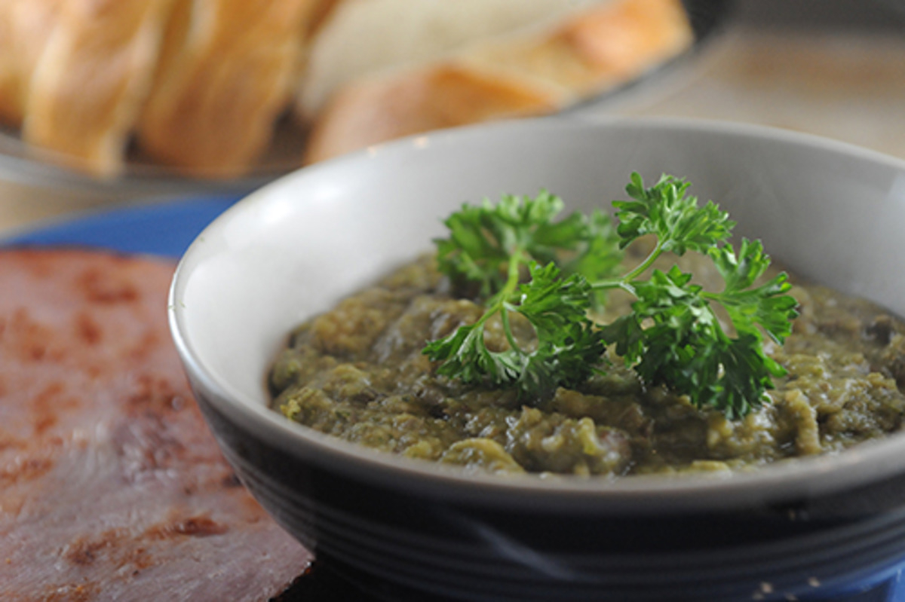

# Jug-Jug (Bajan Christmas Eve Dish)

*Barbados's traditional Christmas Eve dish: pigeon peas and Guinea corn (millet flour) simmered with salt-cured beef and pork, bonnet pepper, thyme and Bajan green seasoning into a thick coarse savoury porridge.*

**Serves:** 8

**Prep Time:** 30 minutes (plus overnight soaking the peas and salt meat)

**Cook Time:** 2 hours 30 minutes

## Overview
Jug-jug is the most identity-specifically Bajan dish in the entire cuisine, eaten almost exclusively at Christmas Eve dinner. From early December onwards, every Bajan family is preparing jug-jug; by Christmas Eve, every dinner table has a mound of it next to the baked ham or roast pork; by 27 December the leftovers are gone and the dish disappears for another eleven months. The origin is a fascinating Scottish-African-Caribbean fusion: brought by Scottish indentured workers in the 17th century as a tropical adaptation of haggis (the name is a Bajan corruption of "haggis"), the original dish of oats and offal stuffed in sheep's stomach was unworkable in tropical Barbados, so Bajan cooks substituted local pigeon peas, millet flour and salt-cured meat. Three hundred years later, it's still Christmas standard. Cooked pigeon peas, Guinea corn flour, cubed salt-cured beef and pork, Bajan green seasoning, Scotch bonnet, thyme and onion simmer together for hours until the peas collapse and the millet flour swells into a thick coarse savoury porridge. Mounded onto plates alongside baked ham or roast pork.

## Ingredients

### The salt-cured meat (traditional Bajan Christmas)
- 300 g salt-cured beef OR corned beef (the traditional Bajan "salt meat"; Carib trinity choice; can use pickled beef from a Caribbean butcher)
- 300 g salt-cured pork OR ham hock (the smoked or salted Caribbean cut)
- Cold water for soaking

### The peas
- 250 g dried pigeon peas (gungo peas / guandules), soaked overnight in cold water
- (Or 2 × 400 g cans pigeon peas, drained, the shortcut)

### The Guinea corn (millet) base
- 200 g millet flour OR Guinea corn flour (sold at Caribbean shops as "Guinea cornmeal")
- (Substitute: 100 g fine cornmeal + 100 g fine semolina, mixed)

### The aromatics
- 1 large onion, finely chopped
- 4 cloves garlic, finely chopped
- 2 stalks scallion, finely chopped (white parts)
- 4 tablespoons Bajan green seasoning
- 1 small Scotch bonnet pepper, deseeded and finely chopped
- 1 tablespoon fresh thyme leaves
- 2 bay leaves
- 1 teaspoon black pepper
- 2 tablespoons sunflower oil OR rendered pork fat (the traditional version uses pork fat)

### The liquid
- 1.5-2 litres water (or the salt-meat poaching liquid, diluted if too salty)
- Salt (taste before adding, the salt meat is salty)

### To finish
- 2 tablespoons unsalted butter
- 2 stalks scallion (green parts), sliced

### To serve (the traditional Bajan Christmas Eve plate)
- A whole baked ham OR a Bajan roast pork
- Sliced baked sweet potato OR caramelised pumpkin
- A green salad
- Bajan rum punch OR sorrel
- A slice of Bajan rum cake for dessert

## Method

### Stage 1 - Soak and prep the salt meat
1. Soak the salt-cured beef and pork overnight in cold water (changing the water once or twice) to remove excess salt.
2. Drain; rinse under cold water.
3. Place in a pot of fresh cold water with a bay leaf and a few peppercorns.
4. Bring to a gentle simmer; cook 75-90 minutes till the meat is tender (a fork goes in easily).
5. Drain (RESERVE the poaching liquid; if it's too salty, dilute with water to use as your jug-jug cooking liquid).
6. Cube the cooked salt meat into 1 cm dice.

### Stage 2 - Cook the pigeon peas (if using dried)
1. Drain the soaked pigeon peas.
2. Place in a fresh pot of cold water with a bay leaf.
3. Bring to a simmer; cook 60-75 minutes till the peas are completely tender (they should crush easily between your fingers).
4. Drain (RESERVE the cooking broth, the traditional Bajan cooking liquid for the rest of the dish).

### Stage 2 alternative - If using canned pigeon peas
1. Drain the canned peas; use 600 ml water instead of pea broth.

### Stage 3 - Sweat the aromatics
1. In a large heavy pot, heat the oil (or pork fat) over medium heat.
2. Add the chopped onion; sweat 5-6 minutes till translucent.
3. Add the chopped garlic, white parts of scallion, Bajan green seasoning, chopped Scotch bonnet, thyme leaves, bay leaves and black pepper.
4. Cook 3-4 minutes till fragrant.

### Stage 4 - Add the salt meat
1. Add the cubed cooked salt-cured beef and pork to the pot.
2. Stir to combine with the aromatics; cook 3-4 minutes.

### Stage 5 - Add the peas and liquid
1. Add the cooked pigeon peas.
2. Pour in 1 litre of the reserved pea broth (or use the diluted salt-meat broth if you prefer the deeper meaty flavour; mix and match if you have both).
3. Bring to a gentle simmer.

### Stage 6 - Mash some of the peas
1. Once simmering, use a potato masher or wooden spoon to mash about half the pigeon peas into the broth (this is what gives jug-jug its thick porridge-like body).
2. Continue simmering 8-10 minutes.

### Stage 7 - Add the millet flour
1. In a small bowl, whisk the millet flour (or cornmeal-semolina substitute) with 200 ml of cold water, this prevents lumps.
2. Slowly drizzle the slurry into the simmering pot while stirring constantly.
3. Continue cooking 20-25 minutes, stirring every 4-5 minutes, till the mixture thickens to a thick coarse porridge, a wooden spoon should stand mostly upright in it.

### Stage 8 - Adjust seasoning and finish
1. Taste; adjust salt (the salt meat is salty; you may not need any more) and pepper.
2. The texture should be a thick savoury porridge, dense, scoopable, NOT pourable.
3. If too thick, add a small amount of broth or water; if too thin, simmer 5 more minutes uncovered.
4. Stir in the cold butter to finish (gives a glossy sheen).
5. Fish out the bay leaves.

### Stage 9 - Plate
1. Spoon a generous mound onto each warm Christmas Eve plate.
2. Place 2-3 slices of baked ham or Bajan roast pork alongside.
3. Add slices of baked sweet potato and a few caramelised pumpkin chunks.
4. Garnish with sliced green scallion tops.
5. A small handful of green salad on the side.

### Stage 10 - Serve
1. Serve hot.
2. Bajan pepper sauce on the table for those who want extra heat.
3. Pair with a glass of cold Bajan rum punch or sorrel.

## Notes
- **Christmas Eve is traditional:** jug-jug is eaten almost exclusively at Christmas Eve dinner in Barbados. Eating it in March is acceptable but feels off-season to most Bajan palates.
- **Salt meat overnight-soak:** essential; without it the dish is over-salty.
- **Guinea corn flour (millet flour) is traditional:** sold at Caribbean shops. The cornmeal + semolina substitute works but lacks the slight nutty flavour of millet.
- **Mash half the peas:** the traditional Bajan move, half mashed, half whole, gives the dish its thick texture with bean character.
- **Slow simmer uncovered:** the slow reduction is what builds the deep flavour and the thick porridge texture.
- **Pigeon peas, not green peas:** the small dried Caribbean beans, not garden peas.
- **The dish is dense:** a spoonful stays mounded on the plate. If it pours, you have soup, not jug-jug.

## Variations
- **Jug-jug with chicken (modern):** for non-pork eaters, substitute chicken thighs for the salt-cured pork; same method.
- **Vegetarian jug-jug:** skip all the salt meat; use vegetable stock; double the Bajan green seasoning; add a tablespoon of smoked paprika for the smoky depth.
- **Jug-jug with okra:** add 150 g sliced okra to the pot in the last 10 minutes, the rural variant.
- **Jug-jug with corn:** add 100 g sweet corn kernels in the last 10 minutes, the modern variant.
- **Slow-cooker jug-jug:** brown the aromatics and salt meat in a pan; transfer to a slow cooker with the rest; low for 6-7 hours.
- **Pressure-cooker jug-jug:** the pigeon peas + salt meat + aromatics pressure-cook in 30 minutes; finish with the millet flour stirred in over 15 minutes simmer.
- **Smaller-batch jug-jug (4 portions):** halve all the ingredients; 1 hour cook time.

## Serving
- At a Bajan Christmas Eve dinner (the traditional setting; the dish is so locked-in to 24 December that it's effectively a Bajan Christmas symbol) · at a Bajan Christmas Day lunch · at a Bajan family Christmas-week gathering · at a Bajan church Christmas potluck · at a Bajan diaspora Christmas dinner anywhere in the world · paired with baked ham, Bajan roast pork, baked sweet potato, caramelised pumpkin, and Bajan rum punch.

## Storage
- Refrigerates 5 days; reheats well in a saucepan with a small splash of water to loosen.
- Freezes 3 months in airtight containers; defrost overnight in the fridge.
- Improves with 1-2 days resting, the flavours marry; the texture firms.
- Day-old jug-jug pan-fried in butter till crisp on the outside is the traditional Boxing Day breakfast.
- The pre-soaked salt meat keeps refrigerated 3 days before cooking.
- A "Christmas Eve cooking marathon" tradition in many Bajan households: make jug-jug on 23 December; refrigerate; reheat to serve on the 24th.
