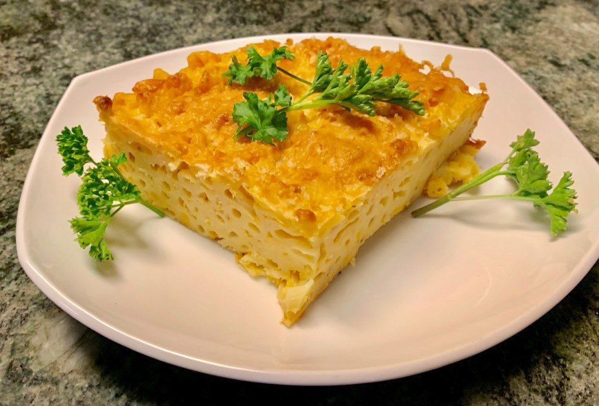

# Bajan Macaroni Pie

*Barbados's most-loved comfort food: macaroni baked in a sharp cheddar sauce with a heavy hand of mustard, Scotch bonnet and Bajan green seasoning, baked till the top forms a deeply golden crust.*

**Serves:** 8 (as a side; 6 as a substantial main with sides)

**Prep Time:** 25 minutes

**Cook Time:** 50 minutes

## Overview
Bajan macaroni pie is the Caribbean cousin of American mac-and-cheese, brighter, sharper and slightly spicier than the original, treated as a substantial side or a starring dish in its own right. The mustard is what marks it as Bajan: the cheese sauce uses both yellow prepared mustard (a heavy two or three tablespoons, not a small touch) and ground mustard powder, giving the dish that sinus-clearing sharpness. A finely chopped Scotch bonnet (or a tablespoon of Bajan pepper sauce) and two tablespoons of Bajan green seasoning blended into the cheese sauce give the herbal-aromatic-spicy edge. The pie packs firmly into a deep rectangular tin and bakes at 200 °C till the top forms a deeply golden, almost-crisp crust contrasting with the creamy interior. Sliced into hefty squares rather than scooped: the firm bake means it holds its shape on the plate. Eaten at every Bajan Sunday lunch alongside rice and peas, stew chicken and fried plantain.

## Ingredients

### The pasta
- 500 g dried elbow macaroni (or small shells; not penne or rigatoni - the small shapes are canonical)
- 1 teaspoon salt for the pasta water

### The Bajan cheese sauce
- 80 g unsalted butter
- 80 g plain flour
- 800 ml whole milk, warmed
- 200 ml evaporated milk (the Caribbean addition; gives extra richness)
- 400 g mature Caribbean-style or extra-mature cheddar, grated (plus 80 g extra for the top)
- 100 g processed cheese (optional but canonical - the orange American-style processed cheese gives the right Caribbean colour and meltability)
- 3 tablespoons prepared yellow mustard (French's or a Caribbean equivalent; NOT Dijon)
- 1 teaspoon dry mustard powder (Coleman's English mustard powder)
- 2 tablespoons Bajan green seasoning (see [Cou-cou and flying fish](cou-cou-and-flying-fish.md))
- 1 small Scotch bonnet pepper, very finely chopped (or 1 tablespoon Bajan pepper sauce)
- 1 small onion, finely chopped
- 1 small green bell pepper, finely chopped
- 1/4 teaspoon ground nutmeg
- 2 large eggs, lightly beaten (for binding; canonical Bajan)
- Salt and white pepper to taste

### The topping
- 80 g grated mature cheddar
- 2 tablespoons unsalted butter, in small dabs

### Equipment
- A deep rectangular ovenproof dish (about 25 × 30 cm, at least 6 cm deep) OR a 23 cm square deep tin

### To serve
- Goes alongside Bajan stew chicken, fried chicken, rice and peas, fried plantain.
- Cold Banks lager OR a glass of sorrel or mauby.

## Method

### Stage 1 - Cook the macaroni
1. Bring a large pot of salted water to a rolling boil.
2. Add the macaroni; cook 2 minutes LESS than the package directions (the macaroni finishes cooking in the oven).
3. Drain in a colander.
4. Rinse briefly under cold water to stop the cooking; drain thoroughly.

### Stage 2 - Sweat the onion and pepper
1. In a small frying pan, melt 1 tablespoon of butter over medium heat.
2. Add the chopped onion and green pepper; sweat 4-5 minutes till softened.
3. Add the chopped Scotch bonnet (or pepper sauce); cook 30 seconds.
4. Set aside.

### Stage 3 - Make the cheese sauce
1. In a large heavy saucepan, melt the 80 g butter over medium heat.
2. Whisk in the flour; cook 2-3 minutes, stirring, to make a pale roux.
3. Slowly whisk in the warm milk, then the evaporated milk, in a steady stream.
4. Cook 5-6 minutes, whisking, till the sauce thickens to the consistency of pouring custard.
5. Reduce heat to low.
6. Whisk in the grated cheddar (and the processed cheese if using) in 3 batches, stirring after each till fully melted.
7. Stir in the prepared mustard, dry mustard powder, Bajan green seasoning, the sweated onion-pepper mix, and the grated nutmeg.
8. Taste; adjust salt and pepper. The sauce should be assertively flavoured - sharp, herbal, peppery.

### Stage 4 - Temper the eggs in (the binding move)
1. Take the sauce OFF the heat.
2. Slowly whisk a ladleful of the warm sauce into the beaten eggs (tempers them to prevent scrambling).
3. Pour the tempered egg mixture back into the sauce, whisking constantly.
4. Return the sauce to the lowest heat for 1-2 minutes, stirring; don't let it boil (the eggs scramble at full boil).

### Stage 5 - Combine
1. Tip the drained macaroni into the cheese sauce.
2. Fold thoroughly so every piece is coated.

### Stage 6 - Bake
1. Heat the oven to 200°C (180°C fan).
2. Butter the ovenproof dish.
3. Tip the macaroni-and-cheese mixture into the dish; press down with the back of a spoon to compact.
4. Scatter the 80 g extra grated cheddar over the top.
5. Dot the surface with small dabs of butter.
6. Bake on the middle shelf 40-50 minutes till the top is deeply golden brown (not just pale) and the filling is bubbling at the edges.
7. If the top isn't golden enough at 40 minutes, give it 3-4 minutes under a hot grill.

### Stage 7 - Rest and cut
1. Lift onto a wire rack; rest 10 minutes (the filling sets, allowing clean cuts).
2. Cut into hefty squares (8 squares for a 25 × 30 cm tin).

### Stage 8 - Serve
1. Lift onto warm plates with a spatula (the squares hold their shape).
2. Serve alongside stew chicken, rice and peas, and fried plantain - the canonical Bajan Sunday lunch.
3. Bajan pepper sauce on the table for extra heat.

## Notes
- **Heavy mustard hand:** 3 tablespoons of prepared mustard + 1 teaspoon dry mustard powder. This is the Bajan signature. Don't substitute Dijon (too sharp; wrong colour).
- **Scotch bonnet pepper:** the heat is part of the dish. If you really can't handle it, use 1/2 teaspoon Bajan pepper sauce instead.
- **Processed cheese is optional but canonical:** the Bajan home version often uses a block of orange-coloured processed cheese (like Velveeta) alongside the cheddar. Pure cheddar works but the colour and meltability suffer.
- **Egg binding:** the eggs give the firm sliceable texture that distinguishes macaroni pie from American mac-and-cheese.
- **Bake till deeply golden:** a pale crust is a Bajan mac-and-cheese fail. Aim for the colour of a deep tan.
- **Compact the macaroni in the tin:** firm packing gives clean square cuts.

## Variations
**Tuna macaroni pie:** add 1 large tin of drained tuna to the sauce - the Bajan lunchbox variant.
**Vegetarian Bajan macaroni pie:** skip any meat; use vegetable stock in place of any meat-based ingredient; the heat and mustard make it work.
**Macaroni pie with bacon:** scatter 200 g crisp bacon lardons over the top before baking.
**Spicy macaroni pie:** double the Scotch bonnet - for the heat-lovers.
**Bajan macaroni pie loaf (the Sunday-school cake):** bake in a loaf tin and slice; the canonical Sunday-school food at Bajan church gatherings.
**Macaroni pie with breadcrumb topping:** scatter 60 g panko + 30 g extra cheddar + 1 tablespoon butter over the top before baking - extra crunch.
**Cream macaroni pie:** swap 200 ml of the whole milk for 200 ml double cream - the richer wedding-day variant.

## Serving
At a Bajan Sunday lunch (the canonical setting; cut into hefty squares; piled alongside stew chicken and rice and peas) · at a Bajan Independence Day celebration · at a Bajan church potluck · at a Bajan birthday party · at a Bajan funeral wake · at home as a Bajan-themed dinner-party side · paired with stew chicken, fried chicken, rice and peas.

## Storage
- Refrigerates 4 days; reheats well covered in a 180°C oven for 20 minutes.
- Freezes 3 months baked; defrost overnight in the fridge before reheating.
- The egg binding means the squares hold up well to reheating - texture is excellent on day 2 and 3.
- Don't microwave - the texture goes rubbery.
- Day-old macaroni pie pan-fried in butter till crisp on both sides is the Bajan day-after breakfast.
- The cheese sauce on its own keeps refrigerated 3 days; useful as a dip or a quick weeknight cheesy-pasta base.
