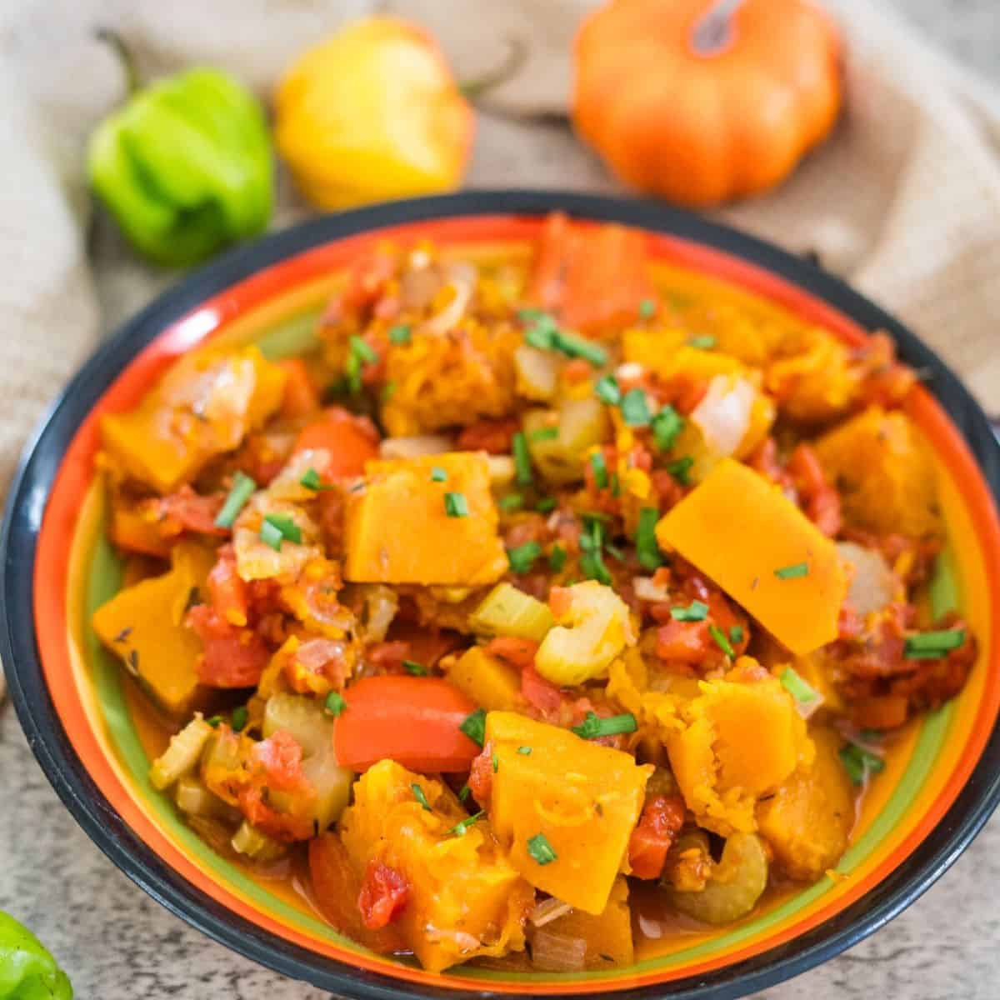

# Bajan Caramelised Pumpkin

*Barbados's silky-sweet vegetable side: chunks of Caribbean pumpkin cooked down with butter, brown sugar, ginger, thyme and coconut milk into a glossy caramelised mash.*

**Serves:** 6 (as a side)

**Prep Time:** 15 minutes

**Cook Time:** 35 minutes

## Overview
Bajan caramelised pumpkin is a deceptively simple side that delivers a lot of flavour. Caribbean calabaza pumpkin (the green-skinned, orange-fleshed Caribbean squash) is the traditional choice; butternut squash is the standard substitute outside the Caribbean, with similar deep-orange flesh and sweetness. The pumpkin cubes into 3 cm chunks (thinner pieces collapse to mush before caramelising) and browns hard in butter first to develop the caramelised colour and sweet-savoury depth. Then a splash of coconut milk, brown sugar and spice go in to braise the rest of the way. The Bajan signatures are what set this apart: fresh thyme, finely grated ginger, a fragment of finely chopped Scotch bonnet for warmth (not heat) and a small dash of soy sauce for umami depth. The finished dish becomes a thick almost-jammy mash that holds its shape on the plate. The sweet-savoury counterpoint to Bajan stew chicken, fried fish or a Sunday roast.

## Ingredients

### The pumpkin
- 1 kg Caribbean calabaza pumpkin OR butternut squash, peeled, deseeded, cubed into 3 cm chunks
- 2 tablespoons unsalted butter
- 1 tablespoon sunflower oil

### The aromatics
- 1 small onion, finely chopped
- 4 cloves garlic, finely chopped
- 1 tablespoon fresh ginger, finely grated
- 1 small Scotch bonnet OR habanero pepper, deseeded and very finely chopped (or 1 teaspoon Bajan pepper sauce)

### The braising / caramelisation
- 3 tablespoons soft dark brown sugar (or muscovado)
- 200 ml coconut milk (full-fat)
- 1 tablespoon dark soy sauce (the Bajan secret)
- 1 tablespoon fresh thyme leaves (or 1 teaspoon dried)
- 1/4 teaspoon ground allspice
- 1/4 teaspoon ground cinnamon
- 1/2 teaspoon salt
- 1/2 teaspoon black pepper

### To finish
- 1 tablespoon fresh lime juice
- 2 stalks scallion, sliced thin (green parts)
- A small grating of fresh nutmeg

### To serve
- Goes alongside Bajan stew chicken, fried fish, Sunday roast pork, grilled chicken, or any Bajan main.

## Method

### Stage 1 - Brown the pumpkin chunks
1. Heat the butter and oil in a wide heavy pan over medium-high heat.
2. Add the pumpkin chunks in a single layer.
3. DO NOT MOVE for 3-4 minutes per side (let the traditional caramelised crust form).
4. Brown the pumpkin on at least 3 sides (or all 6 if you have the patience) - 8-10 minutes total.
5. The pumpkin should have deep brown caramelised faces; the inside is still firm.

### Stage 2 - Add the aromatics
1. Reduce heat to medium.
2. Push the pumpkin to one side of the pan.
3. Add the chopped onion to the empty side; sweat 4 minutes.
4. Add the chopped garlic, grated ginger, and chopped Scotch bonnet; cook 1 minute.

### Stage 3 - Add the braising liquid
1. Sprinkle the brown sugar over everything.
2. Pour in the coconut milk and soy sauce.
3. Add the thyme, allspice, cinnamon, salt and pepper.
4. Stir to combine.

### Stage 4 - Slow braise
1. Reduce heat to low; cover loosely.
2. Cook 15-20 minutes, stirring gently every few minutes, till the pumpkin is meltingly tender (a fork goes in easily) and the liquid has reduced to a thick glossy sauce coating the pumpkin.
3. Some pumpkin chunks will have broken down into the sauce; some should still hold their shape.

### Stage 5 - Finish
1. Stir in the lime juice (brightens the sweet flavours).
2. Sprinkle with sliced scallion tops and a small grating of fresh nutmeg.
3. Taste; adjust salt or sugar.

### Stage 6 - Serve
1. Spoon onto warm plates alongside the main.
2. The texture should be a soft, slightly chunky mash with a glossy caramelised sauce.
3. Serve hot.

## Notes
- **Brown the pumpkin hard:** 3-4 minutes per side. The caramelised crust is half the flavour.
- **3 cm chunks:** big enough not to mush; small enough to cook through.
- **Coconut milk and soy sauce:** the Caribbean and umami combination that makes this Bajan rather than plain roasted pumpkin.
- **Scotch bonnet for warmth not heat:** a small finely chopped piece (deseeded) gives a warming fruitiness without aggressive spice.
- **Don't over-braise:** the pumpkin should still hold some shape. A 25-30 minute braise mushes it completely.

## Variations
**Caramelised pumpkin with raisins and ginger:** add 60 g raisins to the braise; double the ginger - the festive variant.
**Pumpkin with toasted coconut:** scatter 30 g toasted coconut shavings over the finished dish - the Caribbean crunch variant.
**Pumpkin with crisp bacon:** scatter 100 g crisp bacon lardons over the finished pumpkin - the heartier variant.
**Roasted pumpkin (alternative method):** spread the cubed pumpkin on a tray; toss with butter, sugar and spices; roast at 200°C for 35-40 minutes till caramelised - less hands-on, similar result.
**Mashed pumpkin:** continue cooking till the pumpkin is fully soft; mash to a smooth purée - the side-dish-as-vegetable-mash version.
**Coconut pumpkin curry:** triple the coconut milk; add 1 tablespoon Caribbean curry powder; serve as a vegetarian main with rice.
**Sweet potato variant:** swap pumpkin for sweet potato; same method.
**Spicy pumpkin:** double the Scotch bonnet and add a teaspoon of cayenne - the heat-lovers' variant.

## Serving
At a Bajan Sunday lunch (the traditional setting; alongside stew chicken and rice and peas) · at a Bajan Thanksgiving / Independence Day celebration · at a Bajan Christmas dinner · at a Caribbean barbecue · at home as the traditional Bajan vegetable side · paired with stew chicken, fried fish, or jerk chicken.

## Storage
- Refrigerates 4 days; reheats well in a covered pan with a splash of coconut milk or water.
- Freezes 3 months in airtight containers; defrost overnight in the fridge.
- The flavours marry overnight; day-2 caramelised pumpkin is often better than fresh.
- Leftover pumpkin mashed completely and spread on toast with a sprinkle of cinnamon is a sweet Bajan breakfast.
- Day-old caramelised pumpkin stirred into a coconut curry sauce makes a vegetable curry for the day after.
