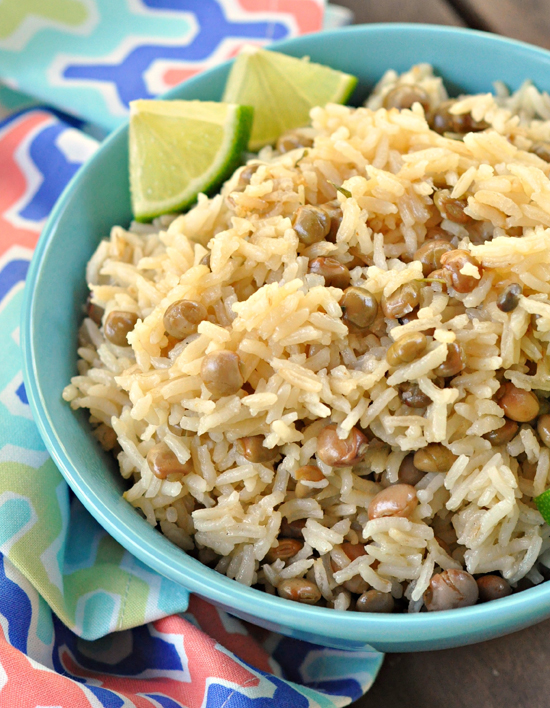

# Bajan Rice and Peas

*Barbados's canonical side: long-grain rice cooked in coconut milk with pigeon peas, an onion, a clove of garlic, fresh thyme and a generous whole Scotch bonnet pepper (kept whole - flavour without aggressive heat). The rice absorbs the coconut milk and a small amount of the pigeon-pea broth as it steams; the canonical Sunday-lunch side that goes with stew chicken, Bajan fried chicken, fish, or anything else on the plate. Despite the name, the "peas" are actually pigeon peas (gungo peas in Jamaica) - small dried beans, not garden peas.*

**Serves:** 6 (as a side)

**Prep Time:** 15 minutes (plus overnight soaking the peas, or use canned)

**Cook Time:** 35 minutes

## Overview
Bajan rice and peas (called "rice and peas" across the English Caribbean) is the canonical Sunday-lunch starch. Three things make it identity-Bajan rather than generic Caribbean. First, the pigeon peas: dried pigeon peas (Cajanus cajan; called "gungo peas" in Jamaica, "guandules" in Spanish-speaking Caribbean) are the canonical bean - small, slightly bitter, deeply aromatic. They're soaked overnight, then boiled with onion, garlic and bay till tender (or use canned pigeon peas as a shortcut). Second, the coconut milk: the rice cooks in a mix of coconut milk + pigeon-pea cooking broth (or water). The coconut milk is what gives the rice its slight sweet richness; without it, you've made plain rice. Some Bajan home cooks use full-fat coconut milk for richness; others use a thinner version. Third, the whole Scotch bonnet: a whole intact Scotch bonnet (uncut, just dropped in) goes into the pot for the rice's cooking. The whole pepper gives flavour and aroma but minimal heat (the heat is in the chopped seeds and ribs); if you want more heat, prick the pepper a few times with a fork; if you want less, leave intact. Fish out the pepper before serving (some Bajan diners eat the pepper if they're brave). Eaten alongside stew chicken, Bajan fried chicken, cou-cou (instead of cornmeal cou-cou - rice and peas is the Sunday version), or with any Bajan main. Three details: USE PIGEON PEAS NOT GARDEN PEAS (gungo peas / pigeon peas / guandules - small slightly bitter Caribbean beans; never substitute green peas), COCONUT MILK IS NON-NEGOTIABLE (without it, this is plain rice; with it, it's rice and peas), and WHOLE SCOTCH BONNET KEPT INTACT (flavour without aggressive heat; remove before serving).

## Ingredients

### The peas (pick one)
- 200 g dried pigeon peas (gungo peas), soaked overnight in cold water
- OR 1 × 400 g can pigeon peas, drained (saves the overnight soak)

### The base
- 1 large onion, finely chopped
- 4 cloves garlic, finely chopped
- 1 small bunch fresh thyme, leaves picked (or 1 teaspoon dried)
- 2 bay leaves
- 2 stalks scallion (spring onion), white parts chopped, green parts reserved
- 2 tablespoons sunflower oil OR coconut oil

### The rice and liquid
- 400 g long-grain white rice (jasmine, basmati, or Caribbean long-grain)
- 400 ml full-fat coconut milk
- 400 ml pigeon-pea cooking broth (from the pea pot; or water if using canned peas)
- 1 whole Scotch bonnet OR habanero pepper (intact, NOT chopped)
- 1.5 teaspoons salt
- 1/2 teaspoon black pepper

### Optional flourishes
- 1 tablespoon dried thyme
- 1/4 teaspoon allspice
- 60 g salt pork or smoked bacon lardons (for the rich pork-flavoured variant)

### To finish
- Sliced green scallion tops (from above)
- A small grating of fresh black pepper

## Method

### Stage 1 - Cook the dried peas (if using dried)
1. Drain the soaked pigeon peas; place in a small pot.
2. Cover with cold water by 5 cm; add a bay leaf and 1 teaspoon salt.
3. Bring to a simmer; cook 60-75 minutes till tender (test by squeezing a pea - should yield to gentle pressure).
4. Drain (RESERVE the cooking broth - this is what cooks the rice).
5. You should have about 200 g cooked peas + 400 ml broth.

### Stage 1 alternative - If using canned peas
1. Drain the canned peas in a colander; rinse lightly under cold water.
2. Use 400 ml water (instead of the pea-cooking broth) in the rice stage.

### Stage 2 - Sweat the aromatics
1. In a heavy pot with a tight-fitting lid, heat the oil over medium heat.
2. Add the chopped onion; sweat 5 minutes till translucent.
3. Add the chopped garlic and scallion whites; cook 1-2 minutes.
4. Stir in the thyme leaves, bay leaves, and (optional) allspice.
5. If using salt pork or bacon: add now; cook 3-4 minutes to render the fat.

### Stage 3 - Add the rice
1. Add the rice to the pot.
2. Stir to coat the grains in the aromatics for 1-2 minutes.

### Stage 4 - Add the liquid and peas
1. Pour in the coconut milk and the reserved pea-cooking broth (or water).
2. Add the salt and pepper.
3. Drop the whole intact Scotch bonnet pepper on top.
4. Add the cooked pigeon peas; stir gently.

### Stage 5 - Cook the rice
1. Bring to a gentle boil.
2. Reduce to the lowest possible heat.
3. Cover with a tight lid.
4. Cook 18-22 minutes till the rice has absorbed all the liquid (check by tilting the pot - no liquid should pool).
5. Don't lift the lid before 18 minutes - the steam needs to cook the rice fully.

### Stage 6 - Rest and fluff
1. Take the pot off the heat (don't remove the lid).
2. Let rest 10 minutes (the rice finishes steaming).
3. Lift the lid.
4. Fish out the whole Scotch bonnet pepper (discard, or eat if brave).
5. Fluff the rice with a fork.
6. Scatter the chopped green scallion tops over.

### Stage 7 - Serve
1. Spoon onto warm plates alongside Bajan stew chicken, Bajan fried chicken, or any Bajan main.
2. The rice should be fluffy, slightly sticky from the coconut milk, with the peas distributed evenly through.

## Notes
- **Pigeon peas, not garden peas:** the small dried beans, not green peas. Find at any Caribbean shop; canned ones are the workable shortcut.
- **Coconut milk is essential:** without it, you've made plain rice. With it, you've made Caribbean rice and peas.
- **Whole intact Scotch bonnet:** flavour without aggressive heat. If you prick it with a fork, you get more heat. If you cut it, you get a LOT of heat.
- **Don't lift the lid:** the steam needs to cook the rice. 18-22 minutes covered, then 10 minutes resting off the heat.
- **Canned pigeon peas work:** the canonical Bajan home version often uses canned for speed; the dried-and-soaked version has slightly better flavour.

## Variations
**Rice and peas with salt pork:** add 100 g diced salt pork to the sweated onion - the rich Bajan variant.
**Vegan rice and peas:** the recipe is already vegan (without the optional salt pork).
**Brown rice and peas:** swap white rice for brown rice; cook 35-40 minutes instead of 18-22; more nutritious.
**Rice and peas with thyme broth:** make a strong thyme-and-bay broth for the rice; more aromatic.
**Rice and red beans (rice and beans Cuban-style):** swap pigeon peas for red kidney beans - the Cuban variant.
**Festive rice and peas:** add 100 g raisins and 50 g toasted coconut shavings - the wedding-day variant.
**Crab rice and peas (Bajan coastal variant):** add cooked crab meat in the last 5 minutes - the seafood variant.

## Serving
At a Bajan Sunday lunch (the canonical setting; rice and peas is the canonical starch on the Sunday plate) · at a Bajan Independence Day (30 November) celebration · at a Bajan rum-shop · at a Caribbean food festival · at home as the Caribbean-themed side · paired with stew chicken, Bajan fried chicken, oxtail, or jerk chicken.

## Storage
- Refrigerates 4 days. Reheats well in a covered pan with a splash of water.
- Freezes 3 months in airtight containers.
- The cooked dried peas (alone) refrigerate 5 days and freeze 3 months.
- Day-old rice and peas pan-fried in butter with an egg on top is the Bajan day-after breakfast hack.
- The peas-cooking broth on its own is a useful base for soup; freeze in portions.
