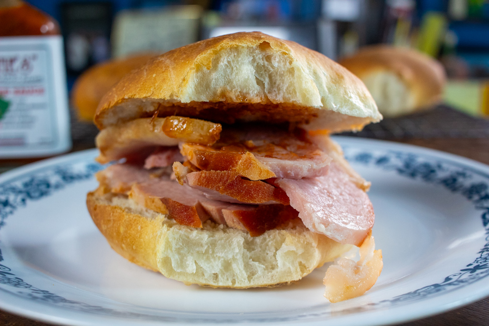

# Bajan Cutter (The Salt-Bread Sandwich)

*Barbados's identity-defining street sandwich: a soft Bajan salt-bread roll slathered with pepper sauce or mustard, stuffed with fish cake, fried flying fish, ham or salt beef.*

**Serves:** 4 cutters

**Prep Time:** 15 minutes (excluding bread-baking if making from scratch)

**Cook Time:** 5 minutes (for warming the rolls and assembling)

## Overview
The Bajan cutter is THE Bajan sandwich, so identity-defining that "let's get a cutter" is a Bajan idiom for going to lunch. The name comes from "cutting" the bread open. The bread is Bajan salt-bread: a small, dense, slightly sweet white roll about 10-12 cm across, similar in spirit to a Portuguese padarão or a small bap. Not a hot-dog bun, not a kaiser roll: salt-bread, baked at every Bajan bakery, is what makes the sandwich a cutter. The fillings are three traditional Bajan options: the fish cutter (saltfish fritter or fried flying fish), the ham cutter (a thick slice of Bajan ham, sometimes with cheese) or the beef cutter (cold Bajan corned beef). The slather is Bajan pepper sauce or yellow mustard, never mayo (which is the modern American-influenced version, not the purist Bajan one). Eat at the rum-shop counter, on the beach in a paper napkin, on the workman's lunch break. The traditional Bajan portable lunch.

## Ingredients

### The bread (per cutter)
- 4 fresh Bajan salt-bread rolls OR small soft white bread rolls (about 10-12 cm diameter; lightly sweet enriched white bread)
- (Or make Bajan salt-bread from scratch - see Variations)

### Filling Option 1 - Fish cutter (the traditional Bajan)
- 4 fresh Bajan fish cakes (see [Bajan Fish Cakes](bajan-fish-cakes.md)) - 2 per cutter
- OR 4 small fried flying fish fillets
- OR 4 small pieces of breaded fried fish (cod, haddock, or any white fish)

### Filling Option 2 - Ham cutter
- 4 slices Bajan cooked ham (or any good thick-cut cooked ham; about 80 g per slice)
- 4 slices mature Bajan cheddar OR a Bajan-style processed cheese (optional)

### Filling Option 3 - Beef cutter
- 200 g cooked Bajan corned beef OR thinly sliced cold roast beef
- (The salt-cured Bajan beef is traditional; cold roast beef is the home-cook substitute)

### Filling Option 4 - Egg cutter (modern)
- 4 large eggs, fried (over-easy)
- A pinch of salt and pepper per egg

### Filling Option 5 - Tuna cutter (modern American-influenced)
- 1 large tin tuna in olive oil, drained and flaked
- 4 tablespoons mayonnaise
- 1 small finely chopped onion
- 1 stalk scallion, sliced
- 1 tablespoon Bajan pepper sauce

### The condiments (essential)
- 4 teaspoons Bajan pepper sauce (Scotch bonnet hot sauce; Susie's or Wendy's are traditional Bajan brands)
- 2 tablespoons prepared yellow mustard
- Optional: 2 tablespoons mayonnaise (modern variant; controversial among purists)

### Optional additions
- 8 slices of fresh tomato
- A small handful of shredded iceberg lettuce
- 8 slices of cucumber

### To serve
- A small dish of extra pepper sauce
- A cold Banks lager OR a Bajan rum punch
- A handful of plantain chips on the side

## Method

### Stage 1 - Prep the filling
1. **For fish cutter:** prepare the [Bajan fish cakes](bajan-fish-cakes.md) just before serving (they should be hot when assembled).
2. **For ham cutter:** slice the ham; if cold from the fridge, let it come to room temperature.
3. **For beef cutter:** slice the corned beef thinly.
4. **For egg cutter:** fry the eggs to order just before serving.
5. **For tuna cutter:** mix the tuna with mayo, onion, scallion and pepper sauce.

### Stage 2 - Warm the rolls (briefly)
1. Place the salt-bread rolls in a low oven (150°C) for 3 minutes to warm slightly.
2. (Don't toast or crisp; the traditional Bajan cutter uses soft warm bread, not toasted.)

### Stage 3 - Slice the rolls
1. With a serrated knife, slice each roll horizontally about 2/3 of the way through (a hinge cut - one side stays joined).
2. Open the roll.

### Stage 4 - Slather the condiments
1. Spread 1 teaspoon of Bajan pepper sauce on the bottom half of each roll.
2. Spread 1/2 tablespoon of mustard on the top half.
3. (Optional: add a small smear of mayo on the bottom for the modern variant.)

### Stage 5 - Fill the cutter
**For a fish cutter:** place 2 hot fish cakes on the bottom half of each roll.
**For a ham cutter:** lay a slice of ham (and a slice of cheese if using) folded loosely into the roll.
**For a beef cutter:** pile a generous portion of sliced corned beef into the roll.
**For an egg cutter:** lay a freshly fried egg into the roll (yolk facing the diner).
**For a tuna cutter:** spoon a generous portion of the tuna mix into the roll.

### Stage 6 - Optional additions
1. Add a couple of slices of fresh tomato.
2. Add a small handful of shredded lettuce.
3. (The optional vegetables are modern; the purist Bajan cutter is filling + condiment only.)

### Stage 7 - Close and serve
1. Close the roll (the hinge cut means it stays held together).
2. Wrap each cutter in a paper napkin or a small piece of grease-proof paper.
3. Serve immediately.
4. Eat with the hands; one cutter is about 4-5 bites.

## Notes
- **The bread is the most important variable:** a soft, slightly sweet small white roll is the traditional Bajan choice. Day-old bread ruins the sandwich.
- **Bajan pepper sauce, not just hot sauce:** the traditional Bajan Scotch bonnet sauce. Tabasco or generic American hot sauce gives a different flavour.
- **Eat fresh:** the cutter is assembled and eaten within 15 minutes. Pre-made cutters go soggy from the wet fillings.
- **Mayo is modern, not traditional:** the purist Bajan cutter uses pepper sauce + mustard only. Mayo is an American-influenced addition.
- **Hot filling, cold bread:** the traditional Bajan way - the bread is warm-but-not-toasted; the filling is fresh-hot (fish cakes) or room-temperature (ham/beef/tuna).
- **One cutter per person is a snack; two is a lunch:** the typical Bajan workman's lunch is 2-3 cutters.

## Variations
**Salt-bread cutter (the bread on its own):** for a no-filling option - just hot salt-bread with butter; the traditional Bajan tea-time bread.
**Bajan flying-fish cutter:** a small fried flying fish fillet in the roll instead of fish cakes - the Oistins fish fry version.
**Salt-bread breakfast cutter:** fried egg + sliced cheese + a slice of Bajan ham - the breakfast variant.
**Loaf-bread cutter (alternative):** if you can't find rolls, use slices from a fresh Bajan loaf - less authentic but works.
**Pholourie cutter (Indo-Caribbean fusion):** swap the fish cake for 2 Trinidadian pholourie split-pea fritters - the modern Caribbean variant.
**Chicken cutter:** swap any filling for thin slices of Bajan stew chicken or fried chicken - the popular variant for kids.
**Vegan cutter:** swap meat fillings for grilled vegetables (mushroom, courgette, sweet pepper) + Bajan pepper sauce.

## Serving
At a Bajan rum-shop (the traditional setting; sold by the dozen) · at a Bajan beach snack stand · at the Oistins Friday-night fish fry · at a Bajan working-day lunch from a corner shop · at a Bajan church social · at a Bajan family lunch · at home as a quick afternoon snack · paired with cold Banks lager, Bajan rum punch, or a glass of cold mauby.

## Storage
- Cutters are assembled fresh; don't refrigerate assembled cutters (the bread goes soggy).
- The bread (separately) keeps 24 hours at room temperature in a sealed bag.
- The Bajan pepper sauce keeps refrigerated 6 months (commercially sold); homemade Bajan pepper sauce keeps refrigerated 2 weeks.
- The fish cakes (if making the fish cutter) refrigerate 3 days; reheat in a hot oven for 6 minutes.
- The cooked ham keeps refrigerated 5-7 days.
- The corned beef keeps refrigerated 1 week.
- A typical Bajan home keeps the components ready to assemble fresh cutters on demand.
