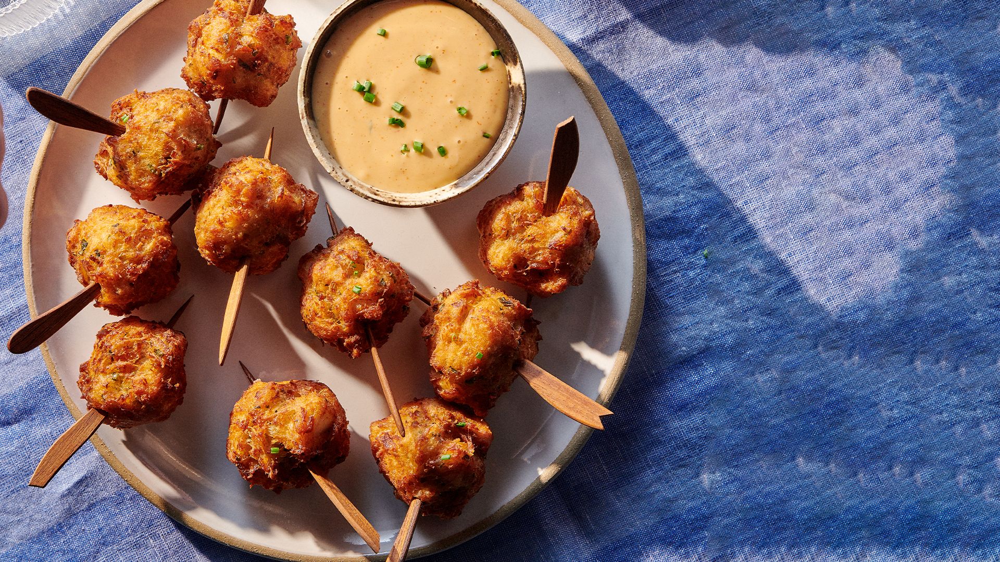

# Bajan Fish Cakes (Saltfish Fritters)

*Barbados's most-eaten snack: small fritters of soaked-and-flaked salt cod in a Bajan-spiced batter, dropped by the tablespoon into hot oil and fried till deep golden and slightly puffed.*

**Serves:** 24 small fish cakes (about 6 per person × 4)

**Prep Time:** 30 minutes (plus overnight saltfish soaking)

**Cook Time:** 15 minutes

## Overview
Bajan fish cakes are the Caribbean answer to fritters: small, rough-textured, deeply seasoned, fried golden. Sold from every Bajan rum-shop, beach vendor and lunch counter, eaten by the dozen at the Oistins Friday-night fish fry. The saltfish (dried salted cod) is the traditional Caribbean fish here, soaked overnight in cold water with a few changes to remove the heavy salt, boiled briefly to soften, then flaked into thin shreds with the fingers. The deeply savoury slightly chewy character is what gives the fritters their backbone. The batter is flour and baking powder mixed with finely chopped onion, scallion, thyme, Scotch bonnet, Bajan green seasoning and black pepper, thick enough to scoop with a spoon but loose enough to spread slightly in the oil. Fried at 175 °C in small tablespoon-portions till deep golden and slightly puffed. Eat piping hot with a small dish of Bajan pepper sauce or a wedge of lime, alongside cold beer or a Bajan rum punch.

## Ingredients

### The saltfish
- 250 g dried salted cod (saltfish)
- Cold water for soaking
- A small pot for boiling

### The batter
- 250 g plain flour
- 1 tablespoon baking powder
- 1 teaspoon salt (taste first, the saltfish is still salty)
- 1/2 teaspoon black pepper
- 1 large egg
- 250 ml water (cold)
- 1 medium onion, finely chopped
- 4 stalks scallion, finely chopped
- 4 cloves garlic, finely chopped
- 2 tablespoons fresh thyme leaves
- 1 small bunch flat-leaf parsley, finely chopped
- 2 tablespoons Bajan green seasoning
- 1 small Scotch bonnet pepper, deseeded and finely chopped
- 1 tablespoon yellow mustard
- 1 tablespoon Bajan pepper sauce (optional)

### For frying
- 1 litre sunflower or groundnut oil

### To serve
- Bajan pepper sauce (Scotch bonnet hot sauce)
- Lime wedges
- A small bowl of homemade tartar sauce (optional; modern variant)
- A cold Banks lager OR a Bajan rum punch

## Method

### Stage 1 - Soak the saltfish (overnight)
1. Place the dried salted cod in a large bowl.
2. Cover with cold water.
3. Refrigerate overnight (8-12 hours).
4. Change the water once or twice during the soak to remove more salt.

### Stage 2 - Boil and flake the saltfish
1. Drain the soaked saltfish.
2. Place in a small pot of fresh cold water.
3. Bring to a gentle simmer; cook 8-10 minutes till the fish flakes easily.
4. Drain; let cool slightly.
5. With clean fingers, flake the fish into thin shreds.
6. Pick out any bones, skin and tough bits.
7. You should have about 180-200 g flaked fish.

### Stage 3 - Make the batter
1. In a large bowl, whisk together the flour, baking powder, black pepper.
2. Add the egg and the water; whisk into a smooth thick batter (the consistency of pancake batter).
3. Add the chopped onion, scallion, garlic, thyme, parsley, Bajan green seasoning, chopped Scotch bonnet, mustard and (optional) Bajan pepper sauce.
4. Stir to combine.
5. Add the flaked saltfish; fold in gently.
6. Taste; adjust seasoning. The batter should be assertively flavoured but you may not need more salt (the saltfish contributes).
7. Let the batter rest 10-15 minutes (allows the baking powder to start activating).

### Stage 4 - Heat the oil
1. Heat the oil to 175°C in a deep heavy pot or wide deep frying pan.
2. The oil should be 5-6 cm deep.

### Stage 5 - Fry the fish cakes
1. Working in batches of 6-8, drop scant tablespoonfuls of batter into the hot oil.
2. The batter will spread slightly and puff up.
3. Fry 2-3 minutes per side till deep golden brown all over.
4. Don't overcrowd, reduces the oil temperature.
5. Lift out with a slotted spoon; drain briefly on kitchen paper.

### Stage 6 - Serve immediately
1. Pile the hot fish cakes on a warm platter.
2. Serve with lime wedges, a small dish of Bajan pepper sauce and (optional) tartar sauce.
3. A cold Banks lager or a Bajan rum punch alongside.

## Notes
- **Overnight saltfish soak:** non-negotiable; otherwise the cakes are over-salty.
- **Flake the fish finely:** thin shreds give the traditional texture; chunks are wrong.
- **175°C oil:** lower and the cakes soak fat; higher and the outside burns.
- **Scotch bonnet pepper:** part of the Bajan profile. If you can't handle it, use 1 teaspoon of mild Bajan pepper sauce.
- **Eat hot:** fish cakes are at their peak for 15 minutes. After 30 minutes the texture firms.
- **Don't pre-batter and rest more than 30 minutes:** the saltfish keeps releasing water; the batter goes soggy.

## Variations
- **Vegetarian "fish" cakes:** swap the saltfish for chopped hearts of palm or finely flaked king-oyster mushrooms; same spice profile.
- **Spicy fish cakes:** double the Scotch bonnet pepper.
- **Cassava-flour fish cakes (gluten-free):** swap the plain flour for cassava flour, lighter, slightly crisper.
- **Codfish fritters with mango chutney:** serve with a homemade mango chutney instead of pepper sauce, the modern variant.
- **Cornmeal fish cakes:** add 50 g cornmeal to the flour mix, the textural variant.
- **Pholourie-style (Trinidadian cousin):** use a yellow split-pea batter instead of saltfish; same frying technique, the Trinidadian cousin.
- **Mini fish cakes (canapé):** make tablespoon-sized; serve with a dipping sauce, canapé-friendly.
- **Air-fryer fish cakes:** spray with oil; air-fry at 200°C for 12-15 minutes; less crisp but lighter.

## Serving
- At a Bajan rum-shop (the traditional setting; sold by the dozen) · at the Oistins Friday-night fish fry · at a Bajan beach picnic · at a Bajan reception or wedding · at a Bajan Independence Day celebration · at a Bajan church potluck · at home as a Saturday-night drinks-and-snacks plate · paired with cold Banks lager, Bajan rum punch, or a small glass of mauby.

## Storage
- The raw fish-cake batter refrigerates 24 hours; bring to room temperature before frying.
- Cooked fish cakes refrigerate 3 days; reheat in a 200°C oven for 6 minutes.
- Don't microwave, the texture goes soggy.
- Freezes 2 months cooked; defrost in the fridge overnight; reheat in a hot oven.
- The soaked, boiled and flaked saltfish keeps refrigerated 3 days before mixing into the batter.
- A "Bajan fish-cake mix" (the dry ingredients + dried herbs) can be made ahead and stored in a sealed jar.
