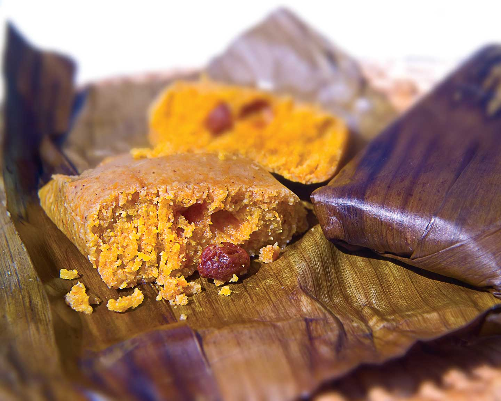

# Conkies (Bajan Steamed Cornmeal Pumpkin Parcels)

*Barbados's Independence-Day sweet: small parcels of spiced cornmeal-and-pumpkin batter folded into banana leaves and steamed till the cornmeal sets into a deeply moist, spiced pudding.*

**Serves:** 12-15 conkies

**Prep Time:** 45 minutes

**Cook Time:** 1 hour 30 minutes

## Overview
Conkies are arguably the most identity-specifically Bajan sweet, a steamed cornmeal-based pudding wrapped in banana leaves and served almost exclusively for Bajan Independence Day (30 November). From early November onwards, every Bajan family is preparing conkies; by the 30th, every household has stacks of them. The dish has been a Bajan November tradition since the colonial era; the modern association with Bajan Independence (30 November 1966) cemented the timing. The batter is yellow cornmeal mixed with finely grated pumpkin, sweet potato and coconut, soft brown sugar, butter, mixed spice (cinnamon, nutmeg, allspice), raisins and an optional touch of vanilla and rum. The banana-leaf wrap is essential for the proper aroma: leaves soften briefly over an open flame, then fold around spoonfuls of batter into neat envelopes tied with kitchen string. Steamed ninety minutes till the cornmeal has set and the inside is moist, dense and aromatic. Outside Barbados, frozen banana leaves sell at Asian and Caribbean shops; corn husks or parchment substitute but lose the aromatic edge.

## Ingredients

### The batter (makes 12-15 conkies)
- 400 g yellow cornmeal (medium-grind)
- 300 g pumpkin OR butternut squash, peeled and finely grated
- 200 g sweet potato, peeled and finely grated
- 200 g fresh grated coconut (or 150 g desiccated unsweetened + 60 ml coconut milk)
- 200 g soft dark brown sugar
- 100 g unsalted butter, melted
- 300 ml coconut milk (full-fat)
- 100 ml whole milk (or extra coconut milk)
- 2 large eggs, lightly beaten
- 1 tablespoon vanilla extract
- 2 tablespoons dark Bajan rum (optional)
- 100 g raisins
- 50 g sultanas (optional)
- 50 g chopped almonds OR pecans (optional)

### The spice mix
- 1 tablespoon ground cinnamon
- 2 teaspoons freshly grated nutmeg
- 2 teaspoons ground mixed spice (or allspice)
- 1 teaspoon ground ginger
- 1 teaspoon salt
- 1 tablespoon fresh thyme leaves (the Bajan signature)
- Finely grated zest of 1 lime

### The wrapping
- 12-15 banana leaves (each cut to roughly 25 × 20 cm; sold frozen at Caribbean / Asian shops)
- Kitchen string for tying
- (Alternative: 12-15 squares of parchment paper, cut to 25 × 20 cm; less traditional but functional)

### Equipment
- A large heavy pot with a tight-fitting lid
- A wire rack OR steamer insert that fits inside the pot
- A flame (gas hob; or pouring boiling water over the leaves) to soften the banana leaves

### To serve
- Warm, peeled out of the banana leaf
- A cup of strong Bajan tea OR mauby
- A small drizzle of rum syrup (modern variant)

## Method

### Stage 1 - Prepare the banana leaves
1. If using frozen banana leaves: defrost; cut into 25 × 20 cm squares.
2. Soften each leaf by EITHER passing the smooth side briefly (5-7 seconds) over an open flame (the leaves change from rigid to flexible; the colour darkens slightly) OR pouring boiling water over them and letting them stand 1 minute.
3. Pat dry with kitchen paper.
4. The softened leaves will fold neatly without cracking.

### Stage 2 - Make the batter
1. In a very large mixing bowl, combine the cornmeal, grated pumpkin, grated sweet potato, grated coconut, brown sugar, raisins, sultanas, optional nuts and all the spice-mix ingredients.
2. Mix thoroughly with a wooden spoon.

### Stage 3 - Add the wet
1. In a smaller bowl, whisk together the melted butter, coconut milk, whole milk, beaten eggs, vanilla and optional rum.
2. Pour the wet into the dry; stir thoroughly till the batter is uniform and thick - the consistency should be wet enough to scoop with a spoon but firm enough to hold its shape (a heaped tablespoon should stay mounded on a plate).
3. If too dry, add more coconut milk 2 tablespoons at a time; if too wet, add more cornmeal 2 tablespoons at a time.
4. Let the batter rest 5 minutes (the cornmeal absorbs the liquid).

### Stage 4 - Wrap the conkies
1. Lay one softened banana leaf flat on the work surface, smooth-side-up.
2. Spoon 2-3 heaped tablespoons of batter into the centre.
3. Fold the long sides of the leaf over the filling (overlapping in the middle).
4. Fold the short ends under to seal (or fold them in for a flat parcel).
5. Tie crosswise with a piece of kitchen string (or several pieces to make a neat parcel).
6. Repeat with the remaining batter and leaves.

### Stage 5 - Steam
1. Fill a large heavy pot with 5 cm of water; place a wire rack or steamer insert inside.
2. Bring the water to a steady boil.
3. Stack the wrapped conkies on the rack (they can sit close together; even stacked 2-3 high if the pot is big enough).
4. Cover with a tight lid.
5. Steam at a steady boil for 90 minutes.
6. Check the water level every 30 minutes; top up with boiling water if needed (don't let the pot boil dry).

### Stage 6 - Check doneness
1. Lift one conkie out with tongs.
2. Carefully unwrap one corner; the cornmeal should be set firm (not loose batter); the colour deep golden-orange.
3. If still loose, return to the pot and steam another 15-20 minutes.

### Stage 7 - Serve
1. Pile the warm conkies on a serving platter (still in their leaves).
2. Diners unwrap their own; the smell of the steamed banana-leaf aroma is traditional.
3. Eat warm with the fingers or a fork.
4. Pair with strong Bajan tea or mauby.

## Notes
- **Banana leaves are traditional:** the leaves contribute aroma. Parchment paper works as a substitute but lacks the banana-leaf flavour.
- **Soften the leaves first:** rigid leaves crack; warm-softened leaves fold neatly.
- **The cornmeal-pumpkin ratio:** 50/50 by weight is traditional. More cornmeal gives dry conkies; more pumpkin gives sloppy.
- **Steam 90 minutes:** under 75 the cornmeal isn't fully set; over 105 the texture goes overly dense.
- **Independence Day timing:** in Barbados, conkies are essentially a November-December dish. Making them in May feels off-season.
- **Bajan thyme:** the small amount of fresh thyme is the Bajan signature; without it, you've made a generic Caribbean cornmeal pudding.

## Variations
**Conkies with raisins and currants:** the festive variant - 100 g raisins + 50 g currants + 50 g chopped dates.
**Plain conkies:** skip the raisins and dried fruit; the simpler variant.
**Spicier conkies:** double the ginger and add 1/4 teaspoon ground cloves - the heavier-spice variant.
**Modern bake-in-a-tin variant:** if you can't find banana leaves, bake the entire batter in a 23 × 23 cm tin at 180°C for 1 hour - less aromatic but practical.
**Mini conkies (individual portion):** make 24 smaller parcels instead of 12-15 larger ones; reduce steam time to 60 minutes.
**Pumpkin-only conkies (no sweet potato):** double the grated pumpkin; skip the sweet potato.
**Vegan conkies:** swap eggs for 4 tablespoons aquafaba + 2 tablespoons milled flax + 2 tablespoons water; butter for coconut oil; the dish is otherwise vegan.
**Sweet potato conkies (sweet potato only):** double the grated sweet potato; skip the pumpkin.

## Serving
At a Bajan Independence Day (30 November) celebration (the traditional setting; the dish is essentially synonymous with Bajan Independence Day) · at a Bajan November / December family gathering · at a Bajan church social · at a Bajan harvest festival · at home as the Bajan tea-cake tradition · paired with strong Bajan tea, mauby, cold cocoa, or a slice of Bajan rum cake for the full Bajan tea spread.

## Storage
- Wrapped conkies refrigerate 5 days; reheat in the banana leaf in a hot oven for 10 minutes.
- Unwrapped cold conkies refrigerate 5 days; slice and eat cold or pan-fry till crisp.
- Freezes 3 months wrapped tight; defrost in the fridge overnight.
- Improves with a day of resting - the flavours marry and the texture firms.
- Cold conkies sliced and pan-fried in butter till crisp on both sides is the Bajan day-after breakfast.
- The raw batter doesn't keep well - wrap and steam the same day.
