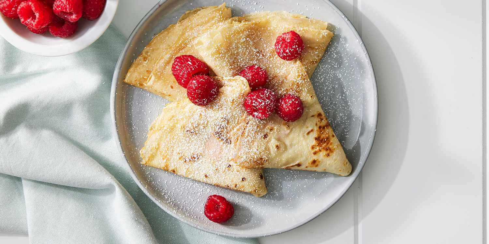

# Blini (Belarusian Buckwheat Pancakes)

*Belarus's small lacy yeasted pancakes: a slowly-risen buckwheat-and-wheat-flour batter, dropped onto a hot buttered pan and fried golden brown; eaten warm with cold sour cream, a spoon of cherry jam, and a glass of strong tea.*

**Serves:** 4 (about 24 small blini, 6 each)

**Prep Time:** 20 minutes (plus 2 hours rise)

**Cook Time:** 30 minutes

## Overview
Blini are the small yeasted pancakes shared across Belarus, Russia and Ukraine, served as either a sweet or savoury course. The traditional Belarusian version is built on a mix of buckwheat flour and plain wheat flour, yeasted (not chemically leavened) and rested two hours till the surface bubbles. Each small blin is fried in clarified butter on a hot pan, turned once, lifted onto a warm plate, then stacked. The buckwheat brings a faintly nutty sour-savoury note that catches a generous spoonful of sour cream and a dab of cherry, blueberry or rosehip jam. Belarusian Maslenitsa (the pre-Lent butter-and-pancake week) serves nothing else for seven days. The same blini are eaten with smoked salmon and pickled herring on the savoury side; in this catalogue we plate them as a sweet dessert with jam and sour cream.

## Ingredients

### Yeasted batter
- 250 ml whole milk (warm to 35°C)
- 1 teaspoon caster sugar
- 7 g fast-action dried yeast (1 sachet)
- 150 g plain flour
- 100 g buckwheat flour
- 1 teaspoon fine sea salt
- 2 large eggs (separated)
- 50 g unsalted butter (melted, plus extra for frying)
- 50 ml soured cream (smetana)

### To serve (sweet)
- 200 ml soured cream (smetana; cold)
- 4 tablespoons cherry jam (or blueberry, rosehip, or apricot)
- 2 tablespoons clear honey
- 1 small bowl of fresh berries (raspberries, blueberries)
- Powdered sugar (for dusting, optional)

## Method

### Stage 1 - Activate the yeast
1. Warm the milk to 35°C (just above lukewarm; finger comfortable).
2. Whisk in the sugar and the yeast.
3. Leave 10 minutes till the surface foams.

### Stage 2 - First mix
1. In a large mixing bowl, sift the plain flour, buckwheat flour and salt together.
2. Make a well in the centre.
3. Pour in the yeast-milk mixture, the egg yolks, the melted butter and the 50 ml soured cream.
4. Whisk gently from the centre outward till smooth (small lumps are fine).
5. The batter should be thick like double cream.

### Stage 3 - Rise
1. Cover the bowl with a clean tea towel.
2. Leave in a warm spot 1 1/2 to 2 hours till the surface is covered in bubbles and the batter has roughly doubled.

### Stage 4 - Fold in whites
1. Whisk the 2 egg whites to soft peaks (don't take them to stiff).
2. Fold gently into the risen batter (don't deflate).
3. The batter should look light and airy.

### Stage 5 - Fry
1. Heat a heavy non-stick pan (about 22 cm) over medium heat.
2. Brush with melted butter.
3. Spoon 1 tablespoon of batter per blin into the pan (4-5 blini fit at a time, not touching).
4. Cook 90 seconds till the underside is golden and bubbles form on the surface.
5. Flip with a thin spatula; cook another 60 seconds till the second side is golden.
6. Lift onto a warm plate; cover with a tea towel to keep soft.
7. Wipe the pan with a piece of kitchen paper between batches; brush with more butter as needed.

### Stage 6 - Serve
1. Stack 6 blini per plate, slightly fanned.
2. Spoon a generous dollop of cold soured cream on top.
3. Add a spoon of cherry jam alongside.
4. Drizzle a thread of honey across.
5. Scatter fresh berries over.
6. Dust with powdered sugar if desired.
7. Serve immediately with cups of strong tea.

## Notes
- **Buckwheat + wheat flour mix:** all-buckwheat blini are heavy and dense; all-wheat lose the signature. The 60/40 mix is the Belarusian sweet spot.
- **Real yeast, not baking powder:** yeasted blini have the lacy holes and the slight sourness. Baking-powder versions are American pancakes by another name.
- **Don't skip the 2-hour rise:** the yeast develops the flavour. A 30-minute rise gives flat dough.
- **Fold the egg whites at the end:** this is the lightness step; rough stirring deflates them.
- **Wipe between batches:** burnt butter from previous blini turns later batches bitter.

## Variations
**Savoury blini:** drop the sugar from the batter; serve with smoked salmon, dill, sour cream and capers (the Maslenitsa classic).
**Buckwheat-only blini:** use 250 g buckwheat flour for a denser, more rustic blin (eat with strong butter and a splash of vinegar).
**Sweet ricotta blini:** spread each warm blin with 1 teaspoon sweet ricotta + lemon zest; roll up; serve as Belarusian crepe-rolls.
**Mini cocktail blini:** make them 4 cm wide; top with caviar and cream for a Russian-Belarusian zakuski platter.
**Apple blini:** drop thin slices of apple onto the batter before flipping; the apple caramelises into the second side.

## Serving
At a Belarusian Maslenitsa (the pre-Lent butter-and-pancake week, the traditional setting) · with cold sour cream and cherry jam at a Sunday tea · stacked on a serving platter at a Belarusian wedding · with smoked salmon and dill at a New Year zakuski table · at a dacha breakfast with hot tea · for a children's Sunday afternoon with honey and berries.

## Storage
- Best the day they're cooked.
- Refrigerate cooked blini up to 24 hours; refresh in a covered pan with a knob of butter.
- Don't microwave (they turn rubbery).
- Freeze cooked blini in a stack with baking paper between each; reheat from frozen in a pan with butter.
- Uncooked batter does not keep; the yeast over-rises.
