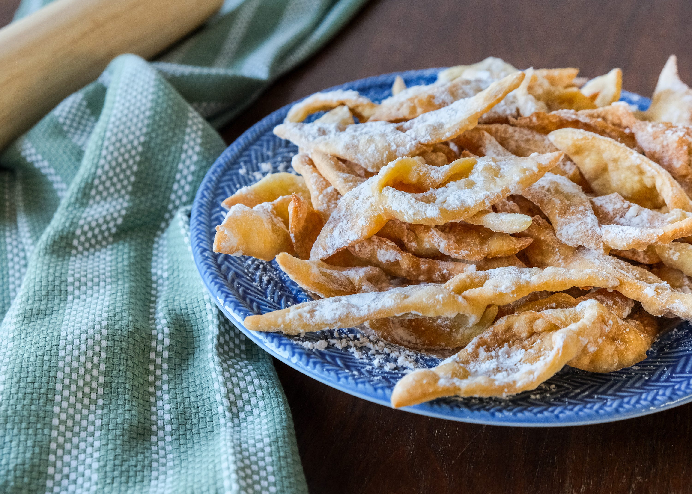

# Khrustyki

*Belarusian "crunchies": ribbon-shaped strips of egg-rich pastry knotted through a slit in the centre, deep-fried until they puff and crisp, dusted with icing sugar while still hot.*

**Serves:** about 40 ribbons (6 to 8 portions)

**Prep Time:** 30 minutes (plus 30 minutes resting)

**Cook Time:** 15 minutes

## Overview
Khrustyki belong to the wider family of Eastern European carnival-season fritters (the Polish chrust, Lithuanian žagarėliai, Ukrainian vergun), made for the days before Lent when the household had to use up eggs, butter and sugar. The dough is rich: plenty of yolks, soured cream and a splash of spirit (cognac or vodka) that helps the strips fry up bubbly and crisp without absorbing oil. Rolled paper-thin, cut into 3 by 10 cm rectangles with a slit down the middle, one end is pulled through the slit to form a twisted ribbon shape. They fry for a minute a side in clean hot oil, puff to almost double, and come out shatter-crisp. A heavy snow of icing sugar finishes them. They keep a week in a tin and are eaten with afternoon tea, on holy days, and at the long Christmas and New Year tables that bridge the orthodox calendar.

## Ingredients

### For the dough
- 250 g plain flour
- 3 large egg yolks
- 1 whole egg
- 50 g caster sugar
- 1 tbsp soured cream
- 1 tbsp cognac, vodka or white rum
- 1 tbsp melted unsalted butter
- A pinch of salt
- Zest of 1 lemon (optional)

### For frying
- 1 litre sunflower oil (or other neutral oil)

### To finish
- 50 g icing sugar

## Method

### Stage 1 - Make the dough
1. In a wide bowl, whisk the egg yolks and whole egg with the sugar until pale, about 2 minutes by hand.
2. Whisk in the soured cream, cognac, melted butter, salt and lemon zest.
3. Sift in the flour and bring together with a wooden spoon, then turn out and knead 5 to 6 minutes by hand to a smooth firm dough. It should feel a little stiffer than pasta dough.
4. Wrap and rest 30 minutes at room temperature.

### Stage 2 - Roll and cut
1. Divide the dough in four. Keep three pieces covered.
2. Roll one piece out very thin on a lightly floured surface, 1 to 2 mm thick (you should almost see the worktop through it).
3. Cut into rectangles roughly 3 by 10 cm with a sharp knife or a pastry wheel.
4. Make a 4 cm slit down the centre of each rectangle.
5. Pull one short end of the rectangle through the slit to form a twisted-ribbon shape.
6. Lay the ribbons on a floured tray. Repeat with the remaining dough.

### Stage 3 - Fry
1. Heat the oil in a deep heavy pan to 170°C (a small piece of dough should rise and sizzle steadily, browning in about 60 seconds).
2. Drop in 4 or 5 ribbons at a time; do not crowd.
3. Fry 45 to 60 seconds, flip, fry another 45 seconds until pale gold and puffed. They go from raw to over-brown fast, so watch them.
4. Lift out with a slotted spoon onto kitchen paper.

### Stage 4 - Finish
1. While the ribbons are still warm, dust generously with sifted icing sugar.
2. Pile onto a serving plate and serve at room temperature with tea or coffee.

## Notes
- **The dough is dry on purpose.** A wet dough fries up greasy and chewy. A firm dough makes the trademark shatter-crisp ribbon.
- **Roll thin, really thin.** The thinner the dough, the more they puff and the lighter they fry. A pasta machine on setting 5 is a useful tool.
- **The spirit is not decoration.** A tablespoon of spirit cuts gluten development and stops the dough absorbing oil. Without it, khrustyki taste oily.
- **170°C is the window.** Cooler and they soak up oil; hotter and they brown before the inside crisps. A thermometer is a real help here.

## Variations
- **Rose-water khrustyki.** Replace the cognac with 1 tablespoon of rose water; a Vilnius-region Polish-Lithuanian variant.
- **Honey-soaked.** Once fried, dip briefly in warm honey thinned with a splash of water, drain, then dust with poppy seeds. A festive Belarusian variant.
- **Cinnamon-sugar.** Dust with caster sugar mixed with ground cinnamon (4:1) instead of icing sugar.
- **Lemon glaze.** Skip the icing sugar dust; brush with a thin lemon-juice-and-icing-sugar glaze. A modern bakery touch.

## Serving
- Serve at room temperature with afternoon tea · also good with a thick black coffee · with a small glass of sweet wine after dinner · piled high for Christmas, New Year and the carnival days before Lent

## Storage
- Keep 5 to 7 days in an airtight tin at room temperature; they stay crisp
- Re-dust with icing sugar before serving if the first dusting has dissolved
- Do not refrigerate; the steam softens the crisp
- The raw dough keeps 2 days in the fridge, well wrapped; bring back to room temperature before rolling
