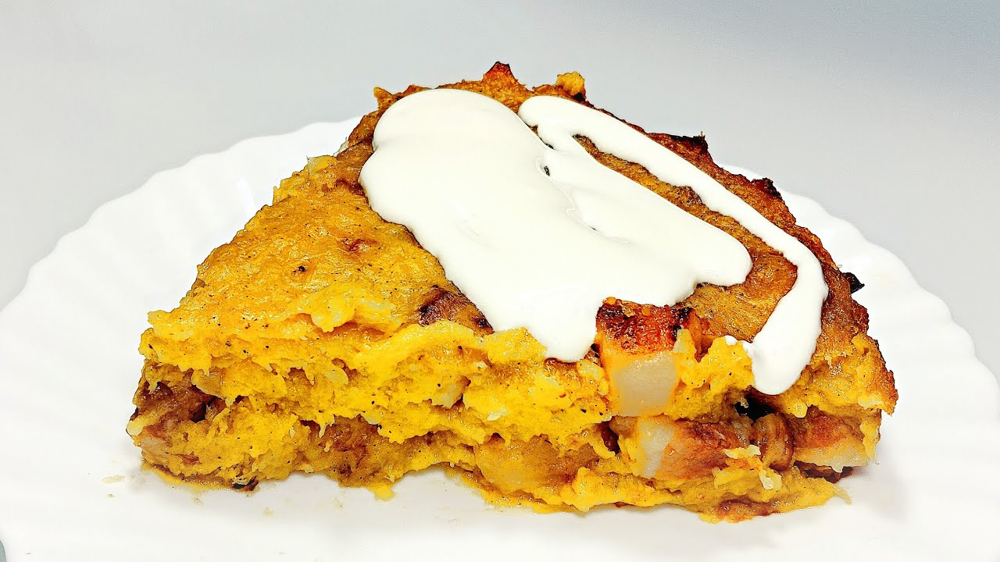

# Sweet Babka Belarusian

*A tall, golden Belarusian yeast cake studded with raisins and candied peel, baked in a fluted tube tin, brushed with rum syrup while still hot, served in thick slices with afternoon tea.*

**Serves:** 10 to 12

**Prep Time:** 30 minutes (plus 2 hours rising)

**Cook Time:** 50 minutes

## Overview
"Babka" means "grandmother" and the cake is shaped like a tall fluted bonnet, baked in the same tin a Belarusian grandmother would have inherited from hers. The Belarusian sweet babka sits between the Polish version (drier, almost biscuit-like) and the Russian kulich (richer, almost pannetone). The dough is enriched but not overloaded: plenty of eggs and butter, milk for tenderness, raisins and candied lemon-and-orange peel for sweetness, a quiet hit of vanilla and lemon zest. The rum syrup brushed on while the cake is still hot is the Belarusian twist: it carries the sponge over from "good" to "festive", perfumes the kitchen, and keeps the crumb moist for a week. Babka is the Easter-table sweet, the wedding-table sweet and the afternoon-tea sweet all at once. The slicing is generous, the eating is unrushed.

## Ingredients

### For the dough
- 500 g strong white bread flour
- 7 g instant yeast (one sachet)
- 80 g caster sugar
- 1 tsp salt
- 200 ml whole milk, warmed to blood temperature
- 4 large egg yolks
- 1 whole egg
- 120 g unsalted butter, softened
- 1 tsp vanilla extract
- Zest of 1 lemon

### For the fruit
- 100 g raisins
- 50 g candied lemon and orange peel, finely chopped
- 1 tbsp dark rum (to plump the raisins)

### For the syrup
- 80 g caster sugar
- 80 ml water
- 2 tbsp dark rum

### For the tin
- Soft butter and dry breadcrumbs (to coat a 22 cm fluted babka tin)

## Method

### Stage 1 - Plump the fruit
1. Combine the raisins with the rum in a small bowl. Leave 30 minutes; the raisins will swell and absorb most of the liquid.

### Stage 2 - Make the dough
1. Whisk the warm milk, sugar and yeast in a jug and leave 5 minutes until foaming.
2. In a large bowl (or stand mixer with dough hook), combine the flour and salt.
3. Pour in the yeasted milk, then add the yolks, whole egg and vanilla. Mix to a rough dough.
4. Knead 5 minutes by hand or 4 minutes in a stand mixer, then add the soft butter in small lumps, continuing to knead until smooth and glossy (another 5 to 6 minutes). The dough should feel soft but pull cleanly off the bowl.
5. Fold in the rum-soaked raisins and the candied peel.

### Stage 3 - First rise
1. Shape into a ball, place in a buttered bowl, cover with a damp cloth.
2. Rise in a warm spot for 60 to 90 minutes until doubled.

### Stage 4 - Shape and second rise
1. Butter a 22 cm fluted babka or bundt tin generously and coat with dry breadcrumbs (shake out the excess).
2. Punch the dough down and shape into a fat ring; lower into the tin so it sits evenly around the central tube.
3. Cover lightly and rise another 45 to 60 minutes until the dough rises to 2 cm below the rim.
4. Heat the oven to 180°C (fan 160°C).

### Stage 5 - Bake
1. Bake 45 to 50 minutes until deep golden and a skewer inserted near the centre comes out clean.
2. If the top browns too fast, drape with foil at the 30-minute mark.

### Stage 6 - Syrup and turn out
1. While the cake bakes, make the syrup: combine sugar and water in a small pan, simmer 2 minutes, off the heat stir in the rum.
2. As the cake comes out, brush the top all over with the warm syrup while it sits in the tin.
3. Wait 10 minutes, then turn out gently onto a cooling rack and brush the sides and top again with any remaining syrup.
4. Cool at least 1 hour before slicing.

## Notes
- **The tin matters.** A proper fluted tube tin is the babka shape; a plain bundt or a tube cake tin both work but the fluting is the look.
- **Soft butter, in lumps.** Cold butter will not incorporate; melted butter slackens the dough. Soft, room temperature, in 1 cm cubes is right.
- **The breadcrumb lining.** A trick that helps the cake turn out cleanly from the tin's deep ridges; flour alone is not enough.
- **Syrup on the hot cake.** The syrup soaks deepest while the cake is hot and the crumb is open. Brush as soon as it comes out of the oven.

## Variations
- **Saffron babka.** Steep a pinch of saffron in the warm milk; the crumb turns gold and gains a Persian-leaning perfume. An Easter-Sunday version.
- **Almond babka.** Replace the candied peel with 100 g of slivered almonds and 1 tbsp of almond extract; scatter more almonds on top before baking.
- **Cocoa-marbled babka.** Take a third of the kneaded dough, work in 30 g of cocoa and 30 g of melted dark chocolate, layer with the plain dough in the tin for a marbled crumb. A 20th-century Minsk-bakery innovation.
- **Lent babka (sucha).** Drop the eggs and butter, lighten the dough with vegetable oil; a Polesia-region pre-Easter version.

## Serving
- Serve sliced thick at room temperature with strong tea or coffee · also with sweet wine or a small glass of krambambulya · at Easter, weddings and the long Christmas table · with butter and honey for breakfast the next day

## Storage
- Keeps 5 days at room temperature wrapped in a clean cloth and a paper bag
- Freezes 2 months, well wrapped; thaw at room temperature 4 hours
- The crumb stays moist longer than most yeast cakes thanks to the syrup
- If it dries, dip slices briefly in warm milk before eating, or toast lightly under the grill
