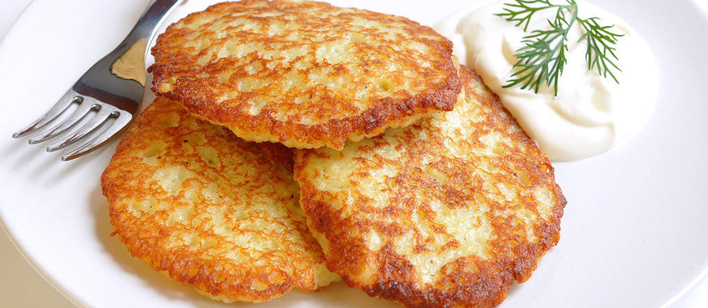

# Draniki

*The Belarusian national dish: raw potatoes grated on the fine side, squeezed dry, bound with a little onion, egg and flour, then fried in lashings of oil until the edges go shatter-crisp and the inside stays creamy.*

**Serves:** 4 (about 12 pancakes)

**Prep Time:** 20 minutes

**Cook Time:** 25 minutes

## Overview
Draniki are the dish every Belarusian grandmother makes the same way and yet swears her version is different. Floury potatoes go on the fine side of the grater (not the coarse rosti side), the grated mass is wrung out hard in a clean tea-towel, and the released starch is poured back from the bowl of liquid that settles underneath. A grated onion stops the potato browning and adds savour; one egg and a spoon of flour bind the lot just enough to hold a pancake shape. They fry in shallow but generous oil, not butter, and the heat stays high enough that the outside crisps before the inside steams to grey. Serve immediately, the moment they come out of the pan, with cold thick sour cream and a sprinkle of dill. They are eaten at any meal of the day in Belarus, often as a quick lunch with nothing else on the plate.

## Ingredients

- 1 kg floury potatoes (Maris Piper, King Edward, or russet)
- 1 medium onion
- 1 egg
- 2 tbsp plain flour
- 1 tsp salt
- Plenty of black pepper
- 100 ml sunflower or vegetable oil for frying

### To serve
- 200 ml thick sour cream (smetana)
- A small handful of fresh dill, chopped

## Method

### Stage 1 - Grate and drain
1. Peel the potatoes and the onion.
2. Grate both on the fine side of a box grater into a large bowl. The onion goes in alongside as you grate; its juice keeps the potato from browning.
3. Tip everything into a clean tea-towel and wring hard over a bowl to squeeze out as much liquid as possible.
4. Stand the bowl of potato liquid still for 2 minutes. A thick white layer of starch will settle at the bottom; pour off the watery top and scrape the starch back into the dry potato.

### Stage 2 - Mix the batter
1. Add the egg, flour, salt and a good grind of pepper to the potato and starch.
2. Mix briefly with a fork. The mixture should hold together like wet sand; if very loose, add another spoon of flour.

### Stage 3 - Fry
1. Heat a wide heavy pan over medium-high heat with enough oil to cover the base 3 mm deep.
2. When the oil shimmers, drop heaped tablespoons of batter into the pan and press each one flat to about 8 cm wide and 1 cm thick.
3. Fry 3 to 4 minutes a side, until deep golden-brown and lacy at the edges.
4. Lift onto kitchen paper, salt lightly while hot, and keep warm in a low oven while you fry the rest. Top up the oil between batches.

### Stage 4 - Serve
1. Pile the hot draniki onto a warm plate.
2. Spoon thick cold sour cream alongside (not on top, which would steam the crisp away).
3. Scatter dill over both pancakes and cream.

## Notes
- **Floury potatoes only.** Waxy salad potatoes (Charlotte, new potatoes) will not bind and stay watery in the pan. Maris Piper or russet is the right call.
- **The starch settles fast.** The bowl trick where you squeeze the liquid out and then scrape the white starch back is what gives draniki their distinctive chewy interior. Skip it and the pancakes fall apart.
- **Hot oil, generous depth.** Not deep-frying, but more than you would use for normal pancakes. Less than 3 mm and the edges burn before the middle cooks.
- **Serve immediately.** Draniki lose their crisp within 5 minutes. Fry, eat, fry, eat. Anything left over reheats poorly.

## Variations
- **Draniki s machankoy.** The classic pairing: serve draniki under a ladleful of machanka (pork-cream gravy with sausage) so the crisp edges soak up the sauce.
- **Draniki with mushrooms.** Stir 100 g cooked, finely chopped wild mushrooms (Boletus or chestnut) into the batter before frying.
- **Kachan draniki.** Cabbage-leaf draniki: wrap each pancake of batter in a blanched white-cabbage leaf and bake at 180°C for 20 minutes after a brief pan-sear. A Mogilev regional version.
- **Sweet draniki.** Skip the onion, add a tablespoon of sugar and a grated apple to the batter, serve with jam instead of sour cream. A children's breakfast variant.

## Serving
Serve hot off the pan with cold sour cream and dill · also with herring and pickled onion on the side · or under machanka gravy · with cucumber-and-dill salad in summer

## Storage
- Best eaten the moment they come out of the pan
- Leftover pancakes keep 2 days refrigerated; reheat in a dry hot pan, never the microwave (the crisp dies)
- The raw batter discolours fast; mix and cook within 30 minutes
