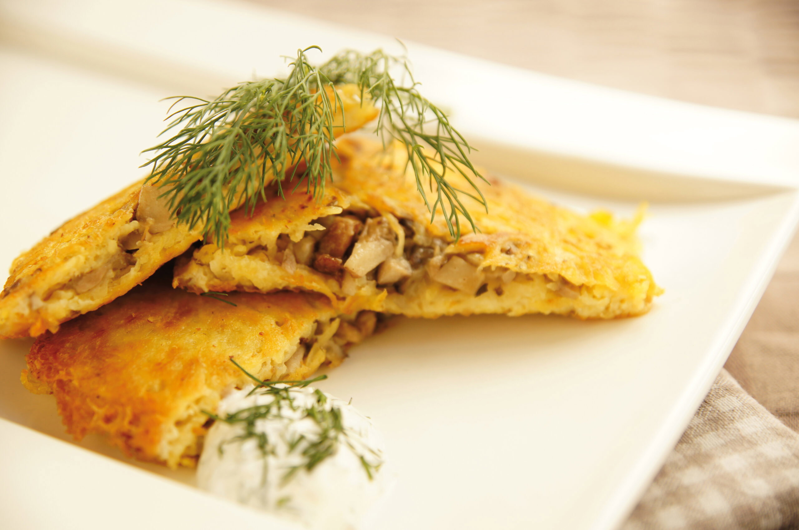

# Kalduny

*Tiny Belarusian dumplings the size of a thumbnail, stuffed with finely-minced pork-and-onion or sautéed wild mushroom, dropped into clear broth and finished with butter and dill.*

**Serves:** 4

**Prep Time:** 1 hour

**Cook Time:** 10 minutes

## Overview
Kalduny are smaller and finer than pelmeni or pierogi: the rounds are cut at 4 to 5 cm rather than 8, the filling is chopped not minced where possible, and the seal is pinched into a half-moon with the corners brought together so each dumpling sits upright like a little hat. The dough is the simplest yeastless mix of flour, water, egg and salt, rolled thin enough to see your finger through. Filling traditions split along religious lines: the Christian version uses pork and onion bound with bone marrow, the Lent and Jewish-Belarusian versions use chopped wild mushroom with fried onion and a knob of butter. Kalduny are almost always boiled in broth and served in the broth itself, or lifted out, dressed in melted butter and showered with dill. Wedding-day kalduny in old Belarusian villages were sometimes filled with a single coin or chilli to bring luck to whoever found it.

## Ingredients

### For the dough
- 400 g plain flour
- 1 egg
- 180 ml warm water
- 1 tsp salt

### For the pork filling
- 300 g pork shoulder, very finely chopped (or coarsely minced)
- 1 medium onion, very finely chopped
- 1 tbsp pork lard or butter
- 1 tsp salt
- Plenty of black pepper
- 1 tbsp very cold water (to keep the filling juicy)

### For cooking and serving
- 1.5 litres light chicken or beef broth
- 50 g butter
- A small handful of fresh dill, chopped
- Smetana (sour cream) on the side

## Method

### Stage 1 - Make the dough
1. Mound the flour on a worktop, make a well, crack in the egg, add the salt and warm water.
2. Mix with a fork drawing flour in from the sides, then knead 8 to 10 minutes by hand until smooth and elastic.
3. Wrap in cling film and rest 30 minutes at room temperature.

### Stage 2 - Make the filling
1. Sweat the onion in the lard over medium heat for 6 minutes until soft but not coloured. Cool completely.
2. Combine the cold onion with the chopped pork, salt, pepper and the tablespoon of cold water. Mix briefly with a fork; do not overwork or the filling tightens.

### Stage 3 - Shape the dumplings
1. Roll the dough out in batches on a lightly floured surface to 1.5 mm thick (almost see-through).
2. Cut 4 to 5 cm rounds with a glass or small cutter.
3. Place a half-teaspoon of filling in the centre of each round.
4. Fold into a half-moon, pinch the edge tight all the way around, then bring the two corners of the half-moon round and pinch them together to form a little hat shape.
5. Lay on a flour-dusted tray. Repeat until all dough and filling are used (about 60 dumplings).

### Stage 4 - Cook
1. Bring the broth to a rolling boil in a wide pan.
2. Drop the kalduny in in batches of 20 to 25. Stir gently to stop them sticking to the bottom.
3. Once they bob to the surface, simmer 4 more minutes for the pork filling to cook through.
4. Lift out with a slotted spoon into warmed bowls.

### Stage 5 - Serve
1. Ladle hot broth over the kalduny.
2. Drop a knob of butter on top so it melts down through the dumplings.
3. Shower with chopped dill.
4. Pass sour cream at the table for those who want it.

## Notes
- **Chop, do not mince, the pork if you can.** Hand-chopped pork has bite and gives a juicier filling. A standard mince works fine but loses some texture.
- **Cold water in the filling.** The trick that keeps the filling moist; the water turns to steam inside the dumpling and the meat stays juicy.
- **Thin dough, small dumpling.** Kalduny are not pelmeni. Roll the dough so thin it is almost translucent and cut small rounds; oversized dumplings are wrong for this dish.
- **Boil in broth, not water.** The broth gains body from the dough's starch and gives the finished dish its character.

## Variations
- **Mushroom kalduny.** Replace the pork with 300 g of mixed wild mushrooms (or chestnut + 20 g rehydrated dried boletus), finely chopped, sautéed with onion in butter until almost dry, cooled and seasoned. The Lent and Belarusian-Jewish version.
- **Beef-and-bone-marrow kalduny.** The traditional Belarusian-noble version: chopped beef shoulder with 30 g of grated raw bone marrow stirred through. Rich, glossy, festive.
- **Curd kalduny (kalduny z tvarogam).** A sweet version: full-fat curd cheese, egg yolk, sugar and a little vanilla as filling. Served with sour cream and stewed cherries.
- **Fried kalduny.** Boil briefly until they float, then pan-fry in butter until golden. A Sunday-leftover treatment.

## Serving
- Serve hot in their broth with butter and dill · or drained and dressed with melted butter and crisp fried onion · sour cream alongside · with a pickled cucumber and a shot of cold vodka at festive tables

## Storage
- Uncooked kalduny freeze well: lay on a tray, freeze solid, then bag; cook from frozen, adding 2 minutes to the boil
- Cooked kalduny keep 2 days refrigerated; revive by warming briefly in fresh broth
- Do not microwave; they go rubbery
- The dough scraps can be re-rolled once but not twice (it tightens)
