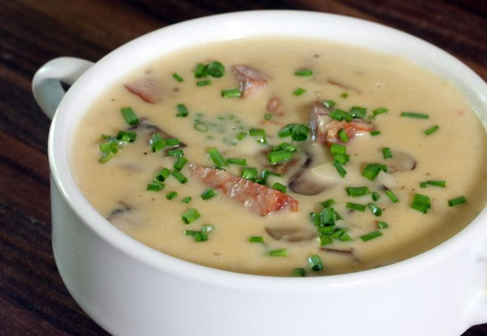

# Machanka

*A Belarusian pork-and-sausage stew with a cream-loosened gravy thickened by flour, ladled steaming over a stack of fresh potato pancakes so the crisp edges drink up the sauce.*

**Serves:** 4

**Prep Time:** 15 minutes

**Cook Time:** 1 hour

## Overview
Machanka takes its name from the verb "macat'", to dip, and the dish does exactly that: a thick, lightly-soured gravy of slow-cooked pork ribs, smoked country sausage and onion, finished with sour cream and a flour roux, into which you dip torn pieces of draniki straight from your plate. It is one of the older Belarusian country-feast dishes, mentioned in 16th-century Grand Duchy records, and was a Sunday lunch built around the home-killed pig: pantry cuts braised long and slow with whatever cured pork was hanging in the rafters. The trick is layering: pork ribs go in first for the gelatinous base, smoked sausage joins partway through to lend its smoke without going dry, and the sour cream and flour finish off the heat so the cream does not split. Country cooks pour it over draniki at the table; restaurants serve the draniki on the side. Either works.

## Ingredients

### For the stew
- 800 g pork ribs (meaty, cut into individual ribs)
- 300 g smoked country pork sausage (Polish kielbasa or similar; Belarusian "palendvitsa" if you can find it)
- 2 large onions, sliced
- 3 tbsp pork lard or sunflower oil
- 2 bay leaves
- 6 black peppercorns
- 3 allspice berries
- 500 ml water or light pork stock
- Salt

### For the cream finish
- 300 ml smetana (full-fat sour cream)
- 2 tbsp plain flour
- 1 tbsp butter
- A small handful of fresh dill, chopped

### To serve
- A batch of fresh draniki (see the Draniki recipe)

## Method

### Stage 1 - Brown the pork
1. Heat the lard in a heavy casserole over medium-high heat.
2. Salt the pork ribs and brown them in batches on all sides, about 6 to 8 minutes per batch. Lift out and set aside.
3. Drop the heat to medium, add the sliced onions, and cook in the rendered fat for 8 minutes until soft and gold.

### Stage 2 - Braise
1. Return the ribs to the pot. Add the bay, peppercorns, allspice and the water or stock.
2. Bring to a simmer, cover, and cook on the lowest possible heat for 45 minutes, until the ribs are tender enough to pull off the bone.
3. Slice the smoked sausage into 2 cm rounds and add to the pot. Simmer another 10 minutes, uncovered, to let some liquid reduce.

### Stage 3 - Sour cream finish
1. In a small bowl, whisk the flour into the sour cream until lump-free.
2. Ladle three or four spoonfuls of the hot pork liquid into the cream, whisking constantly. This tempers the cream so it will not split.
3. Pour the tempered cream back into the pot, stir to combine, and warm gently for 3 to 4 minutes without boiling. The gravy should thicken to a loose pourable consistency.
4. Stir in the butter and taste for salt.

### Stage 4 - Serve
1. Stack hot draniki on each plate.
2. Ladle the machanka over them, making sure each plate gets ribs, sausage and plenty of gravy.
3. Shower with chopped dill.

## Notes
- **Temper the cream.** Pouring cold sour cream straight into hot stock will split it instantly. Whisk a few ladles of hot liquid in first, then return the lot to the pan.
- **Smoked sausage matters.** A dry-cured smoked country sausage is what gives machanka its character. Frankfurter-style emulsified sausages turn rubbery and add nothing. Polish kielbasa or Belarusian palendvitsa are good substitutes.
- **Low and slow.** The ribs need a proper braise (45 minutes minimum on a real simmer) to give up their collagen. A hard boil tightens them.
- **No tomato.** Some modern recipes throw in tomato paste; the proper Belarusian version is cream-and-flour only.

## Variations
- **Mushroom machanka.** Add 200 g of fresh wild mushrooms (or 20 g dried Boletus, soaked) to the onion stage. A common Lent-adjacent variation when pork was scarce.
- **All-sausage machanka.** Skip the ribs and double the smoked sausage; a weeknight shortcut that cooks in 30 minutes flat.
- **Veal machanka.** Replace pork with veal shoulder cut in 3 cm chunks. A Polish-leaning Vilnius region version, lighter and pale.
- **Machanka po-vileyski.** From the Vileika region: stir in a tablespoon of horseradish at the end for a sharp bite alongside the cream.

## Serving
Serve over hot fresh draniki · with cold cucumber-and-dill salad alongside · also good with rye bread to dip · finished with extra dill at the table

## Storage
- The stew keeps 3 days refrigerated and improves on day two
- Freezes 2 months, but the cream may split on thawing; whisk in a spoon of fresh sour cream when reheating
- Re-warm very gently on a low hob, never the microwave on full power
- Fry the draniki fresh each time; do not store and reheat them with the stew
