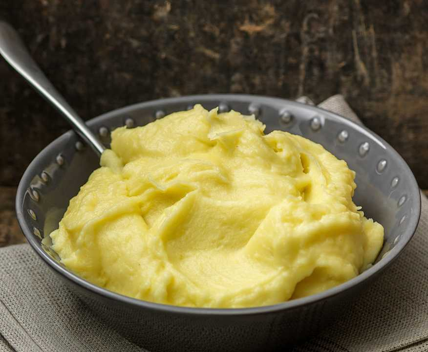

# Kartoshka Pyure

*Belarusian mashed potatoes: floury potatoes boiled in salted water, drained, dried over a low heat, mashed with hot milk and a generous knob of butter, finished with a heavy shower of fresh dill.*

**Serves:** 4

**Prep Time:** 10 minutes

**Cook Time:** 30 minutes

## Overview
"Bulba" is the centre of the Belarusian kitchen and "kartoshka pyure" is its everyday format: the mash that goes alongside machanka, vereshchaka, fried sausage, or just a fried egg. The difference between a Belarusian mash and a French purée is fat: less butter, more milk, no cream, and dill stirred through at the end. The technique is village-kitchen direct: peel, cut to equal chunks, boil in well-salted water, drain, then return the dry potatoes to the hot pan for 2 minutes to steam off surface water. Hot milk gets warmed separately and mashed in with butter. The result is light but full, a clean potato flavour, never gluey. The fork-mash style (not the ricer or food-processor) is right for Belarusian tables; a little texture is welcome, the perfect smoothness of restaurant purée is not the point.

## Ingredients

- 1 kg floury potatoes (Maris Piper, King Edward, Russet)
- 1 tbsp salt for the boiling water
- 200 ml whole milk
- 60 g unsalted butter, cubed and at room temperature
- Salt to finish
- White pepper (or fine black pepper)

### To serve
- A small handful of fresh dill, finely chopped
- An extra knob of butter

## Method

### Stage 1 - Boil
1. Peel the potatoes and cut into even 4 cm chunks.
2. Put in a wide pot, cover with cold water by 2 cm, add the salt.
3. Bring to the boil, then drop to a steady simmer and cook 18 to 22 minutes until the potatoes give easily to a knife tip.
4. Drain at once into a colander.

### Stage 2 - Dry
1. Return the drained potatoes to the empty hot pot.
2. Set over the lowest heat for 2 minutes, shaking the pan gently, so any surface water steams off and the potatoes go fluffy.
3. Do not let them colour.

### Stage 3 - Heat the milk
1. While the potatoes dry, warm the milk in a small pan to just-below-boiling.
2. The milk must be hot or the mash will be cold and gluey.

### Stage 4 - Mash
1. Off the heat, add the butter to the potatoes and start mashing with a hand masher.
2. Once the butter has melted in, pour the hot milk down the side of the pot, a little at a time.
3. Mash and beat with a wooden spoon until light and fluffy. A little texture is welcome; do not over-beat or it goes glue-like.
4. Season generously with salt and a turn of white pepper.

### Stage 5 - Finish
1. Stir in most of the chopped dill (keep a pinch for the top).
2. Spoon into a warmed serving bowl.
3. Top with the extra knob of butter and the reserved dill.

## Notes
- **Floury potatoes only.** Waxy potatoes will not break down properly and the mash goes lumpy and watery. Maris Piper or King Edward in the UK; Russet in the US.
- **Dry the potatoes off after draining.** The 2-minute return to the hot pan is the difference between a fluffy and a soggy mash.
- **Hot milk, hot pan.** Cold milk dropped into the potatoes guarantees a heavy mash. Warm everything.
- **Never blend.** A food processor turns potato into glue in seconds. A hand masher or a potato ricer are the right tools; a wooden spoon to beat in the milk at the end.

## Variations
- **Tolchanka.** Coarser-mash version with a fried onion stirred through and a higher proportion of butter; eaten as a stand-alone dish with salo on top.
- **Pyure z chasnokom.** Add 3 cloves of garlic, peeled, to the boiling water with the potatoes; mash them in for a soft garlic note.
- **Pyure with curd cheese.** Beat 100 g of fresh full-fat curd cheese (tvorog) through the mash for a richer, slightly sour version. A Polesia-region recipe.
- **Bul'ba z grybami.** Top each serving with sautéed wild mushrooms and fried onion; almost a main course.

## Serving
- Serve hot under machanka or vereshchaka gravy · also with fried sausage and pickled cabbage · with herring and onion for a Lent supper · alongside a fried egg for a children's lunch

## Storage
- Best eaten the moment it is made
- Keeps 2 days refrigerated; revive with a splash of hot milk and a knob of butter, warmed gently
- Do not freeze; the texture wrecks on thawing
- Cold leftover mash can be turned into "kartofel'nye kotlety": shape into patties, dip in beaten egg and breadcrumbs, pan-fry in butter
