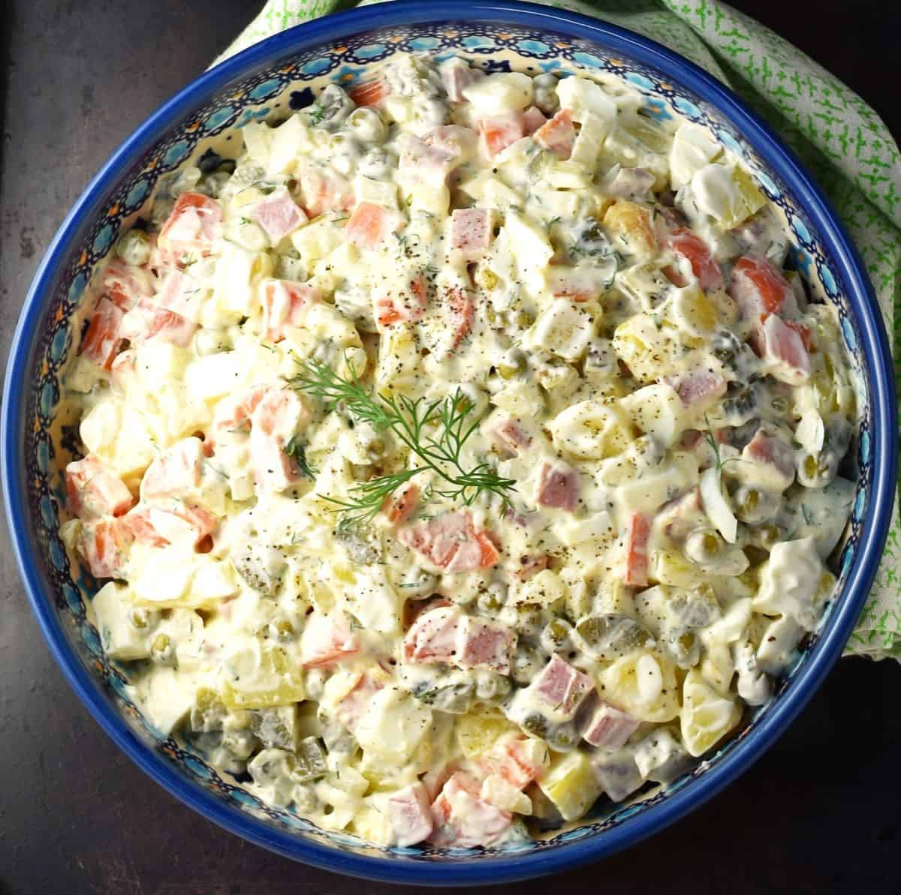

# Salat Olivye Belarusian

*The Belarusian take on the post-Soviet "Russian salad": diced boiled potato, carrot, egg, dill pickle, peas and bologna sausage in a mayonnaise dressing, the New Year's Eve dish on every table from Brest to Vitebsk.*

**Serves:** 6

**Prep Time:** 30 minutes (plus 1 hour chilling)

**Cook Time:** 25 minutes

## Overview
Every former Soviet republic has its olivye and Belarusians make it slightly differently from Russians: the dice is finer, the pickle is the dill-and-garlic Belarusian "ogurtsy" rather than sweeter Russian gherkin, and the meat is more often the smoked-pink "doktorskaya kolbasa" or boiled ham rather than the original 19th-century game-bird. Made well, olivye is a careful exercise in cubing: every ingredient is cut to the same 5 mm dice so the salad feels uniform on the spoon. Cold boiled potato, cold boiled carrot, hard-boiled egg, dill pickle, peas, ham and a little finely chopped onion are folded together with enough good mayonnaise to coat without drowning, salted assertively, peppered, chilled an hour before serving. It is the centrepiece of the Belarusian Novy God (New Year's Eve) table and turns up at every birthday and christening in between.

## Ingredients

- 400 g waxy potatoes (Charlotte, Maris Peer)
- 2 medium carrots
- 4 large eggs
- 200 g good-quality smoked or boiled ham (or "doktorskaya kolbasa" bologna sausage)
- 4 large dill pickles (Belarusian or Polish-style, not sweet gherkins)
- 200 g cooked peas (fresh or frozen and defrosted; tinned at a pinch)
- 1 small onion, very finely chopped
- 200 g good full-fat mayonnaise
- 1 tsp Dijon mustard (optional, helps loosen the mayo)
- Salt and black pepper

### To serve
- A small handful of fresh dill, chopped
- A few rings of dill pickle to garnish

## Method

### Stage 1 - Boil
1. Boil the potatoes whole, skin on, in salted water for 18 to 20 minutes until tender to a knife tip but not falling apart. Drain and cool completely.
2. Boil the carrots whole in salted water for 15 minutes until just tender. Drain and cool.
3. Hard-boil the eggs: cold water, bring to the boil, simmer 9 minutes, cool in cold water, peel.

### Stage 2 - Dice
1. Peel the cooled potatoes, carrots and eggs.
2. Cut everything (potato, carrot, egg, ham, pickles) into a uniform 5 mm dice. The discipline here is the dish; cubes that vary in size make for a messy salad.
3. Chop the onion much finer (2 mm) so it disappears into the dressing.

### Stage 3 - Soak the onion
1. Put the chopped onion in a small sieve and rinse under cold water for 30 seconds.
2. Pat dry. This kills the raw onion bite that would dominate the salad.

### Stage 4 - Assemble
1. In a large bowl, combine the potato, carrot, egg, ham, pickles, peas and onion.
2. Add the mayonnaise (start with two-thirds) and the mustard if using.
3. Fold gently with a spatula, not a spoon, so the dice does not break up.
4. Taste; add more mayonnaise if dry. Salt assertively, pepper generously.

### Stage 5 - Chill and serve
1. Chill at least 1 hour, ideally 3, for the flavours to settle.
2. Pile into a serving bowl, shower with dill, decorate with pickle rings.

## Notes
- **Cube discipline.** A uniform 5 mm dice is the difference between a Belarusian olivye and a sloppy potato salad. Take the extra 10 minutes.
- **The pickle is the spine.** Use proper sour Eastern European dill pickles (the kind packed with garlic and dill stalks, not vinegared cocktail gherkins). They give olivye its sharp counterpoint.
- **Rinse the raw onion.** A 30-second rinse takes off the harshness; without it the onion takes over the salad.
- **Mayonnaise quality.** Good full-fat mayonnaise is half the dressing; supermarket low-fat versions taste watery here. A homemade mayonnaise is even better.

## Variations
- **Stolichnaya version.** Use diced cold roast chicken instead of ham; the original mid-century Soviet "capital" version.
- **Game olivye.** Roast pheasant or quail breast, cubed, replaces the ham. The pre-Soviet hunter's version, closer to the 19th-century original.
- **Lent olivye.** Skip the meat and eggs, double the potato and peas, dress with sunflower-oil-and-vinegar instead of mayonnaise. A monastic version.
- **Apple olivye.** Add 1 small tart green apple, finely diced and tossed in lemon juice, for a sharper modern Vilnius-region version.

## Serving
Serve cold from the fridge in a large bowl · also good as part of a "zakuski" cold-table spread · with cold cuts and dark rye · a New Year's Eve table fixture with herring and pickles

## Storage
- Keeps 2 days refrigerated (no longer; the mayonnaise dressing is a fresh-food risk past that)
- Do not freeze; the mayonnaise and potato textures wreck on thawing
- If making ahead, dice and chill the components separately; mix with mayonnaise only on the day
- Serve cold, never at room temperature for more than 1 hour
