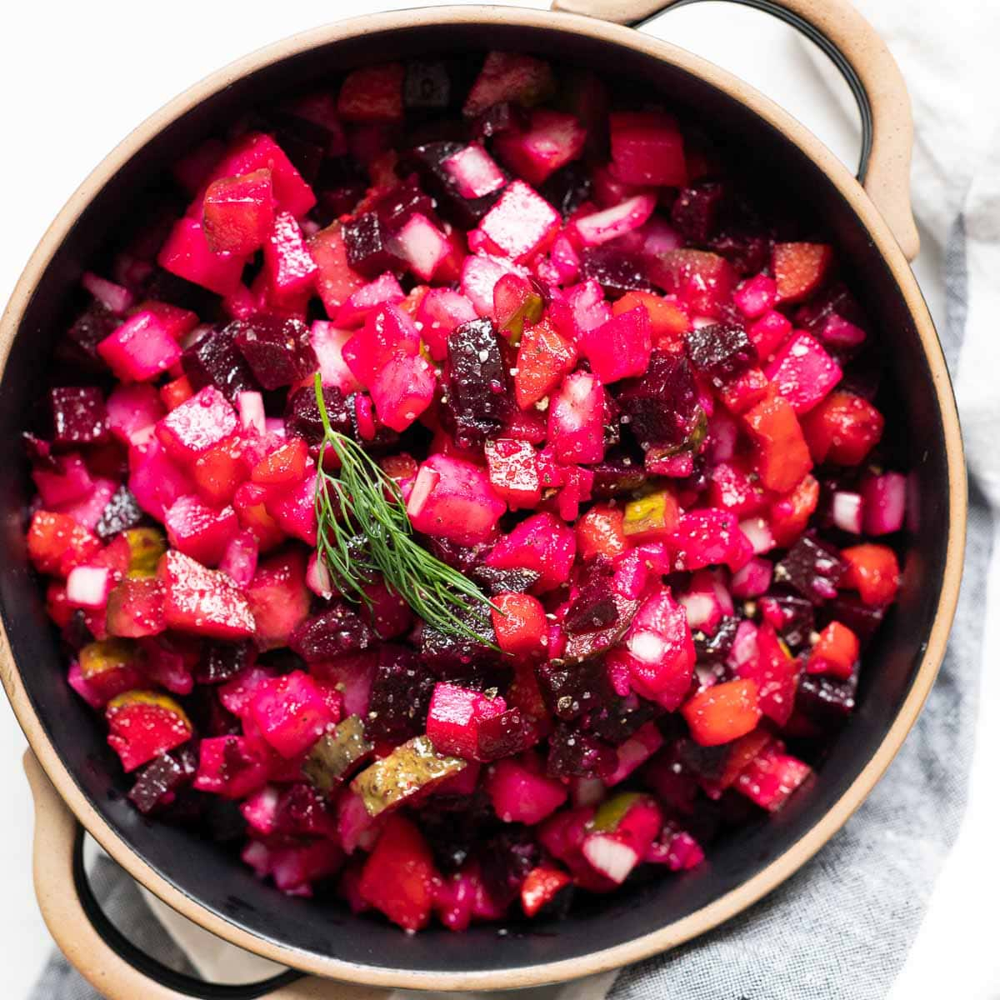

# Vinegret Belarusian (Belarusian Beetroot Salad)

*Belarus's pink-and-magenta winter salad: cubed cooked beetroot, potato, carrot, gherkin and green peas tossed in sunflower oil and a sharp splash of vinegar; chilled overnight so the colour seeps through and every cube turns a deep pink.*

**Serves:** 6-8 as a side

**Prep Time:** 30 minutes (plus 1 hour cool + 1 hour chill)

**Cook Time:** 50 minutes (vegetables)

## Overview
Vinegret (from the French "vinaigrette" via the 19th-century Russian court kitchens) is the Belarusian winter cousin of olivye, but where olivye is bound with mayonnaise, vinegret is dressed with sunflower oil and a sharp slug of vinegar. The construction is methodical: beetroot, potatoes and carrots are boiled whole in their skins, peeled, cubed small; gherkins, sauerkraut and tinned peas are folded through; the dressing is just oil, vinegar, salt and pepper. The crucial finishing move is an overnight rest in the fridge: the beetroot colour bleeds into every other cube, turning the whole salad a uniform deep pink-magenta, and the flavours marry. Every Belarusian winter table carries vinegret at New Year, name-days, and family gatherings; it sits next to olivye, holodets (meat jelly) and selyodka pod shuboy ("herring under a fur coat").

## Ingredients

### Vegetables
- 3 medium beetroots (about 450 g; raw)
- 3 medium floury potatoes (about 400 g)
- 2 large carrots (about 200 g)
- 4 medium gherkins (Belarusian dill gherkins; pickled cucumber, finely diced)
- 100 g sauerkraut (drained, finely chopped if very long)
- 1 small tin (200 g) green peas (drained)
- 1 small red onion (very finely diced)

### Dressing
- 5 tablespoons sunflower oil (or mild olive oil)
- 2 tablespoons white wine vinegar (or apple cider vinegar)
- 1 teaspoon fine sea salt
- 1/2 teaspoon coarsely cracked black pepper
- 1 teaspoon caster sugar (optional, balances the vinegar)

### To finish
- 1 small bunch fresh dill (finely chopped)
- 1 small bunch fresh parsley (finely chopped)
- 2 spring onions (finely sliced, optional)

### To serve
- A slice of dark rye bread per person
- A small bowl of sour cream (optional, for those who want it)

## Method

### Stage 1 - Cook the vegetables (separately)
1. Trim the beetroot tops, leaving 1 cm of stalk (stops bleeding). Place in a saucepan; cover with cold water; bring to a boil. Simmer 35-45 minutes till tender.
2. Place the potatoes (skins on) in a second saucepan; cover with cold water; simmer 20-25 minutes till just tender.
3. Place the carrots (skins on) in a third saucepan; cover with cold water; simmer 15-18 minutes till just tender.
4. (The three cook separately to keep colours and textures distinct.)

### Stage 2 - Cool and peel
1. Drain each pan; cool the vegetables under cold running water.
2. Peel the beetroot (the skins slip off), the potato and the carrot.
3. Cool all three to room temperature (an hour, or 30 minutes in the fridge).

### Stage 3 - Dice
1. Cut each cooled vegetable into 1 cm cubes; keep the piles separate on the chopping board.
2. Finely dice the gherkins to the same size.
3. Drain and rinse the sauerkraut; chop if long.
4. Drain the peas.
5. Finely dice the red onion.

### Stage 4 - Combine
1. In a large mixing bowl, layer the diced potatoes and carrots first.
2. Tip the gherkins, sauerkraut, peas and red onion over.
3. Add the diced beetroot last, on top.
4. (Layering keeps the colour from bleeding too fast; it will all come together at the chill stage.)

### Stage 5 - Dress
1. Whisk the sunflower oil, vinegar, salt, pepper and sugar in a small bowl.
2. Pour over the layered vegetables.
3. Fold gently with a wooden spoon to combine; don't crush the cubes.
4. Check seasoning.

### Stage 6 - Chill
1. Cover the bowl.
2. Refrigerate at least 1 hour (overnight is better).
3. The beetroot colour will bleed through the whole salad and every cube will turn deep pink.

### Stage 7 - Serve
1. Fold gently again to redistribute.
2. Tip into a serving bowl.
3. Scatter the chopped dill, parsley and spring onions over.
4. Serve cold with dark rye bread.

## Notes
- **Cook the vegetables separately:** this is the difference between vinegret and a muddy beetroot mess; keep each pile distinct till you assemble.
- **Skins on, then peel:** boiling beetroot/potato/carrot in the skin keeps the cubes from going waterlogged.
- **Cool fully before dressing:** warm vegetables soak up oil and turn greasy; cool ones stay crisp at the edges.
- **The overnight chill matters:** vinegret is one of the few dishes that genuinely improves overnight; the flavours marry and the colour evens out.
- **Sunflower oil, not olive:** sunflower is the Belarusian dressing oil; olive oil dominates.

## Variations
- **With herring (selyodka):** dice 200 g pickled herring and fold through; the Belarusian-Russian winter feast version.
- **With apple:** dice 1 tart apple into the salad; the fresh-fruit-acid variant.
- **With white beans:** fold in 200 g cooked white beans for a heartier vegetarian vinegret.
- **Vegan-friendly already:** the dish is plant-based by default.
- **With horseradish:** stir 1 teaspoon prepared horseradish into the dressing; sharper, more savoury.

## Serving
- At a Belarusian New Year's Eve table (the traditional setting alongside olivye and herring) · at a family name-day celebration · with vodka and rye bread at a Belarusian Sunday lunch · at a Belarusian Orthodox Christmas Eve fast supper (it's vegetarian) · cold from a Tupperware at a worker's lunchroom · with hot smoked-salted pork.

## Storage
- Refrigerates 3 days in a sealed container; the flavour deepens.
- Don't freeze (the potatoes and beetroot go mealy).
- Best eaten cold; never reheat.
- Make a day ahead for a Belarusian holiday table; the chill is the dish.
