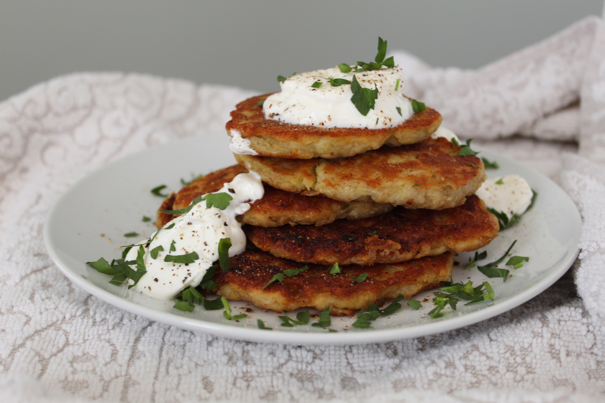

# Draniki Snack-Size

*Coin-sized Belarusian potato pancakes the diameter of a 50p piece, pan-fried crisp and served warm topped with cold smetana and a half-spoon of red salmon roe or chopped smoked fish.*

**Serves:** 6 (as a starter, about 30 small pancakes)

**Prep Time:** 20 minutes

**Cook Time:** 25 minutes

## Overview
Snack-size draniki are the canapé incarnation of the Belarusian national dish, the way a Minsk restaurant or a Belarusian-New Year's-Eve home turns a country pancake into something fit for a tray. The batter is the same as full-size draniki (raw grated potato squeezed dry, bound with onion, egg and a spoon of flour, the released starch poured back in) but each pancake is the size of a coin instead of a saucer. They crisp more evenly at this size, take half the cooking time, and stack beautifully on a board. The topping is fixed: cold smetana spooned on top, then either a half-teaspoon of bright red salmon roe (ikra) or a sliver of cold-smoked salmon or eel, finished with a single sprig of dill. The vodka or krambambulya alongside is implicit.

## Ingredients

### For the pancakes
- 700 g floury potatoes (Maris Piper, King Edward)
- 1 small onion
- 1 egg
- 1 tbsp plain flour
- 1 tsp salt
- Plenty of black pepper
- 80 ml sunflower oil (for frying, plus more as needed)

### For topping
- 200 ml thick cold smetana (full-fat sour cream)
- 80 g red salmon roe (ikra) OR 100 g cold-smoked salmon or eel, finely diced
- A small handful of fresh dill (sprigs and chopped)

## Method

### Stage 1 - Make the batter
1. Peel the potatoes and the onion.
2. Grate both on the fine side of a box grater into a large bowl.
3. Tip into a clean tea-towel and wring hard over a bowl. Squeeze out as much liquid as possible.
4. Let the liquid stand 2 minutes; the starch will settle at the bottom. Pour off the top water, scrape the starch back into the dry potato.
5. Mix in the egg, flour, salt and pepper. The batter should hold like wet sand.

### Stage 2 - Fry small
1. Heat a wide heavy pan over medium-high heat with 3 mm of oil in the base.
2. When the oil shimmers, drop heaped teaspoons of batter into the pan and press each to a 4 cm round and 5 mm thick.
3. Fry 2 minutes a side, until deep gold and lacy at the edges.
4. Lift onto kitchen paper, salt lightly, and keep warm in a low oven while the rest cook.

### Stage 3 - Assemble
1. Arrange the warm draniki in a single layer on a board or large platter (not stacked, or they soften).
2. Top each with a half-teaspoon of cold smetana.
3. Add a small heap of red roe (or a sliver of smoked salmon or eel) on top of the smetana.
4. Finish each with a tiny sprig or two of dill.

### Stage 4 - Serve
1. Serve at once, while the pancakes are still warm and crisp underneath and the topping is cold.
2. Pass small forks or expect fingers; either is fine.

## Notes
- **Small means even.** Coin-sized draniki crisp uniformly all over; saucer-sized snack draniki will be unevenly crisp and floppy in the centre. Stay small.
- **Hot pancake, cold topping.** The contrast is the dish. If the draniki cool to room temperature before topping, warm them back in a hot dry pan for 30 seconds a side.
- **Roe vs smoked fish.** Salmon roe (Russian "ikra") is the showy festival option; cold-smoked salmon or, even better, smoked eel is the everyday Belarusian one.
- **Smetana, not crème fraîche.** Crème fraîche is too sweet and too runny. Proper thick Eastern European sour cream sits up on the pancake.

## Variations
- **Smoked-eel snack draniki.** A Polesia-region speciality (the rivers and lakes there have excellent smoked eel); replace the roe entirely.
- **Cured-trout draniki.** A modern Minsk bistro version: dill-cured trout instead of smoked salmon.
- **Pickled-herring draniki.** A country-Sunday version: a sliver of marinated herring and a fine ring of raw red onion on top of the smetana.
- **Mushroom draniki canapés.** Top with a teaspoon of finely chopped wild-mushroom sauté instead of fish; for Lent or vegetarian guests.

## Serving
- Serve warm on a board at the start of a meal · also at New Year's Eve and big party tables · with vodka or krambambulya · as part of a "zakuski" cold-plate spread

## Storage
- Best assembled and eaten in the same hour
- Plain unassembled draniki keep 1 day refrigerated; reheat in a dry hot pan and top fresh
- The raw batter discolours within 30 minutes; mix and cook quickly
- Do not freeze; the texture wrecks
