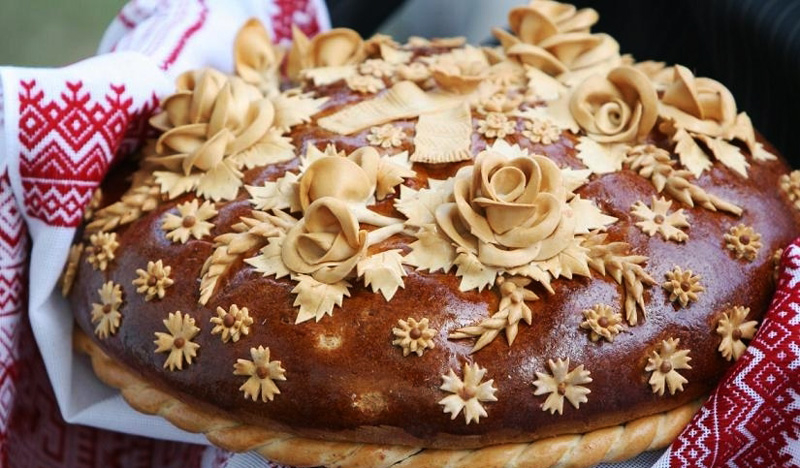

# Karavay

*A small Belarusian celebration bread, an enriched wheat round decorated with dough flowers, baked golden, eaten warm with cold butter as a snack with afternoon tea.*

**Serves:** 6 to 8 (one 20 cm round)

**Prep Time:** 30 minutes (plus 2 hours rising)

**Cook Time:** 35 minutes

## Overview
Karavay in full ceremonial form is the giant wedding loaf of Belarus, baked the night before the wedding by the bride's female relatives and decorated with elaborate dough birds, vines and rosettes that carry their own folk meanings. The everyday family version is smaller and simpler: a 20 cm round of enriched wheat dough, two or three pressed-on decorations rather than thirty, brushed shiny with egg and baked until deep gold. It sits between bread and cake, slightly sweet, butter-rich, dense but tender, the kind of loaf you tear apart at the kitchen table with a pot of jam and strong tea. In village kitchens it was also the traditional welcome to a household guest: the loaf carried on a hand-embroidered cloth with a small mound of salt at its centre, offered with both hands at the door.

## Ingredients

### For the dough
- 500 g strong white bread flour
- 7 g instant yeast
- 50 g caster sugar
- 1 tsp salt
- 200 ml whole milk, warmed
- 2 large eggs (one for the dough, one held back for glazing)
- 80 g unsalted butter, softened
- 1 tbsp honey

### For the glaze
- 1 egg yolk
- 1 tbsp milk

### To serve
- Cold unsalted butter
- A pot of jam (lingonberry, cherry, or honey)

## Method

### Stage 1 - Make the dough
1. Whisk the warm milk, sugar and yeast in a jug; leave 5 minutes until foaming.
2. In a large bowl (or stand mixer with dough hook), combine the flour and salt.
3. Pour in the yeasted milk, then one whole egg (keep the other for glazing) and the honey. Mix to a rough dough.
4. Knead 6 minutes, then add the soft butter in small lumps and knead another 6 to 8 minutes until smooth, glossy and elastic.

### Stage 2 - First rise
1. Shape into a ball, place in a lightly buttered bowl, cover with a damp cloth.
2. Rise in a warm spot 60 to 90 minutes until doubled.

### Stage 3 - Shape and decorate
1. Punch the dough down. Cut off about 100 g and keep covered for decorations.
2. Shape the larger piece into a smooth, taut round about 20 cm wide. Place on a parchment-lined tray.
3. From the reserved dough, roll out small flowers, vines, plaits or rosettes (whatever you can manage). Press lightly onto the surface of the loaf; brush with water if they need help sticking.
4. Cover lightly and rise another 45 minutes until puffy.

### Stage 4 - Bake
1. Heat the oven to 190°C (fan 170°C).
2. Beat the second egg yolk with the milk and brush the whole loaf, including decorations, twice over.
3. Bake 30 to 35 minutes until deep mahogany-gold and the loaf sounds hollow when tapped underneath.
4. Cool 30 minutes on a rack before tearing.

### Stage 5 - Serve
1. Carry to the table on a clean cloth.
2. Tear or slice thick.
3. Pass cold unsalted butter and a pot of jam.

## Notes
- **Enriched but not laden.** The Belarusian everyday karavay is lighter than the wedding loaf: only one egg in the dough, modest butter. Heavier richness pushes it towards babka territory.
- **Decorations should be small and few.** For an everyday loaf, 3 to 5 simple shapes is right; busy decoration belongs to the wedding version.
- **Egg-yolk glaze twice.** Two thin coats build a darker, glossier crust than one thick coat.
- **Tear, do not slice, for guests.** Tradition holds that karavay offered in welcome is torn by the host and handed across, not sawed.

## Variations
- **Karavay with poppy seeds.** Scatter poppy seeds over the egg-glazed surface before baking; a Vilnius-region variant.
- **Karavay with anise.** Add 1 tsp of ground anise to the dough; an old Belarusian-Lithuanian version with a quiet liquorice perfume.
- **Honey-glaze karavay.** Brush warm honey diluted with a splash of hot water over the loaf as it comes out of the oven, for a shiny sticky top.
- **Sweet karavay.** Increase sugar to 100 g and add raisins; the loaf moves towards a babka shape.

## Serving
Serve warm or at room temperature with cold butter and jam · also offered at the door with salt as a welcome to guests · with afternoon tea and a slice of hard cheese · torn open on a celebratory table for everyone to take a piece

## Storage
- Keeps 3 days at room temperature wrapped in a cotton cloth
- Refreshes well: 5 minutes in a 160°C oven brings the crust back
- Freezes 2 months whole; thaw overnight in a cloth at room temperature
- The crumb dries faster than industrial bread because of the egg and butter; eat sooner rather than later
