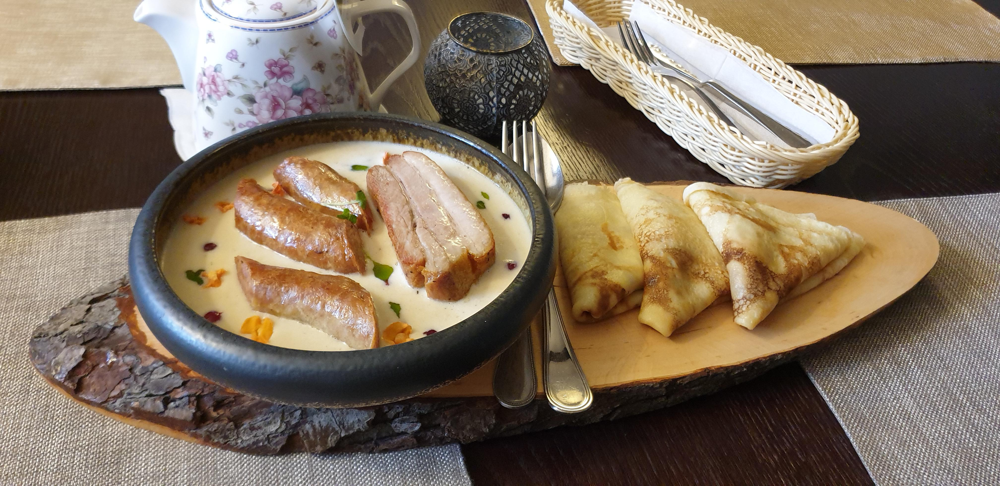

# Vereshchaka

*A medieval Belarusian-Polish stew of pork ribs and smoked sausage simmered with prunes, beer, dark rye bread and honey, finished with a slice of bread sunk into the gravy to thicken it the old way.*

**Serves:** 6

**Prep Time:** 20 minutes

**Cook Time:** 2 hours

## Overview
Vereshchaka turns up in cookery books from the Grand Duchy of Lithuania as early as the 17th century and was a magnate's hunting-feast dish: dark, brown, sweet-savoury, built to feed a hall after a day in the forest. Pork ribs and smoked country sausage are the meat foundation, but the soul of the dish is the thickener: a heel of dense dark rye bread crumbled into the stew partway through, where it dissolves into the gravy and gives it body without flour. Prunes lend a perfumed sweetness, dark beer (porter or kvass-style) the bitter-grain depth, honey a touch of caramel and Lithuanian dried marjoram a herbal lift. By the end the gravy is mahogany-coloured, glossy and just clings to a spoon. Eat with boiled new potatoes, fresh draniki, or torn dark bread to mop up.

## Ingredients

- 700 g pork ribs (meaty, individual cuts)
- 400 g smoked country pork sausage (kielbasa or palendvitsa)
- 3 large onions, sliced
- 3 tbsp pork lard or sunflower oil
- 150 g pitted prunes
- 300 ml dark beer (porter, stout, or a kvass-style dark)
- 500 ml beef or pork stock
- 2 bay leaves
- 8 black peppercorns
- 4 allspice berries
- 1 tsp dried marjoram
- 1 tbsp honey
- 2 tbsp dark vinegar or kvass
- 100 g dense dark rye bread (1 thick slice), torn into rough pieces
- Salt

### To serve
- Boiled new potatoes, draniki, or extra dark rye bread
- A small handful of fresh dill, chopped

## Method

### Stage 1 - Brown the meat
1. Heat the lard in a heavy casserole over medium-high heat.
2. Salt the pork ribs and brown well on all sides in batches, 6 to 8 minutes each. Lift out.
3. Slice the smoked sausage into 3 cm chunks and brown in the same pan for 3 minutes. Lift out.

### Stage 2 - Sweat the onions
1. Drop the heat to medium. Add the onions to the rendered fat in the pan.
2. Cook 12 minutes, stirring often, until deep gold and slightly caramelised at the edges.

### Stage 3 - Build the stew
1. Return the pork ribs and sausage to the pot.
2. Add the prunes, bay, peppercorns, allspice, marjoram, beer, stock, honey and vinegar.
3. Bring to a simmer, cover, and cook on the lowest heat for 90 minutes, until the ribs are pull-apart tender.

### Stage 4 - Bread thickening
1. Tear the dark rye bread into rough pieces and stir into the stew.
2. Cook uncovered 15 to 20 more minutes, stirring occasionally; the bread breaks down and thickens the gravy to a glossy coat.
3. Taste for salt; the smoked sausage and stock often carry enough, but add if it tastes flat.

### Stage 5 - Serve
1. Ladle into warmed bowls or onto plates of boiled potatoes or draniki.
2. Shower with chopped dill.

## Notes
- **Dark rye bread, not light.** A dense sourdough rye (Borodinsky, German pumpernickel, or proper Lithuanian "ruginė") is what does the thickening and adds depth. White bread will go gluey.
- **Prunes, not raisins.** Prunes carry tannin and acidity alongside the sweetness; raisins are too plain.
- **Dark beer, not light lager.** A porter, stout or proper dark ale gives the medieval brown gravy character. A pale lager will not register.
- **Long, slow braise.** Vereshchaka improves dramatically on day two. Make it ahead if you can.

## Variations
- **Hunter's vereshchaka.** Add 200 g of fresh wild mushrooms and a 1 cm piece of dried boletus for a forest-floor depth, plus a splash of brandy at the end. A Polish-Lithuanian magnate's version.
- **Vereshchaka with juniper.** Add 6 lightly crushed juniper berries to the spice mix; common in Grodno-region cooking.
- **Lighter vereshchaka.** Skip the bread thickening and finish with a tablespoon of soured cream stirred through off the heat. A 19th-century townhouse version.
- **Beef vereshchaka.** Replace pork with chuck steak in 4 cm chunks; cook 2 hours rather than 90 minutes. Less traditional but works well.

## Serving
- Serve over boiled new potatoes with dill · also with draniki underneath to soak the gravy · with cold pickled cabbage on the side · accompanied by dark rye and unsalted butter

## Storage
- Keeps 4 days refrigerated and tastes better on day two and three
- Freezes 3 months
- Reheat gently on a low hob; the bread-thickened gravy can catch if too hot
- Add a splash of stock or beer if it has tightened in the fridge
