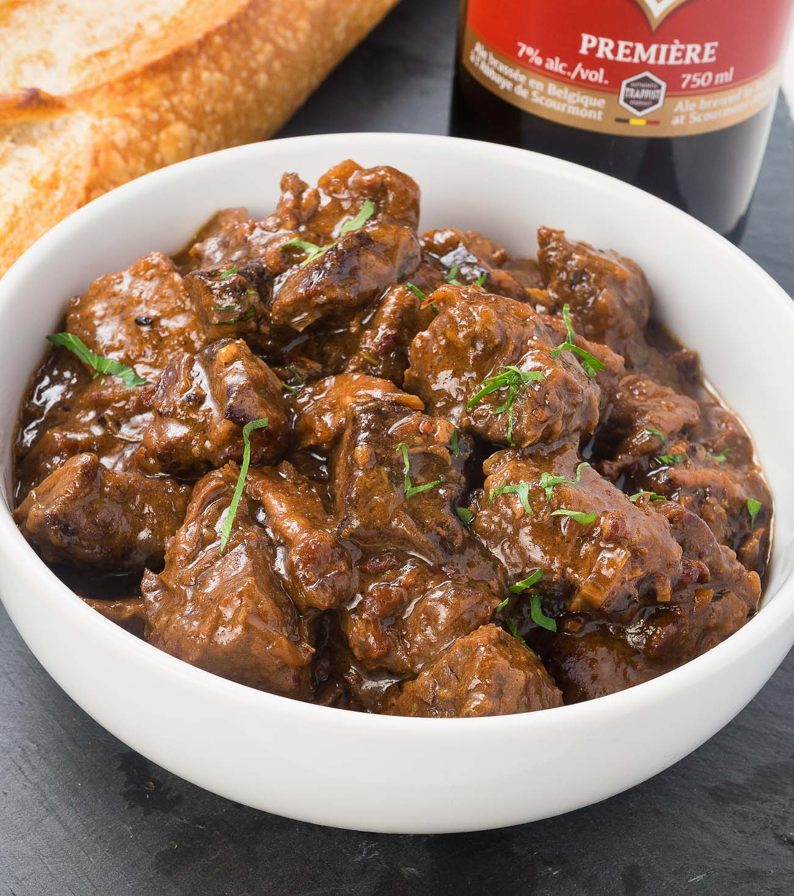

# Carbonnade Flamande

*Belgium's national beef stew: chuck beef browned hard, simmered slow for three hours in dark Trappist abbey ale with caramelised onions, brown sugar, a bay leaf, and the crucial Belgian move - a slice of stale bread spread thick with Dijon mustard pressed face-down into the sauce, where it dissolves and thickens the gravy. Deeply savoury, faintly sweet, with the bitter-malt depth of the beer underneath. Served with Belgian frites or boiled potatoes and a glass of the same beer used in the braise.*

**Serves:** 6

**Prep Time:** 25 minutes

**Cook Time:** 3 hours

## Overview
Carbonnade flamande is the canonical Flemish beef stew, and arguably Belgium's most identity-defining home dish. The construction is built on three Belgian-specific moves. First, the beer: not red wine like a French daube but a dark Belgian abbey ale - Chimay Bleue, Westmalle Dubbel, Leffe Brune, or any dubbel-style Trappist - which gives the sauce its toasted, slightly sweet, raisin-and-coffee character. Second, the caramelised onions: a generous quantity sliced and cooked down slowly in butter until properly bronzed before the meat joins them. Third, the bread-and-mustard slice: a piece of country bread (or a slice of pain d'épices for the sweeter Flemish variant) thickly spread with grainy Dijon mustard, placed mustard-side-down on the surface of the stew about thirty minutes before serving, where it slumps into the sauce and acts as both thickener and seasoning. The beef is chuck or shin, cut into 4 cm cubes and browned hard in fat (traditionally beef tallow; butter works) before joining the onions. The braise runs at the lowest possible simmer for at least three hours. Serve with Belgian frites (mandatory in cafés), boiled new potatoes, or buttered noodles; pair with the same beer used in the cooking. Three details: BROWN THE BEEF PROPERLY (dark crust on every side, in batches; this is half the flavour), USE A DARK ABBEY ALE (light pilsner doesn't have enough body; the malt sweetness is what separates carbonnade from a French braise), and THE MUSTARD BREAD GOES IN AT THE END (too early and it disintegrates; thirty minutes is right).

## Ingredients

### The beef and onions
- 1.5 kg beef chuck or shin, cut into 4 cm cubes
- 2 tablespoons plain flour
- 2 teaspoons salt
- 1 teaspoon black pepper
- 4 tablespoons beef tallow OR unsalted butter (divided)
- 4 large yellow onions, halved and sliced thin
- 4 cloves garlic, finely chopped

### The braising liquid
- 500 ml dark Belgian abbey ale (Chimay Bleue, Westmalle Dubbel, Leffe Brune or similar dubbel)
- 300 ml beef stock
- 2 tablespoons soft dark brown sugar OR 1 tablespoon brown sugar + 1 tablespoon Belgian dark candi sugar
- 2 tablespoons red wine vinegar OR cider vinegar
- 2 bay leaves
- 4 sprigs fresh thyme
- 1 teaspoon dried thyme
- Salt and black pepper

### The mustard-bread finisher
- 1 thick slice of country bread (sourdough or pain de campagne)
- 2 tablespoons grainy Dijon mustard (Maille or similar)

### To serve
- 1 batch Belgian frites (see [Belgian frites](side-dishes/belgian-frites.md)) OR 800 g boiled new potatoes
- Cold lager or the same dubbel used in the stew

## Method

### Stage 1 - Brown the beef
1. Pat the beef cubes dry with kitchen paper - very important for browning.
2. Toss the beef with the flour, salt and pepper in a bowl.
3. Heat 2 tablespoons of beef tallow or butter in a heavy Dutch oven over medium-high heat until shimmering.
4. Brown the beef in 3 batches (overcrowding steams it). 4-5 minutes per batch, turning to get a dark crust on at least 3 sides of each cube.
5. Transfer browned beef to a bowl as you go. Don't wash the pot - the fond is gold.

### Stage 2 - Caramelise the onions
1. Reduce heat to medium and add the remaining 2 tablespoons fat to the same pot.
2. Add the sliced onions and a generous pinch of salt.
3. Cook 25-30 minutes, stirring every few minutes, until deeply bronze and jammy. Don't rush this.
4. Add the chopped garlic in the last 2 minutes; cook till fragrant.

### Stage 3 - Deglaze and assemble the braise
1. Pour in the beer slowly, scraping the bottom of the pot with a wooden spoon to lift every bit of fond.
2. Add the beef stock, brown sugar, vinegar, bay leaves, thyme sprigs and dried thyme.
3. Return the browned beef and any juices in the bowl to the pot.
4. Bring to a gentle simmer; taste the liquid for salt and adjust.

### Stage 4 - Slow braise
1. Cover and reduce heat to the lowest possible simmer (bubbles just breaking the surface).
2. Cook 2.5 hours, stirring occasionally to make sure nothing catches on the bottom.
3. The beef should be fork-tender; the sauce reduced and glossy.

### Stage 5 - The mustard-bread finisher
1. Spread the slice of bread thickly with the Dijon mustard.
2. Place mustard-side-down on top of the stew.
3. Cover and continue cooking on low for 30 minutes.
4. After 30 minutes, the bread should have slumped and dissolved into the sauce. Stir it through gently with a wooden spoon - it acts as a thickener.

### Stage 6 - Final adjustments
1. Taste the sauce. It should be deeply savoury, slightly sweet (from the brown sugar and onions), with the malt backbone of the beer and a sharp mustard echo.
2. Adjust seasoning: more salt, a teaspoon more vinegar if too sweet, a teaspoon more brown sugar if too sharp.
3. Fish out the bay leaves and thyme stalks before serving.

### Stage 7 - Serve
1. Spoon into wide shallow bowls.
2. Serve alongside Belgian frites in a paper cone (the canonical café presentation) or boiled new potatoes.
3. Pour a glass of the same dubbel used in the cooking.

## Notes
- **Dark beer is essential:** a pilsner or pale ale won't give the right depth. Look for "dubbel" on the label.
- **Don't skip the browning:** the dark crust on the beef is half the flavour. Patience pays.
- **The mustard bread is canonical:** Flemish home cooks all do this. It thickens the sauce and adds a sharp mustard note that cuts the sweetness.
- **Better the next day:** the flavours marry overnight. Cook ahead if you can.
- **Pain d'épices variant:** in Flanders, some cooks use a slice of gingerbread (pain d'épices) instead of mustard bread - sweeter, more aromatic. Try both.

## Variations
**Carbonnade aux pruneaux:** add 100 g pitted prunes in stage 3 - the Flemish sweet-savoury variant.
**Stoofvlees:** the Dutch / Flemish "stew meat" name; identical recipe, often slightly less sweet.
**Carbonnade with Trappist Westmalle Tripel:** uses a tripel instead of dubbel - lighter, more spicy.
**Vegetarian "carbonnade" with king oyster mushrooms:** a modern Brussels variant - king oyster mushrooms instead of beef, the same beer-and-onion treatment.
**Carbonnade flamande au speculoos:** the bread is replaced with two speculoos biscuits - sweeter, more aromatic.
**Quick carbonnade in the pressure cooker:** 45 minutes high pressure instead of 3 hours; flavour is good but not as deep.

## Serving
At a Brussels brasserie alongside frites and a Trappist beer (the canonical setting) · at a Flemish family Sunday lunch · at a winter Belgian café in Bruges or Ghent · at a Belgian harvest dinner · at a Belgian-themed gastropub abroad · at home as the cold-weather Sunday braise.

## Storage
- Refrigerates 4 days; reheats better than it cooks first time round.
- Freezes 3 months in airtight containers.
- The flavours improve overnight - it's the canonical make-ahead Belgian stew.
- Reheat gently on the stovetop with a splash of water or stock to loosen.
