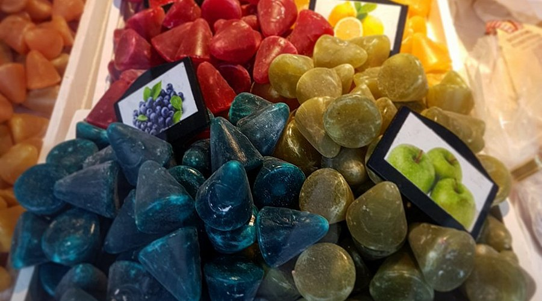

# Cuberdons (Belgian Raspberry Cone Sweets)

*Ghent's iconic cone sweet: a hard sugar shell around a soft raspberry gum-arabic centre. Snap-then-slump texture, bright purple, sold loose from market stalls.*

**Serves:** About 40 small cuberdons

**Prep Time:** 30 minutes (active work)

**Cook Time:** 20 minutes (plus 4 days of moulding rest)

## Overview
Cuberdons (nicknamed "neuzekes" or "little noses" by Ghent locals because of their conical shape) are arguably Belgium's most regional sweet. They're sold from market stalls in Ghent, Brussels, Antwerp and Bruges, made by a handful of family-run confectioners; the centre is so perishable, drying out within three weeks of moulding, that they don't survive industrial distribution. The classic flavour is raspberry, but you'll find violet, apple, blueberry, mint, coffee and elderflower at the bigger stalls. The construction is unusual: a hard sugar-glucose shell forms by setting around a soft gum-arabic syrup core. Traditionally moulded by pouring hot flavoured syrup into starch-powder cone impressions and leaving it for four days, during which the surface crystallises into a shell while the centre stays liquid. This home version uses small silicone cone moulds and accepts a slightly softer shell. The result captures the cuberdon character: thin sugar crust, sticky gum-arabic raspberry centre.

## Ingredients

### The syrup
- 400 g granulated sugar
- 100 g liquid glucose (or light corn syrup)
- 100 ml water
- 50 g gum arabic powder (food grade; available from specialty baking suppliers)
- 100 ml cold water (for blooming the gum)
- 30 ml raspberry purée (push 100 g fresh raspberries through a sieve)
- 1 tablespoon raspberry essence OR 2 tablespoons concentrated raspberry syrup
- Red-purple food colouring (gel-based; about 1/4 teaspoon)
- 1 tablespoon lemon juice

### Equipment
- Silicone cone-shaped sweet moulds (about 2 cm wide × 3 cm tall): look for "cone candy mould" online
- A sugar thermometer
- A heavy small saucepan

### To finish
- Caster sugar for light dusting (optional)

## Method

### Stage 1 - Bloom the gum arabic
1. Place the 100 ml cold water in a small bowl.
2. Sprinkle the gum arabic powder over the surface in an even layer.
3. Let sit 20 minutes till the gum has absorbed the water and formed a thick, slightly sticky paste.
4. Whisk briefly to combine.

### Stage 2 - Cook the sugar
1. In a heavy saucepan, combine the sugar, liquid glucose, and 100 ml water.
2. Stir over medium heat just till the sugar dissolves.
3. Once dissolved, stop stirring; let the syrup simmer.
4. Insert a sugar thermometer.
5. Cook to 145°C (hard ball stage): this takes 10-12 minutes. Don't go past 150°C or the syrup browns.
6. Watch closely from 130°C, the temperature climbs fast in the last few degrees.

### Stage 3 - Combine and flavour
1. Remove the sugar syrup from the heat.
2. Working quickly (it cools fast), whisk in the bloomed gum arabic paste.
3. Add the raspberry purée, raspberry essence and lemon juice.
4. Whisk in the food colouring till the syrup is a deep raspberry-purple.

### Stage 4 - Fill the moulds
1. Working quickly while the syrup is still pourable (still around 80-90°C), pour into the silicone cone moulds, filling each to the brim.
2. If the syrup thickens too much to pour, return briefly to a low heat to loosen.
3. Tap the moulds gently on the work surface to release any bubbles.

### Stage 5 - The 4-day rest
1. Leave the moulds at warm room temperature (20-22°C, dry environment) for at least 48 hours, ideally 4 days.
2. During this time, the surface of each cuberdon crystallises into a hard sugar shell while the centre stays soft and syrupy.
3. Don't move or jostle them; the shell sets best with stillness.
4. Don't refrigerate, the moisture in the fridge prevents the shell from setting.

### Stage 6 - Unmould and finish
1. After at least 48 hours (ideally 4 days), gently flex the silicone moulds to release each cuberdon.
2. They should have a slightly tacky outer surface and a clear hard shell.
3. Toss lightly in caster sugar to prevent sticking, if desired.
4. Store in a single layer in a tin, separated by parchment paper.

## Notes
- **Gum arabic is essential:** the slumping, syrupy centre is a function of the gum. Cornflour, agar, or pectin all give different (and inferior) textures.
- **145°C is the magic number:** lower and the shell stays soft; higher and the syrup browns. A thermometer is non-negotiable.
- **Work fast at stage 4:** the syrup thickens within minutes once off the heat. Have the moulds ready before you start cooking.
- **Rest is everything:** the shell takes 48 hours to form. Skip this and you have soft sticky cones, not cuberdons.
- **Don't refrigerate:** humidity prevents shell formation. Room temperature, dry environment.
- **They're perishable:** even properly made, cuberdons stay good for 3-4 weeks. The centre slowly dries; after a month the texture changes.
- **Market vs homemade:** the Ghent market cuberdons are softer-skinned and stickier; home versions tend toward a harder shell. Both are valid.

## Variations
- **Violet cuberdons:** swap raspberry for violet essence and a violet food colouring, the second-most-popular flavour at Ghent markets.
- **Blueberry cuberdons:** real blueberry purée and a touch of blackberry essence.
- **Apple cuberdons:** swap the raspberry for green apple essence and yellow-green colouring, the rural Flanders variant.
- **Coffee cuberdons:** swap the raspberry essence for 2 tablespoons strong espresso; use brown food colouring.
- **Mint cuberdons:** peppermint essence and pale green colouring, excellent after dinner.
- **Cuberdon ice cream:** crush 6 cuberdons into 500 g of softened vanilla ice cream; refreeze, Ghent-cafe modern variant.
- **Elderflower cuberdons:** elderflower cordial as the flavouring; pale yellow colouring.

## Serving
- At a Ghent market stall (the traditional setting; specifically the rival Geldhof and Lievens stalls on the Groentenmarkt) · at a Belgian Christmas market · at an Antwerp or Brussels sweet shop · as the Belgian after-dinner sweet · with espresso · as a take-home Belgian gift.

## Storage
- Store in a single layer in a tin lined with parchment at cool room temperature (16-20°C). Keep in a dry environment.
- Don't refrigerate, condensation softens the shell.
- Don't freeze, the gum arabic centre changes texture irreversibly.
- Eat within 4 weeks of moulding. The centre slowly dries from soft-syrupy to firm-chewy over time; both are pleasant but different.
- Cuberdons more than 2 months old can still be eaten but the centre has gone from syrup to a chewy gum.
