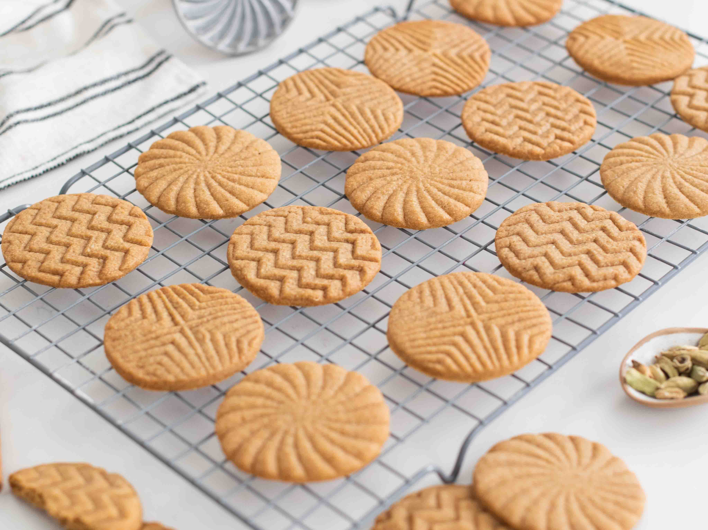

# Speculoos (Belgian Spiced Biscuits)

*Belgium's signature spiced biscuit: flat, crisp, deep-amber rectangles flavoured with cinnamon, nutmeg, cloves, ginger and dark candi sugar. Served with coffee year-round.*

**Serves:** 30 biscuits

**Prep Time:** 20 minutes (plus 4 hours or overnight chilling)

**Cook Time:** 14 minutes per tray

## Overview
Speculoos is Belgium's most identity-defining biscuit, and the reason cookie butter became a thing in the rest of the world: Lotus Biscoff is the Belgian speculoos sold worldwide, and the spread is made by grinding the biscuit. Three things distinguish a Belgian speculoos from any other spice biscuit. First, the spice mix: predominantly cinnamon, with a Belgian-specific support cast of cloves, nutmeg, cardamom, ginger and white pepper; the proportions differ from Dutch speculaas (heavier on cloves) and Anglo-American gingerbread (more ginger-forward). Second, the sugar: dark candi sugar gives speculoos its deep caramel-amber colour and slight molasses note; muscovado is the workable substitute. Third, the chill: the dough rests in the fridge for at least four hours (overnight ideal), which lets the spices bloom and the gluten relax. Traditionally pressed into carved wooden moulds for Sint-Niklaas on 6 December; modern recipes roll the dough out and cut rectangles.

## Ingredients

### The biscuit dough
- 350 g plain flour
- 220 g dark candi sugar OR dark muscovado sugar (Belgian dark candi sugar is canonical; muscovado works)
- 180 g cold unsalted butter, in 1 cm cubes
- 1 large egg
- 2 tablespoons whole milk
- 1/2 teaspoon bicarbonate of soda

### The speculoos spice mix (per 350 g flour)
- 2 teaspoons ground cinnamon
- 1/2 teaspoon ground nutmeg
- 1/2 teaspoon ground cloves
- 1/2 teaspoon ground ginger
- 1/4 teaspoon ground cardamom
- 1/4 teaspoon ground white pepper
- 1/4 teaspoon ground star anise (optional)
- A pinch of salt

### To finish
- 2 tablespoons demerara sugar OR more pearl sugar for sprinkling (optional)

### To serve
- Alongside a strong espresso or a Belgian café au lait
- With a glass of dessert wine (vin doux)
- Crushed and stirred into vanilla ice cream
- The biscuit half-dipped into hot chocolate

## Method

### Stage 1 - Mix the dough
1. In a large bowl (or the bowl of a stand mixer with paddle attachment), combine the flour, dark sugar, bicarbonate of soda, salt, and all the ground spices.
2. Whisk together so the spices are evenly distributed.
3. Add the cold butter cubes; rub with fingertips (or beat on low) till the mixture resembles damp sand.
4. Whisk the egg with the milk; add to the dry ingredients.
5. Mix on low speed (or with a wooden spoon) just till the dough comes together into a uniform ball. Don't overwork.

### Stage 2 - Chill (essential)
1. Shape the dough into a flat disc.
2. Wrap tightly in cling film.
3. Refrigerate at least 4 hours, ideally overnight.
4. This rest is critical - it lets the spices develop, the gluten relax, and the butter firm up so the biscuits hold their shape on baking.

### Stage 3 - Roll and cut
1. Heat the oven to 170°C (150°C fan).
2. Line 2 baking trays with parchment.
3. Divide the chilled dough into 2 portions. Keep one wrapped in the fridge while you work on the first.
4. Lightly flour the work surface and roll the first portion to 3 mm thick.
5. Cut into rectangles (about 6 × 4 cm) - the canonical Lotus shape - or use Speculoos wooden moulds if you have them, or any biscuit cutter.
6. Use a fork to gently mark a pattern on each (parallel lines, or a windmill shape - this is decorative and helps even baking).
7. Lift onto the lined trays with a spatula; leave 2 cm between biscuits (they spread slightly).
8. Sprinkle the demerara sugar over the tops if using.
9. Repeat with the second portion of dough.

### Stage 4 - Bake
1. Bake on the middle shelf of the oven 14-15 minutes per tray.
2. The biscuits should be deeply golden-amber all over and crisp at the edges; the centres firm up as they cool.
3. Watch carefully - the dark sugar can take them from amber to burnt in 2 minutes.

### Stage 5 - Cool
1. Let the biscuits cool on the trays 5 minutes (they're soft when hot; they crisp as they cool).
2. Transfer to a wire rack with a thin spatula.
3. Cool completely - 30-45 minutes - before storing.

## Notes
- **Dark candi sugar matters:** the deep amber colour and molasses notes of authentic speculoos depend on it. Dark muscovado is the best workable substitute. Don't use light brown sugar or caster - the result is pale and one-dimensional.
- **Chill the dough fully:** 4 hours is the minimum; overnight is better. Skipping this gives you biscuits that spread too much and don't develop the right flavour.
- **Thin rolling:** 3 mm is the canonical thickness. Thicker biscuits stay soft in the middle and don't get the crisp snap.
- **Spice ratio matters:** speculoos isn't just cinnamon; the cardamom, cloves and white pepper are what make it Belgian rather than American gingerbread.
- **Storage matters:** crisp speculoos goes soft in a humid container. Keep in a tin with a tight lid.

## Variations
**Speculoos with pearl sugar tops:** swap the demerara sprinkle for pearl sugar pressed lightly into the dough before baking - more rustic.
**Speculoospasta (cookie butter):** crush 250 g cooled biscuits to fine crumbs in a food processor; add 60 ml condensed milk and 100 ml double cream; blitz till spreadable - homemade Belgian cookie butter.
**Speculoos with chocolate:** dip the cooled biscuits half-way into melted dark chocolate; let set on parchment.
**St Nicholas speculoos (with carved moulds):** press the dough firmly into a carved wooden mould (windmill, horse, St Nicholas), invert onto the baking tray - traditional 6 December bake.
**Speculoos crumb cheesecake base:** crush 250 g biscuits with 100 g melted butter and press into a 23 cm springform - the world-famous cheesecake base.
**Vegan speculoos:** swap the egg for 3 tablespoons of aquafaba, the butter for vegan block butter, milk for oat milk.
**Speculoos sandwich biscuits with white chocolate filling:** spread melted white chocolate between two cooled biscuits.

## Serving
With a Belgian espresso or café au lait (the canonical setting) · alongside a Belgian hot chocolate · at a Belgian or Dutch coffee shop · at a Sint-Niklaas (6 December) celebration · with a glass of dessert wine after dinner · crumbled over vanilla ice cream · half-dipped into a strong coffee.

## Storage
- Stores 3 weeks in a tin with a tight lid at room temperature; they actually improve for the first few days as the spices marry.
- Don't refrigerate - the biscuits go softer.
- Freezes 3 months in airtight bags; thaw at room temperature for 30 minutes.
- The dough refrigerates 5 days (raw, well-wrapped) so you can bake fresh batches as needed.
- Raw dough freezes 3 months wrapped in a log; slice 5 mm rounds straight from frozen and bake 16-18 minutes.
