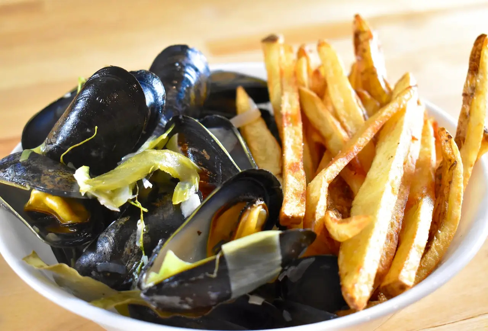

# Moules-Frites

*Belgium's national plate: a casserole of fresh mussels steamed open in a broth of white wine, butter, shallots, celery and parsley, served straight from the pot with a paper cone of twice-fried Belgian frites and a small bowl of mayonnaise on the side. The empty mussel shells go in the pot lid. The broth at the bottom gets sopped up with frites. The drink is a Belgian witbier or a glass of cold white. The dish that defines every Belgian seaside café from Ostend to Bruges.*

**Serves:** 4

**Prep Time:** 25 minutes

**Cook Time:** 12 minutes (plus frites time)

## Overview
Moules-frites is Belgium's most famous restaurant dish and a year-round staple from Ostend on the North Sea coast to every brasserie in Brussels and Bruges. The construction is built around four essential moves. First, the mussels: live, fresh, and de-bearded - typically Bouchot or Zeeland mussels from the North Sea coast (in season September to April). Two kilograms feeds four hungry diners or three serious eaters. Second, the broth: shallots, celery, garlic and parsley stalks sweated in butter, then a generous splash of dry white wine, then the mussels in on top with the lid clamped down. Third, the timing: 4-6 minutes covered, shaking the pot once or twice; the mussels open and release their own briny juice, which combines with the wine to make the broth. Fourth, the frites: served alongside, hot, in a paper cone, with mayonnaise (not ketchup; Belgians take the mayo question seriously). The classic Brussels presentation is moules marinière (the canonical wine-and-shallot version); other Belgian variants add cream, white beer, curry, or Roquefort. Eat the mussels by using an empty shell as tongs to pick out the next one - faster than a fork. The empty shells go in the pot lid. The leftover broth at the bottom gets soaked up with the last frites. Three details: USE LIVE MUSSELS ONLY (any that won't close when tapped go in the bin; any that don't open after cooking also go in the bin), DON'T OVERCOOK (4-6 minutes max; longer and the mussel goes rubbery), and FRITES MUST BE TWICE-FRIED (the canonical Belgian frite is twice-fried in beef tallow, not once; see [Belgian frites](side-dishes/belgian-frites.md)).

## Ingredients

### The mussels (for 4)
- 2 kg live mussels (Zeeland, Bouchot, or North Sea blue)
- 1 tablespoon plain flour (for cleaning, optional)

### The broth (marinière base)
- 50 g unsalted butter
- 3 large shallots, finely chopped
- 2 stalks celery (the inner pale ones), finely diced
- 4 cloves garlic, finely chopped
- 1 small bunch fresh flat-leaf parsley (about 20 g) - stalks chopped fine, leaves chopped and reserved for finishing
- 250 ml dry white wine (Muscadet, Sauvignon Blanc, or a Belgian-style witbier for the bière variant)
- 1 bay leaf
- Black pepper

### To finish
- 30 g cold unsalted butter, cubed
- Reserved chopped parsley leaves

### To serve
- 1 batch Belgian frites (see [Belgian frites](side-dishes/belgian-frites.md)) - twice-fried in beef tallow ideally
- 1 small bowl mayonnaise (homemade or Hellmann's; never ketchup)
- 1 lemon, cut into wedges
- 4 small bowls for empty shells (or use the pot lid)
- 1 bottle cold Belgian witbier (Hoegaarden, Blanche de Bruges) OR dry white wine

## Method

### Stage 1 - Clean the mussels
1. Place the mussels in a large bowl of cold water.
2. Add 1 tablespoon of flour and stir; let sit 20 minutes (the flour helps purge any sand).
3. Scrub each mussel under cold running water; pull off the "beard" (the wispy hairs) with a sharp tug toward the hinge.
4. Discard any mussels with cracked shells, any that are open and don't close when tapped firmly on the counter, and any that feel suspiciously light (likely empty).
5. Drain in a colander.

### Stage 2 - Build the broth
1. Heat the butter in a large heavy stockpot or Dutch oven (one that has a tight lid) over medium heat.
2. Add the chopped shallots, celery, garlic and parsley stalks.
3. Sweat 5-6 minutes, stirring, till translucent and soft. No colour.

### Stage 3 - Add wine, bring to a simmer
1. Pour in the white wine.
2. Add the bay leaf and a generous grind of black pepper.
3. Bring to a brisk simmer; let it bubble 1 minute to cook off the harshest alcohol.

### Stage 4 - Cook the mussels
1. Tip the cleaned mussels into the pot.
2. Clamp the lid on firmly.
3. Cook 4-6 minutes over high heat. Shake the pot vigorously twice during cooking (this redistributes the mussels so they all get heat).
4. The mussels are done when they've all (or nearly all) opened. Don't go beyond 6 minutes total.

### Stage 5 - Finish the broth
1. Lift the lid; the mussels should be wide open.
2. Use a slotted spoon to transfer most of the mussels to 4 warmed bowls, leaving the broth in the pot.
3. Discard any mussels that haven't opened (they were dead before cooking).
4. Reduce the broth in the pot over high heat for 30 seconds.
5. Whisk in the cold butter cubes, one at a time, off the heat - this gives the broth a glossy emulsion.
6. Stir in the reserved chopped parsley.

### Stage 6 - Serve
1. Ladle the buttery broth generously over the mussels.
2. Place a paper cone of Belgian frites alongside each plate.
3. Set the mayonnaise on the table; cut the lemon into wedges.
4. Provide a bowl for the empty shells (or use the pot lid - the canonical Belgian way).
5. Eat the mussels with the help of an empty shell as tongs. Soak up the broth at the end with the last of the frites.

## Notes
- **Mussel quality is everything:** use the freshest possible. If the fishmonger has them in a sealed bag rather than on ice, they should still smell briny-clean; any whiff of ammonia means they've turned.
- **The "don't open" rule:** mussels that don't open after cooking were dead before they hit the pot. Bin them. (The old rule about mussels that don't open being unsafe is true but the real point is they were already dead.)
- **Don't overcook:** mussel flesh goes rubbery after 7-8 minutes. The first ones to open are the best ones.
- **The frites must be twice-fried:** Belgian frites are double-fried in beef tallow. Once is a French fry; twice is a Belgian frite.
- **Mayonnaise, not ketchup:** Belgians dip their frites in mayo. Don't argue.
- **Eat with empty shells:** the canonical Belgian technique - use a hinged empty shell as tongs to extract the next mussel. Faster, more elegant, no fork needed.
- **Don't try to wash the pot mid-cook:** the broth and the juice from the mussels are what makes the dish.

## Variations
**Moules à la crème:** add 100 ml double cream to the broth in stage 5 - the Brussels variant.
**Moules à la bière (Belgian beer):** swap the white wine for a Belgian witbier (Hoegaarden) - sweeter, more fragrant.
**Moules à l'ail (garlic):** double the garlic and add a teaspoon of finely chopped chilli.
**Moules au curry (Belgian):** add 1 teaspoon of curry powder to the shallots in stage 2 - the Brussels-Indian fusion version.
**Moules au Roquefort:** crumble 80 g Roquefort cheese into the broth in stage 5 - blue-cheese variant.
**Moules à la provençale:** add a tin of chopped tomatoes and a pinch of Espelette pepper - the southern French take.
**Moules nature:** no broth; just the mussels steamed in their own juice with butter and parsley.

## Serving
At a Brussels brasserie or Belgian seaside café in Ostend or Knokke (the canonical setting) · at a Belgian summer terrace lunch · at a French-Belgian crossover brasserie · at a moules-frites festival (Bruges has an annual one) · at a Belgian Father's Day dinner · at home with a chilled Hoegaarden and a paper cone of frites.

## Storage
- Cooked mussels do not keep - eat them within 30 minutes of cooking.
- Leftover broth can be strained and refrigerated up to 2 days; use as a base for fish stew or soup.
- Don't reheat cooked mussels - the flesh turns to rubber.
- Raw live mussels keep 2-3 days in the coldest part of the fridge in a damp tea towel (never in a sealed bag, never in water).
