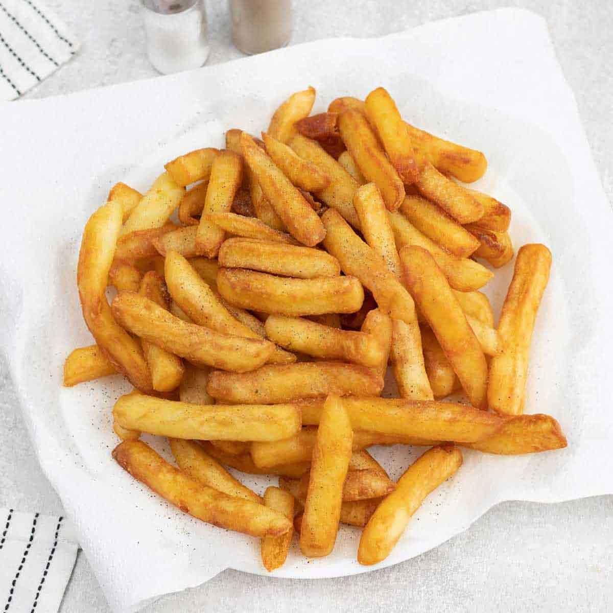

# Belgian Frites (Twice-Fried Frites in Beef Tallow)

*Belgium's national side dish: floury potatoes cut to a hand-thick batonnet, blanched in beef tallow till tender, rested, then fried again hot till deeply golden, blistered and crisp.*

**Serves:** 4

**Prep Time:** 20 minutes (plus 30 minutes resting between fries)

**Cook Time:** 25 minutes (split over two fries)

## Overview
The Belgian frite is the country's most famous food contribution after chocolate, and the rules around making one are non-negotiable. The cut is sturdier than a French fry: about 1 cm square and 6 to 10 cm long, never a shoestring and never a chunky steak chip. The double-fry technique is the defining characteristic; a gentle blanch in moderate oil softens the inside without colouring, a fifteen-minute rest lets steam escape and the surface starch dry to a film, and a final fry in hotter oil crisps the outside to deep gold. The rest between fries is critical and skipping it gives pale, soggy frites. The fat is rundvet (beef tallow) in any proper Belgian frituur; the savoury depth is something no vegetable oil matches. The traditional potato is the Bintje, with Maris Piper, King Edward or Russet as good substitutes; never waxy varieties because they go limp under the second fry. Served in a paper cone with mayonnaise.

## Ingredients

### The potatoes
- 1.5 kg floury potatoes (Bintje, Maris Piper, King Edward or Russet)

### The frying fat
- 1.5 kg rendered beef tallow (rundvet): the traditional fat
- OR 2 litres refined sunflower or groundnut oil
- (Either way you need enough to fill a deep frying pot to 7-8 cm depth)

### To finish and serve
- Fine sea salt (Maldon or fleur de sel)
- 1 batch homemade mayonnaise OR shop mayo (Hellmann's, Hela, Pelias)
- A choice of frituur sauces: andalouse, samouraï, brasil, tartare (optional, see Variations)
- 4 paper cones OR 4 small wide bowls

### Equipment
- A heavy deep pot (at least 25 cm wide, 15 cm deep)
- A frying thermometer
- A wire spider or large slotted spoon
- A wire rack over a tray for draining and resting

## Method

### Stage 1 - Cut the potatoes
1. Peel the potatoes.
2. Trim each into a rectangular block by cutting off the rounded sides.
3. Slice each block into 1 cm thick planks.
4. Stack 2-3 planks and slice into 1 cm wide batons.
5. The final batonnet should be approximately 1 × 1 × 6-10 cm.
6. Place the cut frites in a large bowl of cold water as you go.

### Stage 2 - Soak and dry
1. Once cut, soak the frites in cold water 15 minutes to wash off surface starch.
2. Drain in a colander.
3. Spread the frites on a clean tea towel and pat thoroughly dry. Surface dryness is essential, wet potatoes splatter the fat dangerously.

### Stage 3 - First fry (the blanching)
1. Melt the tallow (or pour the oil) into the deep pot till 7-8 cm deep.
2. Heat to 150°C, using a thermometer to check.
3. Lower a handful of frites into the fat with a wire spider. The temperature will drop slightly; that's fine.
4. Fry 5-7 minutes, gently moving them with the spider once or twice to stop them sticking.
5. The frites should be soft inside (a fork goes in easily) and pale, with no colour on the outside.
6. Lift out with the spider, drain briefly over the pot, then transfer to a wire rack over a tray.
7. Repeat with the remaining frites in batches.

### Stage 4 - Rest
1. Let the blanched frites rest at least 15 minutes (and up to 2 hours).
2. The frites cool to room temperature; their surface starch sets into a film.
3. This rest is critical, skip it and the second fry won't crisp properly.

### Stage 5 - Second fry (the crisping)
1. Heat the fat to 180°C.
2. Working in batches, plunge the rested frites into the hot fat with the spider.
3. Fry 2-3 minutes, agitating gently, till deeply golden and blistered.
4. The frites should be crisp and noisy when you lift them from the fat.
5. Lift out, drain briefly over the pot, then tip onto a tray lined with kitchen paper.
6. Season immediately with fine sea salt while still hot, the salt sticks to the fat surface.

### Stage 6 - Serve
1. Pile the hot salted frites into a paper cone or wide bowl.
2. Serve immediately with mayonnaise (or your sauce of choice) in a separate small dish.
3. Eat hot. Frites lose 50% of their charm 10 minutes after frying.

## Notes
- **Beef tallow makes the difference:** if you can render or buy beef tallow, do it. The flavour is unmistakable, a savoury, meaty depth that vegetable oil can't match.
- **Bintje is traditional:** if you can find them (some specialist greengrocers stock the Dutch variety), use them. Maris Piper, King Edward, Russet all substitute well.
- **The rest between fries is non-negotiable:** without it, you have a soft fry, not a crisp one. Restaurants do this hours ahead; home cooks should do at least 15 minutes.
- **Salt immediately:** the salt only sticks while the frites are hot and slightly oily. Cold frites with later-added salt taste under-seasoned.
- **Mayonnaise is the traditional dip:** Belgian mayo is slightly sweeter and tarter than American. Hellmann's works; the Belgian-specific brand Pelias is the gold standard if you can find it.
- **Never share a frituur:** Belgian frites must be eaten by one person from one cone. A shared frite gets cold and limp; a personal cone stays hot to the bottom.

## Variations
- **Andalouse sauce:** mayo + tomato paste + paprika + diced bell pepper + a dash of vinegar, the most popular Belgian dipping sauce after plain mayo.
- **Sauce samouraï:** mayo + harissa + a touch of tomato paste, spicy variant.
- **Sauce brasil:** mayo + ketchup + a touch of sambal + pineapple chunks, the wildly popular Belgian "tropical" sauce.
- **Sauce tartare:** mayo + capers + cornichons + chopped parsley + chopped onion + lemon, classic.
- **Sauce pickles:** mayo + chopped pickles + mustard, simpler than tartare.
- **Vegetarian Belgian frites:** swap the tallow for refined sunflower oil, the texture is excellent though the flavour is one note less interesting.
- **Air-fryer frites:** not Belgian, but for the no-deep-fryer household, blanch the potatoes in boiling water 4 minutes, dry thoroughly, toss with 2 tablespoons oil, air-fry at 200°C for 18 minutes shaking halfway.
- **Crisper frites with a starch coating:** before the second fry, dust the rested frites lightly with rice flour, extra crisp.

## Serving
- At a Belgian frituur (the traditional setting; every Belgian town has at least one) · at a Brussels café alongside moules-frites · at a Belgian football match · at a Bruges-canal frituur on a cold evening · at home as the Friday-night snack with a Trappist beer · at a Belgian Sunday brunch alongside steak-frites · paired with sausages, mussels, vol-au-vent or carbonnade flamande.

## Storage
- Frites do not store well. They lose their crisp within 30 minutes.
- The blanched (first-fried) frites can be refrigerated 3 days; bring to room temperature before the second fry.
- The blanched frites freeze 2 months on a tray then bagged; fry from frozen at 180°C, allow an extra minute.
- Day-old fried frites can be revived by reheating in a 200°C oven for 5 minutes on a wire rack, acceptable, not great.
- Don't microwave fried frites. The texture is destroyed.
