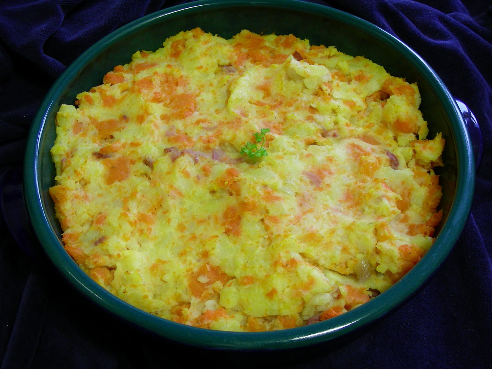

# Stoemp aux Carottes

*The carrot-led Brussels stoemp: floury potatoes mashed coarsely with slow-cooked sweet carrots, onion, butter and a touch of cream, finished with thyme and parsley. A natural pairing for the boudin noir (Belgian black pudding), grilled bratwurst, or a slow-roast pork belly. The Belgian Sunday side dish in the colder months.*

**Serves:** 4 (as a side)

**Prep Time:** 15 minutes

**Cook Time:** 35 minutes

## Overview
Stoemp aux carottes is the carrot-led Belgian variation on the traditional Brussels stoemp: same coarse-crush technique, same generous butter and cream, but the vegetable here is sweet braised carrot instead of leek. A natural Sunday-side for boudin noir, grilled bratwurst or a slow-roast pork belly. The carrots must be diced small and sweated long and slow in butter so they go properly soft and sweet, not just barely cooked; rushing this step gives stoemp with raw-tasting orange flecks instead of a unified sweet base. Floury potatoes (Bintje or Maris Piper) get boiled till fully tender, then crushed into the carrot-and-butter base with a fork or masher, leaving visible chunks of both. A touch of cream, salt and white pepper, a generous pinch of grated nutmeg, thyme and chopped parsley to finish. Serve in deep bowls with a sausage on top.

## Ingredients

### The base
- 800 g floury potatoes (Bintje, Maris Piper, King Edward or Russet), peeled and cut into 4 cm chunks
- 600 g carrots, peeled and cut into 5 mm dice
- 1 large onion, finely chopped
- 60 g unsalted butter (plus more to serve)
- 100 ml whole milk, warm
- 60 ml double cream
- Salt and white pepper
- 1/2 teaspoon grated nutmeg

### To finish
- 2 sprigs fresh thyme, leaves picked
- 2 tablespoons chopped flat-leaf parsley
- 20 g cold unsalted butter, cubed

### To serve
- Goes alongside boudin noir (Belgian black pudding), grilled bratwurst, slow-roast pork belly, or as part of a Belgian Sunday lunch plate.

## Method

### Stage 1 - Sweat the carrots and onion
1. Melt 40 g of the butter in a wide heavy pan over medium-low heat.
2. Add the chopped onion and a pinch of salt; sweat 5 minutes till translucent.
3. Add the diced carrots and another pinch of salt.
4. Cover with a lid; cook 15-20 minutes, stirring every 4-5 minutes, till the carrots are soft, sweet and pale orange. No browning.
5. Uncover for the last 3 minutes if there's any liquid in the pan, to evaporate.

### Stage 2 - Boil the potatoes
1. Meanwhile, place the potato chunks in a large pot and cover with cold salted water.
2. Bring to the boil, then reduce to a steady simmer.
3. Cook 15-18 minutes till fully tender (a knife slides in without resistance).
4. Drain; return the empty pot to the hob for 1 minute to evaporate moisture.

### Stage 3 - The crush
1. Tip the boiled potatoes into the pan with the sweated carrots.
2. Add the remaining 20 g butter, the warm milk, and the cream.
3. With a sturdy fork or a potato masher, crush coarsely, visible chunks of both potato and carrot should remain.
4. Stir in the picked thyme leaves and grated nutmeg.
5. Season generously with salt and white pepper.

### Stage 4 - Finish
1. Stir in the chopped parsley.
2. Whisk in the cold cubed butter, off the heat, for the final gloss.
3. Taste and adjust seasoning.

### Stage 5 - Serve
1. Spoon into warm bowls or onto warm plates.
2. Press a small well into the top with the back of a spoon and add a dab of butter into the well.
3. Serve immediately, with boudin noir, sausages, or a Sunday roast alongside.

## Notes
- **Small dice for the carrots:** 5 mm cubes. Bigger pieces stay firm in the centre, ruining the texture.
- **Long slow sweat:** rushing the carrot cook gives you crunchy bits in the crush. Patience.
- **No browning:** the goal is silky-sweet, not caramelised. Keep the heat low.
- **Bintje is traditional:** the Belgian floury potato. Maris Piper, King Edward and Russet all substitute well.
- **Generous butter:** Belgians do not stint on butter in stoemp. Three Belgian tablespoons is half a stick. Don't lighten this.

## Variations
**Stoemp aux carottes et lard:** add 100 g of crisp bacon lardons at stage 4, the meat-eater variant.
**Stoemp aux carottes et romarin:** swap thyme for rosemary leaves, more aromatic.
**Stoemp aux carottes et ail rôti:** add the squeezed flesh of a whole roasted garlic head at stage 3, the Brussels modern variant.
**Stoemp aux navets:** swap carrots for diced turnips (kept in stoemp aux navets folder; rural Flemish variant).
**Stoemp à la moutarde:** add 1 tablespoon of grainy Dijon mustard at stage 4, the modern brasserie variant.

## Serving
Alongside grilled bratwurst at a Belgian Sunday lunch · with boudin noir as a winter brasserie classic · with slow-roast pork belly · with grilled black pudding · at a Belgian Christmas-week family meal · paired with a glass of Belgian dubbel.

## Storage
- Refrigerates 3 days. Reheats well in a pan with a splash of milk or cream.
- Freezes 2 months; the texture loosens slightly on defrost but is still good.
- Pan-fried day-old stoemp with a fried egg on top is an excellent Belgian breakfast.
- Doesn't keep more than a day if the carrots were under-cooked; the firm bits stay firm.
