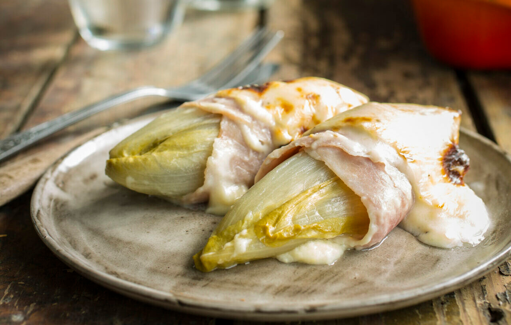

# Witloof au Gratin (Chicory Wrapped in Ham, Baked in Béchamel)

*Belgium's chicory classic: heads of witloof braised tender in butter, wrapped in Belgian ham, laid under béchamel and grated Gruyère, baked till bubbling and golden.*

**Serves:** 4

**Prep Time:** 20 minutes

**Cook Time:** 45 minutes

## Overview
Witloof is Flemish for "white leaf", what the English-speaking world calls Belgian endive or chicory: tight, conical heads of pale leaves grown in dark sheds so they stay white and only mildly bitter. The dish (also called endives au jambon or witloof met ham in Flanders) wraps each braised head in a slice of cooked ham and bakes it under a béchamel and cheese gratin. The trick is to braise the chicory thoroughly first: whole heads, gently simmered in butter and a splash of stock for twenty-five minutes till the firm hearts are completely soft and any harsh bitterness has mellowed. Skip this step and the gratin comes out crunchy and aggressively bitter. The béchamel is classic: butter, flour, milk, salt, white pepper, nutmeg, and a generous handful of grated Emmental or Gruyère stirred in. Served with boiled potatoes alongside and a glass of dry white or witbier.

## Ingredients

### The chicory
- 8 large heads of witloof / Belgian endive / chicory (about 800 g total)
- 60 g unsalted butter
- 1 teaspoon salt
- 1/2 teaspoon caster sugar (balances the bitterness)
- 1 tablespoon lemon juice
- 200 ml chicken stock OR water
- A grating of black pepper

### The ham
- 8 slices good cooked ham (jambon blanc, Belgian Ardennes ham, or a quality cooked ham): large enough to wrap around each chicory head

### The béchamel
- 60 g unsalted butter
- 60 g plain flour
- 600 ml whole milk, warm
- 100 ml double cream
- 1/2 teaspoon salt
- 1/4 teaspoon white pepper
- 1/2 teaspoon grated nutmeg
- 100 g Emmental or Gruyère, grated (for the sauce)

### The topping
- 80 g Emmental or Gruyère, grated (for the top)
- 2 tablespoons fresh breadcrumbs (optional, for extra crunch)
- 20 g unsalted butter in small dabs

### To serve
- 800 g small boiled new potatoes, buttered and parsleyed
- A glass of dry Riesling or a Belgian witbier

## Method

### Stage 1 - Trim and braise the chicory
1. Trim the brown stump from each chicory head; remove any wilted outer leaves.
2. Cut a deep cone-shaped notch out of the core with a small knife (this lets the heat penetrate the bitter core).
3. Melt the 60 g butter in a wide heavy pan over medium heat.
4. Add the chicory heads in a single layer; turn to coat in butter.
5. Sprinkle with salt and sugar; squeeze over the lemon juice.
6. Pour in the chicken stock.
7. Cover with a lid and braise gently 25-30 minutes, turning halfway, till the chicory is completely soft when pressed with the back of a spoon.
8. Uncover; raise the heat for 4-5 minutes to evaporate any remaining liquid.

### Stage 2 - Drain the chicory
1. Lift the chicory heads onto a clean tea towel.
2. Roll each gently in the towel to absorb excess moisture.
3. Let them cool slightly so they're easier to handle.

### Stage 3 - Make the béchamel
1. In a heavy saucepan, melt the 60 g butter over medium heat.
2. Whisk in the flour; cook 2 minutes, stirring, to make a pale roux.
3. Pour in the warm milk in a steady stream, whisking constantly.
4. Cook 6-8 minutes, whisking, till the sauce thickens to the consistency of pouring cream.
5. Stir in the double cream, salt, white pepper and grated nutmeg.
6. Off the heat, stir in the 100 g grated cheese till fully melted.
7. Taste and adjust seasoning.

### Stage 4 - Wrap and assemble
1. Heat the oven to 200°C (180°C fan).
2. Butter a wide gratin dish (about 30 × 20 cm).
3. Wrap each braised chicory head in a slice of cooked ham (lay the ham flat, place the chicory across one end, roll up).
4. Lay the wrapped heads side by side in the gratin dish, seam-side-down.
5. Pour the béchamel evenly over the top.
6. Scatter with the remaining 80 g grated cheese.
7. Dot the surface with small dabs of butter and (optional) breadcrumbs.

### Stage 5 - Bake
1. Bake on the middle shelf of the oven for 25-30 minutes till the top is deeply golden, the cheese bubbling and the edges crisp.
2. If the top isn't golden enough at 25 minutes, give it 2-3 minutes under a hot grill.

### Stage 6 - Serve
1. Let the gratin rest 5 minutes (the béchamel firms up slightly).
2. Spoon onto warm plates, 2 chicory heads per portion.
3. Serve with buttered new potatoes and a glass of dry white wine.

## Notes
- **Braise the chicory thoroughly:** under-cooked chicory in a gratin is aggressively bitter. 25-30 minutes covered is the right time.
- **Drain hard:** a wet chicory leaks into the béchamel and turns the gratin into soup.
- **Cut a notch in the core:** without it, the bitter core stays bitter. With it, the heat penetrates and softens it.
- **Sugar in the braise:** balances the natural bitterness. Don't skip.
- **Use a real cooked ham:** a thick slice of jambon blanc or Ardennes; thin supermarket sandwich ham doesn't have the right body.
- **Emmental or Gruyère:** the traditional cheese pair. Some Brussels cooks add a little Bruges Vieux Cheese (an aged Dutch-style) for sharper bite.

## Variations
**Witloof au gratin sans jambon (vegetarian):** skip the ham; layer the chicory directly into the béchamel, the lighter Brussels variant.
**Witloof gratin with mushrooms:** add 200 g sautéed sliced mushrooms over the chicory before the béchamel.
**Witloof au lard:** swap the ham for 200 g of crisp bacon lardons scattered between the chicory before saucing.
**Modern Brussels brasserie style:** add a sprinkle of finely chopped chervil over the top after baking, plus a few drops of truffle oil.
**Witloof gratin au bleu:** swap half the Emmental for crumbled Roquefort or Bleu d'Auvergne, sharper.
**Witloof à la flamande:** simpler version, just braised chicory in butter, no ham, no béchamel; for those who want the pure chicory flavour.

## Serving
At a Belgian family Sunday lunch (the traditional setting) · at a Brussels bistro in winter · at a Belgian Christmas Eve meal · as a substantial vegetable course at a multi-course Belgian dinner · at a Flemish gastropub · at home as a winter midweek dinner with boiled potatoes and a glass of dry white.

## Storage
- Refrigerates 3 days. Reheats well covered in a 180°C oven for 15-20 minutes.
- The béchamel sets firm in the fridge and re-loosens on reheating.
- Freezes 2 months. Defrost overnight in the fridge before reheating.
- Day-old witloof gratin sliced and pan-fried in butter till crisp on both sides is an excellent breakfast.
- Don't store with the ham wrapped if you can avoid it; the ham can leach pink colour into the béchamel.
