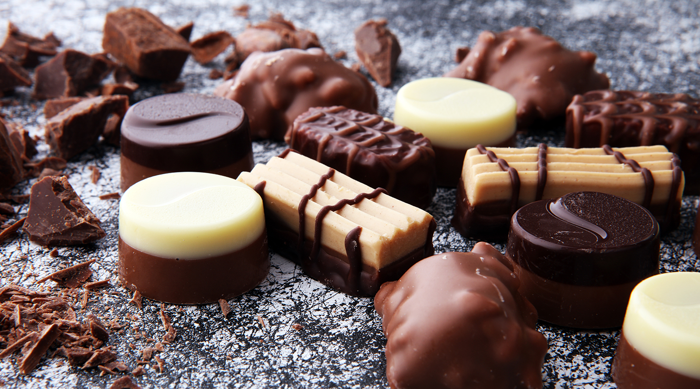

# Belgian Pralines (Chocolates with Soft Centres)

*Belgium's most famous chocolate export: a thin shell of tempered chocolate filled with praliné, gianduja or flavoured ganache. Hand-moulded since 1912.*

**Serves:** 30 pralines

**Prep Time:** 1 hour 30 minutes (active work)

**Cook Time:** 30 minutes (plus 4-6 hours setting time)

## Overview
A Belgian praline is what most of the world simply calls "a Belgian chocolate", the gold standard of moulded chocolate confectionery. The word praline can be confusing: in French it usually means caramelised nuts in candy form, and in American English it's a New Orleans pecan-and-caramel patty. In Belgium, une praline specifically means a moulded chocolate shell filled with a soft centre. The invention is credited to Jean Neuhaus II in Brussels in 1912, when he developed a shell sturdy enough to hold a soft filling without breaking, the precursor to every filled chocolate sold today. The construction has three stages: temper the chocolate (so the cocoa butter crystallises into the stable Form V that gives the snap and gloss), shell-mould (pour, invert, drain, set), then pipe in a soft ganache or praliné and cap with another layer of tempered chocolate. Rests four to six hours before unmoulding with a gentle tap.

## Ingredients

### The chocolate shells (and caps)
- 600 g good Belgian dark couverture chocolate (Callebaut 70%, Belcolade Noir Pure, or Valrhona Guanaja): chopped or in callets
- (Or use milk couverture: Callebaut Milk 33%; or white: Callebaut White 28%)

### Filling 1: Dark chocolate ganache (makes about 200 g; fills about 15 pralines)
- 150 g dark couverture chocolate (70%), chopped
- 100 ml double cream
- 20 g unsalted butter
- 1 teaspoon vanilla extract

### Filling 2: Praliné hazelnut (makes about 200 g; fills about 15 pralines)
- 150 g whole hazelnuts (skinned)
- 100 g caster sugar
- 30 g milk chocolate, melted

### Equipment
- 2 polycarbonate praline moulds (each holds 15-30 cavities)
- A digital probe thermometer
- A clean dry palette knife / offset spatula
- 2 piping bags fitted with small plain nozzles
- A heatproof bowl over a saucepan for double-boiler tempering, OR a microwave

### Optional finishes
- A pinch of fleur de sel for the dark ganache pralines
- A few crushed roasted hazelnuts for decoration
- Edible gold leaf for celebration boxes

## Method

### Stage 1 - Prep the moulds
1. Clean the polycarbonate moulds with a soft cloth (no soap; the residue affects the chocolate's release).
2. Polish each cavity with a cotton ball, this is what makes the finished praline glossy.

### Stage 2 - Temper the chocolate (Method 1 - seeding)
1. Place 400 g of the chocolate in a heatproof bowl.
2. Set over a saucepan of barely simmering water (the bowl mustn't touch the water).
3. Heat gently, stirring, till the chocolate reaches 50°C (for dark; 45°C for milk; 42°C for white). Check with a digital probe.
4. Remove the bowl from the heat.
5. Add the remaining 200 g chocolate (the "seed"); stir gently.
6. Let the temperature drop to 27°C (for dark; 26°C for milk; 25°C for white).
7. Briefly warm again over the saucepan till the chocolate reaches 31-32°C (for dark; 29-30°C for milk; 28-29°C for white). This is working temperature, the chocolate is now tempered.
8. Test: drop a small spoonful on parchment; let set 2 minutes. It should be glossy, snap cleanly, and show no streaks.

### Stage 3 - Mould the shells
1. Pour the tempered chocolate into the polycarbonate moulds, filling each cavity to overflowing.
2. Tap the mould firmly on the work surface 4-5 times to remove air bubbles.
3. Invert the mould over a bowl, tapping to release excess chocolate. The cavities should be left with a 2-3 mm coating on their walls.
4. Scrape the top of the mould clean with a palette knife.
5. Place the mould inverted on a wire rack for 5 minutes; the excess chocolate drains.
6. Turn the mould right-side-up; scrape the top clean again.
7. Leave the shells to set 30-40 minutes at cool room temperature (around 18°C is ideal).

### Stage 4 - Make Filling 1: Dark chocolate ganache
1. Place the 150 g chopped dark chocolate in a heatproof bowl.
2. Heat the cream just to a simmer; pour over the chocolate.
3. Let stand 1 minute; whisk till smooth and glossy.
4. Whisk in the butter and vanilla.
5. Let cool to 28-30°C, this takes 20-30 minutes at room temperature.
6. Scoop into a piping bag.

### Stage 5 - Make Filling 2: Praliné hazelnut
1. Heat the caster sugar in a heavy frying pan over medium heat (no water).
2. Stir gently till the sugar melts and turns amber, about 6-8 minutes.
3. Add the hazelnuts; stir to coat.
4. Tip onto a parchment-lined tray; let cool completely.
5. Once cold and brittle, break into pieces and blitz in a food processor for 4-6 minutes till you have a smooth paste (it goes through a crumb stage then a paste stage).
6. Stir in the melted milk chocolate.
7. Let cool to 28-30°C.
8. Scoop into a piping bag.

### Stage 6 - Fill the shells
1. Pipe the fillings into the set chocolate shells, leaving 2-3 mm of space at the top for the cap.
2. Don't overfill, excess filling stops the cap sealing properly.
3. Let the filled shells sit 30 minutes for the surface of the filling to firm slightly.

### Stage 7 - Cap the pralines
1. Re-temper the remaining chocolate if needed (a brief warm to 32°C).
2. Pour a thin layer over the filled mould.
3. Scrape across the top with a palette knife in a single firm motion, removing all excess, this is what creates the flat bottom of each finished praline.
4. Tap the mould gently to settle the cap.

### Stage 8 - Set and unmould
1. Let the moulds sit at cool room temperature (16-18°C) for 4-6 hours till the caps are fully set and the pralines have contracted slightly from the cavity walls.
2. Invert the mould over a clean cool surface; tap firmly. The pralines should pop out cleanly with a glossy shell.
3. If any stick, the chocolate wasn't tempered properly, they will need to be carefully prised out.

### Stage 9 - Store and serve
1. Store in a single layer in a cool tin, separated by parchment.
2. Serve at room temperature for the best texture.

## Notes
- **Temper is everything:** an un-tempered chocolate gives soft, dull, white-streaked pralines that don't release from the mould. The Form V crystallisation is non-negotiable.
- **Use polycarbonate moulds:** silicone gives matte finishes; cheap plastic moulds warp on the second use. Professional polycarbonate is what makes the glossy bowed surface.
- **Working temperature matters:** 31-32°C for dark chocolate. A few degrees too hot and the shell won't snap; too cool and it won't flow into the mould.
- **Room temperature, not fridge:** the fridge causes condensation which dulls the surface (bloom).
- **Eat at room temperature:** chilled pralines are too firm; warm pralines lose their snap. 19-22°C is the eating temperature.
- **A trained Belgian chocolatier makes this look easy.** Expect your first attempt to have soft spots and uneven shells. Practice (and a thermometer) help.

## Variations
- **Praliné with feuilletine (crispy):** add 20 g crushed feuilletine wafers to the praliné paste before piping, adds crunch.
- **Champagne truffle filling:** swap the cream in Filling 1 for 70 ml cream + 30 ml champagne or sparkling wine.
- **Coffee ganache:** add 1 tablespoon espresso powder to the cream in Filling 1 before pouring over the chocolate.
- **Raspberry-white-chocolate filling:** swap the dark chocolate in Filling 1 for white; reduce 50 g fresh raspberries to a thick purée and stir in.
- **Salted caramel filling:** make a soft caramel (sugar, cream, butter, salt) cooled to 30°C; pipe into shells.
- **Pistachio gianduja:** swap the hazelnuts in Filling 2 for pistachios; use white chocolate.
- **Dark chocolate enrobed truffles (alternative, no mould needed):** make ganache balls, refrigerate till firm, dip in tempered chocolate, roll in cocoa powder, a simpler praliné-style treat without the moulds.

## Serving
- At a Belgian chocolatier or pâtisserie in Brussels, Antwerp or Bruges (the traditional setting) · in a hand-tied gift box from Leonidas, Neuhaus, Pierre Marcolini or Galler (the classic Belgian premium boutiques) · after a Belgian dinner with coffee · at a Belgian wedding reception · at Belgian Christmas or Easter as a gift · as the traditional Belgian "I brought you these from Brussels" present.

## Storage
- Store in a single layer in a cool tin (16-20°C), away from light and humidity, for up to 3 weeks.
- Don't refrigerate, condensation forms when removed and dulls the surface.
- Don't freeze, the temper breaks; the chocolate develops white sugar/fat bloom.
- Don't store near strongly scented foods, chocolate absorbs odours readily.
- The ganache fillings keep 3 weeks; the praliné fillings keep 6 weeks (the nut oils have a longer life than dairy ganache).
