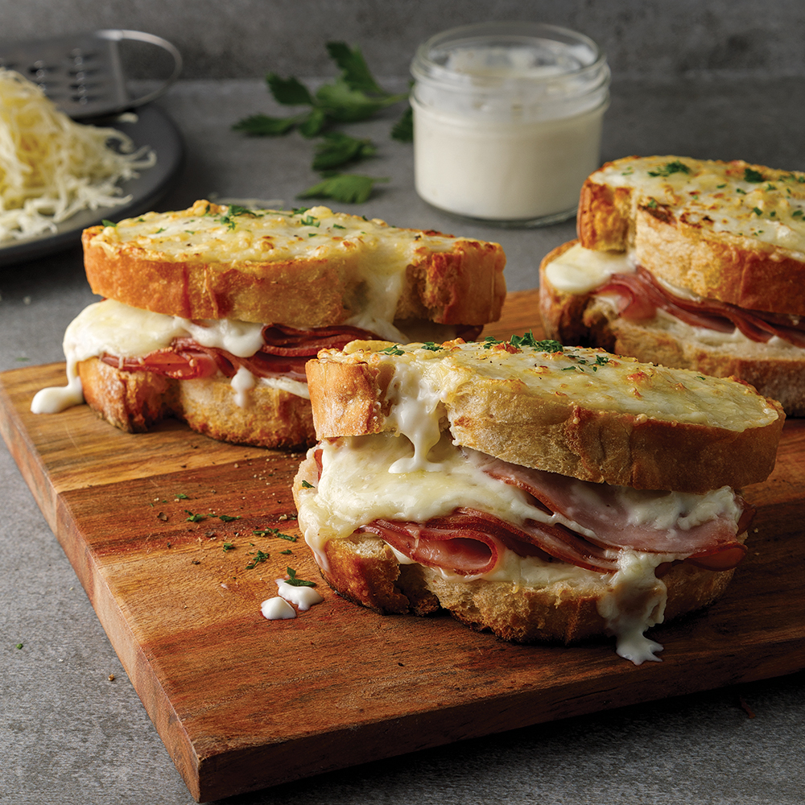

# Croque Monsieur Belge

*The Belgian café classic: buttered thick-cut bread pan-toasted around Ardennes ham and Gruyère, often finished with a béchamel-cheese gratin under the grill. Served with frites.*

**Serves:** 2

**Prep Time:** 10 minutes

**Cook Time:** 12 minutes

## Overview
The croque monsieur is French in origin, invented around 1910 at a Paris café, but the Belgian version distinguishes itself with three moves. First, the ham: Belgian Ardennes ham (smoked, slightly sweet, fine-textured) or a good Belgian cooked ham like jambon de Liège, rather than the French jambon blanc. Second, the cheese: Belgian preferences lean to Gruyère and Emmental together, sometimes with a layer of Bruges Vieux or aged Gouda for depth. Third, the topping: many Brussels brasseries finish with a béchamel-cheese gratin on top, baked under the grill till bubbling and dark gold, more like a croque madame's elaborate cousin than a plain pan-toasted sandwich. The result is heavier and richer than the French original, served with frites and a small green salad. A fried egg on top turns it into a croque madame Belge.

## Ingredients

### The sandwiches (makes 2)
- 4 thick slices of good white bread (1.5 cm thick) - pain de mie, brioche tranche, or a sturdy white bloomer
- 60 g unsalted butter, soft
- 4 slices Belgian Ardennes ham OR good cooked jambon d'Ardenne (about 120 g total)
- 80 g Gruyère, finely grated
- 80 g Emmental, finely grated
- 30 g Bruges Vieux OR aged Gouda, finely grated (optional, for depth)
- A pinch of grated nutmeg
- A small grating of black pepper

### The béchamel topping (essential for the Belgian gratin finish)
- 30 g unsalted butter
- 30 g plain flour
- 250 ml whole milk, warm
- 1/2 teaspoon salt
- 1/4 teaspoon white pepper
- 1/4 teaspoon grated nutmeg
- 1 teaspoon Dijon mustard
- 40 g Gruyère, finely grated (for the béchamel)
- 40 g Emmental, finely grated (for the top)

### To serve
- A small green salad (oak leaf, frisée, watercress) with a lemon-Dijon vinaigrette
- A handful of Belgian frites (see [Belgian frites](../side-dishes/belgian-frites.md)) OR a few cornichons
- A cold Belgian lager OR a witbier

## Method

### Stage 1 - Make the béchamel
1. Melt the 30 g butter in a small heavy saucepan over medium heat.
2. Whisk in the flour; cook 90 seconds, stirring, to make a pale roux.
3. Pour in the warm milk in a steady stream, whisking constantly.
4. Cook 3-4 minutes, whisking, till the sauce thickens to the consistency of double cream.
5. Season with salt, white pepper and nutmeg.
6. Stir in the Dijon mustard and the 40 g Gruyère till smooth.
7. Set aside; the béchamel keeps warm.

### Stage 2 - Butter the bread
1. Spread butter generously on one side of each bread slice (this is the outside of the sandwich).
2. Spread a thinner layer of butter on the inside surfaces too (helps the cheese melt and seal).

### Stage 3 - Assemble the sandwiches
1. Lay 2 bread slices butter-side-down on the work surface.
2. On the inside, scatter half the grated Gruyère, half the grated Emmental, and (optional) half the Bruges Vieux.
3. Lay 2 slices of ham on top of each, folded if needed.
4. Add a small pinch of grated nutmeg and black pepper.
5. Top with the remaining cheese.
6. Place the second bread slice on top, butter-side-up.

### Stage 4 - Pan-toast
1. Heat a heavy frying pan over medium heat (no extra fat needed - the butter on the bread is enough).
2. Place the sandwiches in the pan.
3. Cook 3 minutes till the underside is deep golden brown.
4. Flip carefully with a spatula.
5. Cook another 3 minutes till the second side is golden and the cheese inside is starting to melt.

### Stage 5 - The Belgian gratin finish
1. Heat the oven grill to high.
2. Transfer the toasted sandwiches to a small baking sheet.
3. Spoon a generous layer of warm béchamel over the top of each sandwich.
4. Scatter the remaining 40 g Emmental evenly over.
5. Slide under the hot grill 2-3 minutes till the top is bubbling and deep golden, with patches of darker bronze at the edges.

### Stage 6 - Serve
1. Lift onto warm plates.
2. Place a small handful of dressed green salad alongside.
3. Add a few Belgian frites or a couple of cornichons.
4. Serve with a cold Belgian lager.
5. Eat with a knife and fork (the gratin topping doesn't work as finger food).

## Notes
- **Bread thickness matters:** 1.5 cm is the right thickness; thinner and the sandwich falls apart, thicker and the cheese doesn't melt through.
- **Butter both sides:** the outside butter is for browning; the inside butter helps the cheese fuse to the bread and seal the ham.
- **Aged cheese:** young supermarket Gruyère lacks the umami depth. A 12-month or better works far better.
- **The gratin top is the Belgian move:** the French original is just a pan-toasted sandwich. The Belgian version adds the béchamel-cheese topping under the grill - more like a hot open sandwich than a closed grilled cheese.
- **Mustard in the béchamel is non-negotiable:** Dijon gives the sharp counterpoint to the rich cheese.
- **Eat immediately:** the gratin crust softens fast.

## Variations
**Croque Madame Belge:** crack a fried egg over each sandwich just before serving (over-easy ideal; the runny yolk runs through the gratin).
**Croque au jambon de Bayonne:** swap Belgian Ardennes for French Bayonne ham - the cross-border variant.
**Croque au fromage seul (cheese only):** skip the ham; double the cheese; the vegetarian version.
**Croque hawaïen (Belgian version):** add a slice of grilled pineapple between the ham and cheese - the controversial Brussels diner variant.
**Croque au boeuf:** swap the ham for thin slices of cold roast beef and a smear of horseradish on the bread.
**Bruges-style croque:** use Brugge Vieux exclusively as the cheese; richer and sharper.
**Mini-croques (for canapés):** cut the sandwich into 4 squares before the grill stage; serve as canapés with a cocktail.

## Serving
At a Brussels brasserie at lunchtime (the canonical setting) · at a Belgian café in Bruges, Antwerp or Ghent · with a beer at a Belgian gastropub · as a quick Belgian dinner alongside a salad · at a Belgian Sunday brunch · at home for a sophisticated grilled cheese.

## Storage
- Doesn't keep - eat within 10 minutes of finishing under the grill.
- Béchamel can be made ahead 2 days; reheat gently with a splash of milk.
- Don't refrigerate the assembled sandwich; the bread goes soggy.
- The components (bread, butter, ham, cheese) all keep separately as normal pantry items.
