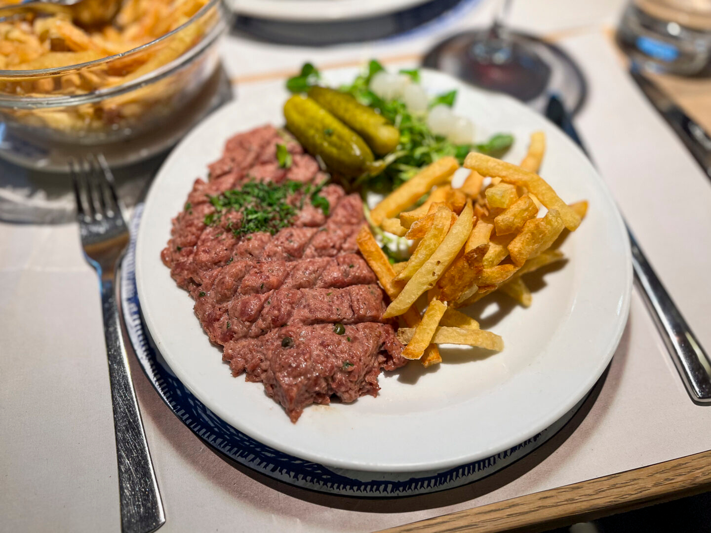

# Filet Américain (Belgian Raw Beef Spread)

*Belgium's raw-beef classic: finely chopped lean beef bound with mayo, mustard, capers, shallot and parsley. Served on dark rye, on a baguette, or piled with frites.*

**Serves:** 4 (as a snack / starter)

**Prep Time:** 25 minutes

**Cook Time:** None (raw)

## Overview
Filet américain is Belgium's national raw-beef preparation, similar in spirit to French steak tartare but distinct in execution. The French original is chopped beef topped with raw egg yolk and condiments served at table for the diner to mix; the Belgian version arrives pre-mixed and emulsified into a near-spread consistency, more like a coarse-textured beef mayonnaise than a dressed chopped steak. Despite the name there's nothing American about it: the dish is Belgian-Dutch in origin, named "à l'américaine" in the 1920s when American things were fashionable. Three Belgian-specific moves: lean fillet or rump finely chopped by knife (not minced; mincing destroys the texture); a Belgian-style mayonnaise built in the bowl with egg yolk, Dijon, vinegar, oil, capers, shallot, gherkins, parsley and Worcestershire; and the service, on dark rye at home or piled with frites at a brasserie. Use the freshest beef you can find and eat it the same day.

## Ingredients

### The beef (use the freshest possible)
- 400 g lean beef fillet OR top-cut rump (trimmed of every scrap of fat, sinew and silver skin)
- Use beef from a butcher you trust, the same day if possible

### The dressing
- 2 large egg yolks (very fresh; pasteurised if you're nervous)
- 1 tablespoon Dijon mustard
- 2 teaspoons white wine vinegar
- 120 ml neutral oil (sunflower or grapeseed)
- 1 tablespoon mayonnaise (optional, gives extra body; some Belgian recipes skip this)

### The mix-ins
- 1 small shallot, very finely chopped
- 2 tablespoons capers, finely chopped
- 4 cornichons (gherkins), very finely chopped
- 2 tablespoons chopped flat-leaf parsley
- 1 tablespoon chopped chives
- 1 teaspoon Worcestershire sauce
- 1/2 teaspoon Tabasco (or a Belgian-style hot sauce)
- 1 teaspoon ketchup (optional; gives a faint sweetness)
- 1/2 teaspoon salt
- A generous grind of black pepper

### To serve
- 8 slices dark Belgian rye bread (pain noir / roggebrood) OR a small fresh baguette, sliced
- A few salad leaves (oak leaf, baby gem, watercress)
- A lemon wedge per person
- Optional: a small mound of Belgian frites alongside

## Method

### Stage 1 - Prepare the beef
1. Place the beef in the freezer 20 minutes (firms it for easier chopping).
2. Lay on a clean board.
3. With a very sharp knife, slice the beef into thin strips (2-3 mm).
4. Stack the strips and slice across into thin matchsticks.
5. Chop across the matchsticks into a fine dice (2-3 mm cubes).
6. Don't grind, don't blitz - the hand-chop gives the right texture.
7. Place the chopped beef in a bowl in the fridge while you make the dressing.

### Stage 2 - Make the emulsion (the binder)
1. In a clean bowl, whisk the egg yolks with the Dijon mustard and vinegar.
2. Whisking constantly, drizzle in the oil very slowly - a thin steady stream at first till the emulsion forms, then in a thicker stream.
3. The mixture should thicken into a dense mayonnaise-like consistency.
4. Whisk in the optional 1 tablespoon shop mayo if using.

### Stage 3 - Add the mix-ins
1. Stir into the emulsion the chopped shallot, capers, cornichons, parsley, chives, Worcestershire sauce, Tabasco, optional ketchup, salt and a generous grind of pepper.
2. Taste; adjust seasoning, more vinegar / mustard / Tabasco / salt as needed. The dressing should be sharp, mustardy and lively.

### Stage 4 - Combine with the beef
1. Take the chopped beef from the fridge.
2. Add the dressing in 3 stages, folding gently after each addition with a wooden spoon.
3. Stop adding dressing when the beef holds together but isn't swimming - you want a "spreadable but coarse" texture.
4. (Any leftover dressing keeps 2 days; use as a sandwich spread.)
5. Taste; adjust seasoning one final time.

### Stage 5 - Plate
1. Shape the mixture into a mound or quenelle in the centre of each plate.
2. Garnish with a small bunch of salad leaves and a lemon wedge.
3. Serve immediately with the rye bread / baguette / frites alongside.

## Notes
- **Beef quality is non-negotiable:** raw beef must be very fresh, from a butcher you trust. Same-day cut is best.
- **Hand-chop, never mince:** the texture of clean small cubes is what makes filet américain. Minced beef gives a paste-like feel.
- **Pasteurised eggs:** if you're nervous about raw egg, use pasteurised yolks (sold in cartons at supermarkets); the flavour is identical.
- **Cold tools and surfaces:** the colder the beef stays during prep, the better the texture. Chill your knife and chopping board if you can.
- **Eat within an hour:** raw beef oxidises and the colour turns from pink to grey within 2 hours; the texture also softens. Make and eat.
- **Brussels brasserie style:** ask for "américain préparé maison" - meaning made-fresh-at-table; some places do this in front of you with a small theatre.

## Variations
**Steak tartare classique (French):** chopped beef topped with a raw yolk and small bowls of all the condiments separate, so the diner can mix to taste; less emulsified than the Belgian.
**Tatar au boeuf hâché (cooked):** for the squeamish - lightly brown the beef in a pan for 60 seconds before chopping; you lose the rawness but keep the chopped texture.
**Filet américain au tabasco:** double the Tabasco; the spicy variant popular in Antwerp.
**Filet américain à la truffe:** finish with a few drops of truffle oil and a grating of black truffle - upmarket Brussels variant.
**Vegetarian "américain":** swap the beef for finely diced cooked beetroot mixed with toasted walnuts and a chunky vegan mayo - excellent texture-similar, completely different in spirit.
**Filet américain sur toast (the canapé):** spread thinly on toasted baguette slices with a caper on top - the Belgian cocktail-canapé variant.

## Serving
At a Brussels brasserie as a starter or main (the traditional setting) · at a Belgian café for a quick lunch with bread and a Stella · at a Belgian summer terrace · at a Flemish family Sunday brunch · at a Belgian wedding reception buffet · at home with a pre-dinner Belgian gin or a glass of cold Belgian lager.

## Storage
- Make and eat within an hour. Raw beef oxidises fast.
- If you must hold a small amount, refrigerate in a sealed tub, covered tight to keep air out, for up to 4 hours.
- Don't freeze the prepared mix - the texture suffers.
- The dressing component on its own (without the beef) keeps 2-3 days in the fridge; use as a sandwich spread or salad dressing.
- Pre-made supermarket filet américain in tubs has a sell-by date; respect it.
