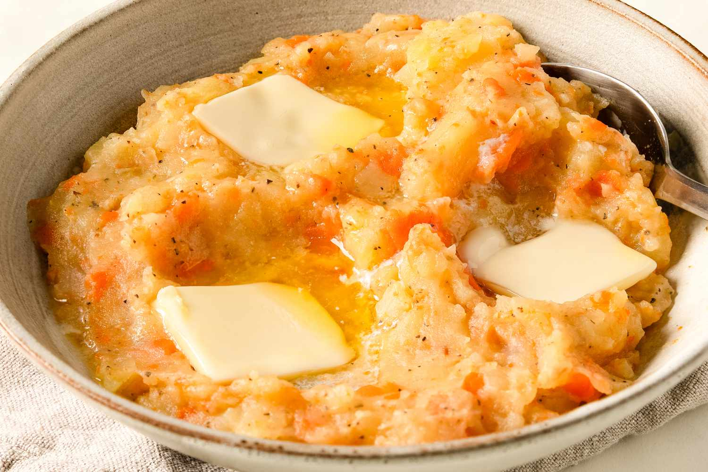

# Stoemp (Brussels Mashed Potatoes with Vegetables and Sausage)

*Brussels' winter comfort plate: floury potatoes crushed coarse with leeks, butter and cream, topped with grilled smoked sausage and crisp bacon lardons.*

**Serves:** 4

**Prep Time:** 20 minutes

**Cook Time:** 40 minutes

## Overview
Stoemp is Brussels' traditional winter dinner and the textural opposite of a smooth French purée: floury potatoes boiled tender, then crushed coarsely with cooked leeks, onion, butter and cream so that visible chunks of potato and sweet braised leek run through the mix. The result sits somewhere between mashed potato and bubble-and-squeak. The Brussels move is to top it with grilled smoked sausage (saucisse de campagne, saucisson de Liège or a good cumberland sausage at home) and a generous scattering of crisp bacon lardons; the smoky meat is what makes it a meal rather than a side. Many regional stoemp variants exist (carrots, Brussels sprouts, spinach) and each has its champions, but leeks plus sausage is the Brussels default. The leeks must be sweated long and slow in butter till silky; the potatoes must be floury, not waxy; the crush coarse, never smooth.

## Ingredients

### The base
- 1 kg floury potatoes (Bintje, Maris Piper, King Edward, or Russet), peeled and cut into 4 cm chunks
- 2 large leeks (white and pale green only), washed thoroughly and sliced thin
- 1 large onion, finely chopped
- 60 g unsalted butter (plus more to serve)
- 120 ml whole milk, warm
- 80 ml double cream
- Salt and white pepper
- Pinch of grated nutmeg

### The toppings (Brussels traditional)
- 4 good smoked sausages (saucisse de campagne, Liège sausage, or Cumberland) - about 600 g total
- 200 g smoked bacon lardons (1 cm cubes)
- 2 tablespoons sunflower oil

### To serve
- Strong Dijon mustard
- Cold Belgian lager (Stella Artois, Jupiler, Maes) OR a witbier (Hoegaarden)

## Method

### Stage 1 - Sweat the leeks and onion
1. Melt 30 g of the butter in a wide pan over medium-low heat.
2. Add the chopped onion and a pinch of salt; sweat 5 minutes.
3. Add the sliced leeks; sweat 15-18 minutes, stirring every few minutes.
4. The leeks should be silky, sweet and lightly translucent. No colour.

### Stage 2 - Boil the potatoes
1. Meanwhile, place the potato chunks in a large pot and cover with cold salted water.
2. Bring to the boil, then reduce to a steady simmer.
3. Cook 15-18 minutes till a knife slides in easily - fully tender.
4. Drain in a colander; return the empty pot to the hob for 1 minute to evaporate any moisture.

### Stage 3 - Cook the sausages and bacon
1. While the potatoes simmer, heat the sunflower oil in a heavy frying pan over medium heat.
2. Add the bacon lardons; cook 6-8 minutes till crisp and golden. Lift out with a slotted spoon and set aside, leaving the bacon fat in the pan.
3. Add the sausages to the same pan; cook 12-15 minutes, turning, till browned and cooked through. (Or grill them under a hot grill if you prefer.)

### Stage 4 - The coarse crush
1. Tip the drained potatoes into the leek-and-onion pan.
2. Pour over the warm milk and the double cream.
3. Add the remaining 30 g butter.
4. With a potato masher (or a sturdy fork), crush coarsely - leave visible chunks of potato and visible strips of leek. Don't smooth into a purée.
5. Season generously with salt, white pepper and a pinch of grated nutmeg. Taste and adjust.

### Stage 5 - Plate
1. Spoon a generous mound of stoemp into each warm wide bowl.
2. Press a small well into the top with the back of a spoon.
3. Place a sausage (or slice it on the diagonal) on top.
4. Scatter the crisp bacon lardons over.
5. Add a small dab of extra butter into the well (it melts down through the mound).

### Stage 6 - Serve
1. Serve immediately while hot.
2. Strong mustard on the side.
3. Cold Belgian lager to drink.

## Notes
- **Bintje is the traditional potato:** the Belgian floury workhorse. Maris Piper, King Edward and Russet all work. Avoid Yukon Gold or any waxy variety - they won't crush properly.
- **Sweat the leeks long and slow:** 15 minutes minimum. This is where the sweetness comes from. Rushing this step gives you flat-tasting stoemp.
- **Coarse crush is the point:** if you smooth it out with a ricer, you've made mashed potatoes, not stoemp.
- **Smoked sausage matters:** the Liège saucisson or a Cumberland with proper smoke is the traditional pairing. Don't use a plain bratwurst.
- **Cream + butter is generous:** stoemp is a winter dish; the richness is the point.

## Variations
**Stoemp aux carottes:** swap the leeks for 600 g of carrots (peeled, diced, sweated in butter till sweet) - the most common variant after leek; see [Stoemp aux carottes](side-dishes/stoemp-aux-carottes.md).
**Stoemp aux choux de Bruxelles:** swap the leeks for 600 g shredded Brussels sprouts, sweated long and slow till silky.
**Stoemp aux épinards:** swap leeks for 400 g wilted spinach, finely chopped - the spring variant.
**Stoemp aux poireaux et lard:** the traditional Brussels recipe (this one) but with extra bacon mixed into the crush itself.
**Stoemp avec boudin noir:** swap the smoked sausage for grilled black pudding (boudin noir) - the Liège variant.
**Vegetarian stoemp:** skip the meat; double the leeks, top with a fried egg.
**Stoemp aux navets:** swap leeks for diced turnips - a more rural variant from rural Flanders.

## Serving
At a Brussels brasserie on a cold winter evening (the traditional setting) · at a Belgian working-day lunch · at a Belgian family dinner from October to March · at a Belgian Christmas-market food stall · at a Flemish pub alongside a Trappist beer · at home as a Sunday-night comfort plate.

## Storage
- Refrigerates 3 days. Reheats well in a pan with a splash of milk or cream.
- The coarse crush gets slightly creamier on reheating but still holds its texture.
- Freezes 2 months; defrost overnight in the fridge and reheat with a splash of milk.
- Cooked sausages keep 3 days refrigerated; slice and pan-fry to refresh.
- Day-old stoemp pan-fried in butter till crisp is a serious Belgian breakfast.
