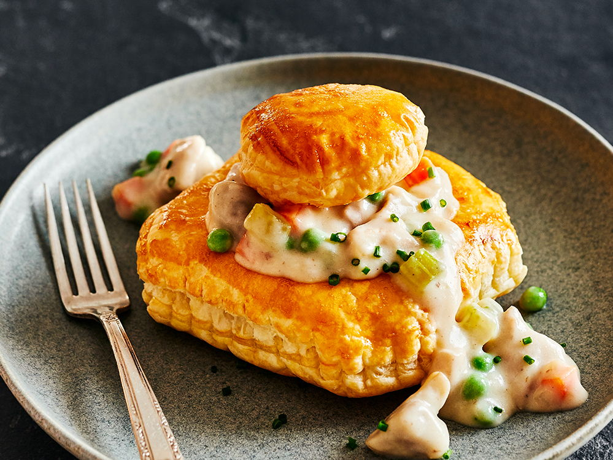

# Vol-au-Vent à la Belge

*Belgium's Sunday-lunch classic: a tall puff-pastry case holding poached chicken, mushrooms and tiny boulettes meatballs in a lemony egg-yolk velouté. Served with frites.*

**Serves:** 6

**Prep Time:** 40 minutes

**Cook Time:** 1 hour 10 minutes

## Overview
Vol-au-vent à la Belge means "flight on the wind", named for the way the puff-pastry case puffs and rises in the oven. The Belgian version of the French original, but the filling is identity-specific: chicken poached in stock, mushrooms sautéed in butter, and small veal-or-pork meatballs (boulettes). The meatballs are what mark this as Belgian rather than French. The sauce is a classic velouté built on the chicken poaching liquid, finished with cream, egg yolks and a squeeze of lemon. Most Belgian families buy frozen puff-pastry shells and make the filling from scratch; that's how every grandmother in the country does it for Sunday lunch. The construction is layered: a warmed pastry case in the centre of the plate, generous spoonfuls of filling pouring down the sides, frites or boiled potatoes alongside. A wedge of lemon and grated nutmeg over the top.

## Ingredients

### The chicken poach
- 1 free-range chicken (1.5-1.7 kg) - poach the whole bird then strip; or 800 g boneless skinless chicken thighs
- 1.2 litres good chicken stock
- 1 leek (white part), washed
- 1 carrot
- 1 stick celery
- 1 onion, halved with 2 cloves stuck in
- 2 bay leaves
- 6 black peppercorns

### The meatballs (boulettes)
- 250 g minced veal OR minced pork OR a mix
- 250 g minced beef
- 1 small onion, very finely chopped
- 1 egg yolk
- 60 ml whole milk
- 60 g fresh white breadcrumbs (from a day-old loaf)
- 1 tablespoon chopped flat-leaf parsley
- 1/4 teaspoon grated nutmeg
- 1 teaspoon salt
- 1/2 teaspoon black pepper
- 2 tablespoons plain flour (for rolling)
- 2 tablespoons sunflower oil (for frying)

### The mushrooms
- 400 g button or chestnut mushrooms, halved or quartered
- 40 g unsalted butter
- Pinch of salt

### The velouté sauce
- 60 g unsalted butter
- 60 g plain flour
- 800 ml strained chicken poaching liquid (from the chicken pot above)
- 200 ml double cream
- 3 large egg yolks
- 1 tablespoon lemon juice (plus a wedge to serve)
- Salt, white pepper, grated nutmeg

### To finish and assemble
- 6 large bought puff-pastry vol-au-vent shells (about 12 cm diameter), warmed
- 1 small bunch flat-leaf parsley, chopped

### To serve
- 1 batch Belgian frites OR 800 g small boiled new potatoes
- 6 lemon wedges
- A glass of dry white wine OR a Belgian witbier

## Method

### Stage 1 - Poach the chicken
1. Place the whole chicken (or thighs) in a large stockpot.
2. Add the leek, carrot, celery, clove-studded onion, bay leaves, peppercorns.
3. Pour over the chicken stock (top up with cold water if needed to cover).
4. Bring to a gentle simmer; never a full boil. Cover and poach 45 minutes (whole chicken) or 20-25 minutes (thighs).
5. The chicken should be tender and read 75°C internally.
6. Lift the chicken out and let it cool slightly; strain the poaching liquid through a fine sieve and reserve.
7. When cool enough to handle, strip the meat from the bones in bite-sized pieces; discard skin and bones.

### Stage 2 - Make the meatballs
1. In a bowl, combine the minced meats, finely chopped onion, egg yolk, milk, breadcrumbs, parsley, nutmeg, salt and pepper.
2. Knead together with clean hands till uniform.
3. Roll into walnut-sized balls (about 18-24 balls total). Roll lightly in the flour.
4. Heat the sunflower oil in a heavy frying pan over medium heat.
5. Brown the meatballs on all sides, 6-8 minutes total. Don't crowd the pan; work in 2 batches.
6. Set aside.

### Stage 3 - Sauté the mushrooms
1. In the same pan as the meatballs, melt the 40 g butter over medium-high heat.
2. Add the mushrooms in a single layer; do not stir for 2 minutes.
3. Cook 5-6 minutes total, turning, till golden and any liquid has evaporated.
4. Set aside.

### Stage 4 - Build the velouté
1. In a wide heavy pot, melt the 60 g butter over medium heat.
2. Whisk in the flour; cook 2 minutes, stirring, to make a pale blond roux.
3. Whisk in the reserved chicken poaching liquid in a steady stream.
4. Cook 5-6 minutes, whisking, till the sauce thickens to the consistency of pouring cream.
5. Season with salt, white pepper and a generous pinch of grated nutmeg.

### Stage 5 - Combine
1. Add the chicken meat, browned meatballs, and sautéed mushrooms to the velouté.
2. Stir gently to coat everything in sauce.
3. Simmer 6-8 minutes on a very low heat to warm everything through and let the flavours marry.

### Stage 6 - The egg yolk and cream finish
1. In a bowl, whisk the egg yolks with the double cream and lemon juice.
2. Ladle 200 ml of the hot sauce into the yolk mixture in a slow steady stream, whisking constantly - this tempers the eggs.
3. Take the pot off the heat.
4. Pour the tempered yolk-cream mixture back into the pot, stirring constantly.
5. Return to the lowest heat for 1-2 minutes till lightly thickened. Do not let it boil.
6. Taste; adjust salt, pepper, and lemon. Stir in most of the chopped parsley (save some for garnish).

### Stage 7 - Warm the pastry shells
1. Place the vol-au-vent shells on a baking tray.
2. Warm in a 180°C oven for 5-6 minutes till crisp and slightly puffed again.

### Stage 8 - Plate
1. Place a warm pastry shell in the centre of each warmed wide plate.
2. Spoon the chicken filling generously into and around the shell - it should spill onto the plate.
3. Scatter with reserved parsley.
4. Serve immediately with a lemon wedge, Belgian frites or boiled potatoes alongside.

## Notes
- **Boulettes are non-negotiable:** the meatballs are what make this Belgian rather than French. A vol-au-vent without boulettes is just a chicken volau-vent.
- **Don't boil after the yolks:** the egg-yolk-cream liaison is fragile. Lowest heat, constant stirring.
- **Bought pastry shells are fine:** every Belgian household uses bought ones; the filling is where the cook's hand shows.
- **Warm the shells:** straight from the box they're flat and slightly stale. 5 minutes in a hot oven restores them.
- **A wedge of lemon at the table:** the velouté is rich; the lemon cuts it. Don't skip.

## Variations
**Bouchée à la reine (smaller version):** make smaller pastry shells (6-7 cm) and a finer mince of chicken - the elegant version for a starter.
**Vol-au-vent au poisson:** swap the chicken and meatballs for chunks of cod, salmon, prawns and scallops - the seafood version, big in Ghent.
**Vol-au-vent aux ris de veau:** with sweetbreads in place of meatballs - the high-restaurant version.
**Vol-au-vent à la flamande:** add a handful of cooked Belgian ham (jambon d'Ardenne) to the filling.
**Quick weeknight version:** use rotisserie chicken meat, frozen meatballs (good quality ones), and bought puff-pastry shells - 30 minutes start to finish.
**Vegetarian "vol-au-vent":** sliced king oyster mushrooms instead of meat, vegetable stock, the same velouté treatment.

## Serving
At a Brussels brasserie Sunday lunch (the canonical setting) · at a Belgian family Sunday dinner · at a Belgian wedding reception · at a Flemish Christmas Eve meal · at a Liège café · at a Belgian-themed restaurant abroad · at home for a celebratory winter dinner.

## Storage
- Refrigerate the filling (without the pastry shells) for 3 days; reheat very gently on the stovetop. The pastry shells separately keep 4 days in an airtight tin.
- Don't refrigerate filling inside the pastry shell - the pastry goes soggy.
- Freezes 2 months but the egg-yolk liaison can break on defrosting; expect a slightly thinner sauce.
- Reheat the filling in a saucepan over very low heat, stirring constantly; add a splash of cream to loosen.
- Day-old filling makes an excellent base for a chicken pot pie.
