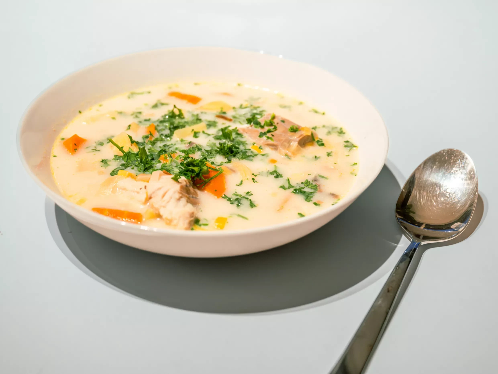

# Waterzooi (Gentse Waterzooi)

*Ghent's flagship stew: chicken and julienned leek, celery, carrot and onion poached in broth thickened with egg yolks and cream, finished with parsley. Eat with boiled potatoes.*

**Serves:** 6

**Prep Time:** 30 minutes

**Cook Time:** 1 hour 15 minutes

## Overview
Waterzooi means "watery boil" in old Flemish; "Gentse" because it's from Ghent. The Flemish stew that sits at the opposite end of the spectrum from carbonnade: where carbonnade is dark, sweet and beer-driven, waterzooi is pale, golden, restrained and built on the same logic as a French blanquette. Poach gently, thicken with egg yolk and cream at the end, finish with herb. The original Ghent recipe used freshwater fish from the Scheldt and Leie rivers; pollution killed the river-fish industry a century ago, and the modern traditional version uses chicken. Vegetables are julienned thin so they cook fast and serve as long elegant strips through the broth. The thickening is the critical move: egg yolks whisked with cream and a ladle of hot broth, then poured back into the pot off the heat (boiling will scramble the eggs). Velvety, lightly thickened, served with boiled potatoes and a glass of witbier.

## Ingredients

### The chicken and aromatics
- 1 whole free-range chicken (1.6-1.8 kg), jointed into 8 pieces (or 6 large bone-in skinless thighs)
- 2 leeks (white and pale green only), washed thoroughly and julienned
- 3 medium carrots, peeled and julienned
- 3 stalks celery (inner pale ones), julienned
- 1 large onion, finely chopped
- 4 sprigs fresh thyme
- 2 bay leaves
- 6 black peppercorns
- 6 cloves
- 1.2 litres good chicken stock (homemade ideal)
- 200 ml dry white wine
- 60 g unsalted butter
- Salt and white pepper

### The thickening (egg yolk and cream liaison)
- 3 large egg yolks
- 200 ml double cream
- 1 tablespoon lemon juice
- 30 g unsalted butter, cubed and cold

### To finish
- 1 small bunch fresh flat-leaf parsley (about 30 g), leaves only, chopped
- Pinch of grated nutmeg

### To serve
- 800 g small new potatoes, boiled in salted water and dressed with butter and chopped parsley
- 6 thick slices of country bread
- 1 bottle of Belgian witbier (Hoegaarden) OR a glass of dry Riesling

## Method

### Stage 1 - Brown the chicken lightly
1. Pat the chicken pieces dry and season generously with salt and white pepper.
2. Melt 30 g of the butter in a wide heavy pot over medium heat.
3. Place the chicken skin-side-down (if jointed with skin) and brown lightly - no dark crust; pale gold only. About 4 minutes per side.
4. Transfer the chicken to a plate and set aside.

### Stage 2 - Sweat the vegetables
1. Add the remaining 30 g butter to the same pot.
2. Add the chopped onion and a pinch of salt; sweat 5 minutes till translucent.
3. Add half of each julienned vegetable (leek, carrot, celery) - the rest joins later.
4. Sweat 8 minutes, stirring occasionally; no colour, just softened.

### Stage 3 - The poach
1. Return the chicken pieces to the pot.
2. Add the thyme, bay leaves, peppercorns, cloves, white wine and chicken stock.
3. Bring to a gentle simmer - never a full boil; small bubbles only.
4. Cover and poach 35-40 minutes till the chicken is tender and reads 75°C internal.

### Stage 4 - Add the remaining julienned vegetables
1. Lift out the chicken pieces and place on a board; cover loosely to keep warm.
2. Add the remaining julienned leek, carrot and celery to the broth.
3. Simmer uncovered 8-10 minutes till the vegetables are tender-crisp.
4. Meanwhile, strip the chicken meat off the bones in large pieces; discard skin and bones.

### Stage 5 - The egg-yolk-and-cream liaison (off the heat)
1. In a bowl, whisk the egg yolks with the double cream and lemon juice.
2. Ladle 200 ml of the hot broth (slowly, while whisking) into the yolk mixture - this tempers it so the eggs don't scramble.
3. Take the pot OFF the heat.
4. Pour the tempered yolk-cream mixture back into the pot, stirring constantly.
5. Return the pot to the LOWEST possible heat; warm gently 2-3 minutes till the broth lightly thickens and coats a spoon. Don't let it boil.
6. Whisk in the cubed cold butter, off the heat again, for the final gloss.

### Stage 6 - Reassemble and finish
1. Return the chicken meat to the pot.
2. Stir in most of the chopped parsley (save a tablespoon for garnish).
3. Add a pinch of grated nutmeg.
4. Taste; adjust with salt, white pepper, and a few drops more lemon juice.

### Stage 7 - Serve
1. Ladle into wide shallow bowls.
2. Top with a scatter of the reserved parsley.
3. Serve the buttered new potatoes alongside (some Belgians spoon a few into each bowl; some serve separately).
4. Crusty country bread on the side to soak up the broth.

## Notes
- **Never boil after the eggs go in:** the yolk-cream liaison is fragile. Above 80°C and the eggs scramble. Lowest heat, constant stirring.
- **Temper the yolks properly:** a slow stream of hot broth into the eggs while whisking. Skip this and the eggs go granular in the pot.
- **Julienne, not dice:** the long elegant strips are part of the waterzooi identity. A dice gives you something else.
- **Pale, not dark:** the chicken should brown to pale gold, not dark crust. This is a clean white stew, not a deep brown braise.
- **Fish version:** swap the chicken for 1.2 kg firm white fish (cod, monkfish, sea bass) and reduce the poaching time to 6-8 minutes. The fish version is the original Ghent recipe.

## Variations
**Waterzooi van vis (fish waterzooi):** sea fish replacing chicken - the original Ghent recipe; closer to a French bourride.
**Waterzooi van langoustines:** Brussels seafood variant with langoustines, white fish, and mussels.
**Modern fillet-only waterzooi:** boneless chicken breasts poached gently - faster but less flavour without the bones.
**Waterzooi met dragon:** add a tablespoon of chopped fresh tarragon at stage 6 - the Brussels variant.
**Vegetarian waterzooi:** chunks of celeriac and mushrooms instead of chicken, vegetable stock; finish with the same yolk-cream liaison.
**Quick weeknight waterzooi:** use rotisserie chicken meat torn into pieces; start at stage 2 with a good chicken stock.

## Serving
At a Ghent restaurant overlooking the river (the traditional setting) · at a Flemish family Sunday lunch · at a Belgian Christmas Eve dinner · at a Flemish wedding reception · at a Belgian gastropub on a cold winter evening · at home as a Sunday roast alternative.

## Storage
- Refrigerates 2 days. The egg-cream liaison can break on reheating - reheat very gently on the stovetop, stirring constantly, and never bring to a boil.
- Don't freeze; the liaison breaks completely and the texture becomes grainy.
- Better eaten fresh - this is one of the Flemish dishes that doesn't improve overnight.
- Boiled potatoes keep separately 3 days; refresh in butter or a quick re-boil.
