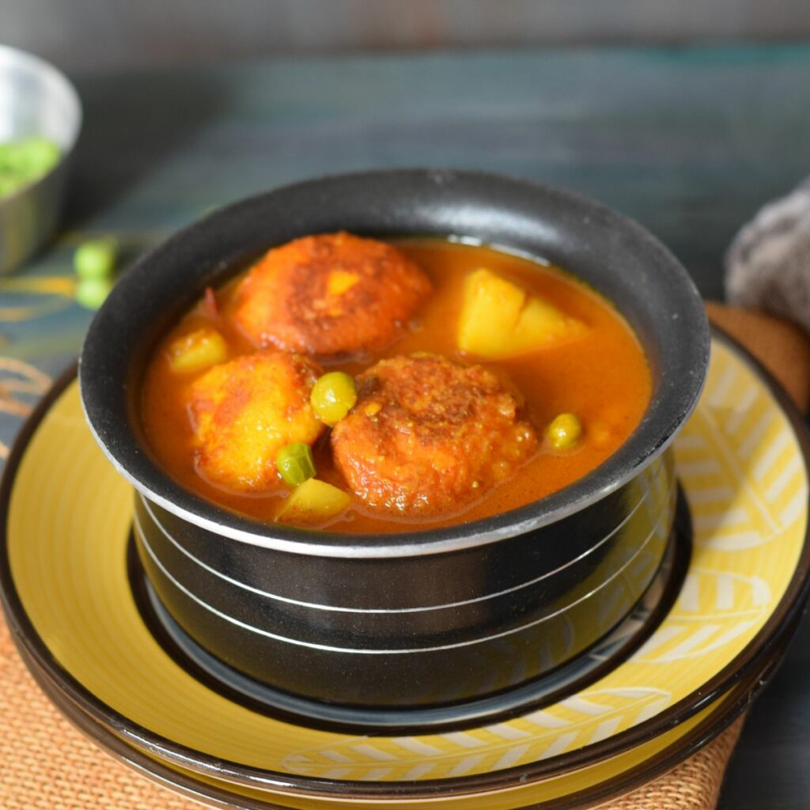

# Chanar Dalna

*A Bengali vegetarian curry of fresh paneer cubes and pale gold potatoes simmered in a light, ginger-and-cumin-scented gravy. The Sunday curry of vegetarian Bengali households.*

**Serves:** 4

**Prep Time:** 20 minutes

**Cook Time:** 30 minutes

## Overview
The vegetarian centrepiece of Bengali Sunday lunches and festival meals, the curry that arrives on the rice plate when fish is off the menu (a Hindu vegetarian day, Saraswati Puja, a temple feast). "Chanar" in Bengali refers to fresh-curdled paneer, "dalna" to a light soupy curry, and the dish is exactly what the name promises. You lightly fry cubes of chhena (or shop paneer if you must) and quartered potatoes until they're pale gold, then simmer them in a thin gravy of mustard oil, whole spices, freshly pounded ginger and ground cumin. There's no onion, no garlic and no tomato in the most traditional version. The dish leans entirely on its whole spices and the ginger paste, which keeps it festival-friendly across vegetarian Hindu households. Eat with a small mound of gobindobhog rice, a wedge of lime on the side, and the chhena half-collapsing into the spiced broth as you spoon.

## Ingredients

### Paneer and potatoes
- 400 g paneer (cut into 2 cm cubes; or homemade chenna)
- 3 medium potatoes (peeled, quartered)
- 1 teaspoon turmeric
- 4 tablespoons mustard oil

### Whole spices
- 2 Indian bay leaves (tej patta)
- 5 cm piece cinnamon (cassia bark)
- 4 green cardamom pods (bashed)
- 4 cloves
- 1 teaspoon cumin seeds
- 1 dried red chilli (optional, broken)

### Wet masala
- 2 tablespoons ginger paste (fresh, no garlic)
- 1 tablespoon ground cumin
- 1 teaspoon ground coriander
- 1 teaspoon Kashmiri chilli powder
- ¾ teaspoon turmeric
- 2 green chillies (slit lengthways)

### Liquid and finish
- 500 ml water
- 1 teaspoon sugar
- Salt (to taste)
- 1 teaspoon [Garam Masala](../../base-ingredients/curry-powder/garam-masala.md)
- 1 teaspoon ghee (to finish)
- A small handful of fresh coriander (chopped)

## Method

### Stage 1 - Fry the paneer
1. Heat 2 tablespoons of the mustard oil in a heavy-based pan over medium-high heat until it just smokes, then reduce the heat slightly.
2. Slide in the paneer cubes and fry for 3 to 4 minutes, turning, until golden on all sides.
3. Lift out with a slotted spoon and drop into a bowl of warm water, this stops them going hard as they sit.

### Stage 2 - Fry the potatoes
1. In the same oil, fry the potato quarters for 5 to 6 minutes, turning, until lightly golden at the edges (turmeric-rub them first if you want extra colour).
2. Lift out and set aside.

### Stage 3 - Bloom the whole spices
1. Add the remaining 2 tablespoons of mustard oil to the pan.
2. Drop in the bay leaves, cinnamon, cardamom, cloves, cumin seeds and dried red chilli.
3. Sizzle for 30 seconds until the cumin pops and the air smells of warm spice.

### Stage 4 - Build the wet masala
1. Lower the heat to medium.
2. Spoon in the ginger paste, it will spit, so stand back.
3. Cook for 1 to 2 minutes, stirring, until the raw edge is gone and the paste smells sweet.
4. Sprinkle in the ground cumin, ground coriander, Kashmiri chilli powder and turmeric.
5. Stir for 30 seconds, splashing in a tablespoon of water if the spices threaten to catch, they should bloom in the oil, not scorch.

### Stage 5 - The dalna
1. Drain the paneer from the warm-water bath and add it to the pan along with the par-fried potatoes and slit green chillies.
2. Stir gently to coat in the masala.
3. Pour in the water and add the sugar and salt.
4. Bring to a gentle simmer, cover and cook for 12 to 15 minutes until the potatoes are completely soft and the gravy has lightly thickened.
5. Stir once or twice (gently, so the paneer doesn't break) to stop anything catching.

### Stage 6 - Finish
1. Taste and adjust salt.
2. Sprinkle over the garam masala and dot in the ghee.
3. Cover and rest off the heat for 5 minutes.
4. Top with chopped coriander.

## Notes
- **No onion, no garlic.** Traditional chanar dalna is satvik-cooking-friendly, no onion or garlic. This is what gives it its distinctive clean, ginger-led flavour. Adding them is fine if you prefer, but the dish then drifts toward a generic paneer curry.
- **Soak the fried paneer.** The warm-water trick is genuinely important. Paneer goes leathery if it sits dry between frying and the gravy. Five minutes in warm water keeps it soft.
- **Fresh ginger paste.** Pre-made jar pastes work but a freshly pounded knob of ginger (or a quick processor blitz) is a noticeable lift in a dish this clean.
- **Heat level.** This is a mild curry. The slit green chillies infuse rather than dominate. For more punch, double them or add a pinch more Kashmiri chilli.

## Serving
Serve with luchi (Bengali puffed bread), plain steamed basmati rice, or with a simple cholar dal on the side for a vegetarian thali. A spoonful of mango chutney on the rim of the plate is the classic finishing touch.

## Storage
- Refrigerate up to 2 days. The paneer firms up slightly in the fridge; a gentle reheat in the gravy softens it again.
- Don't freeze; the paneer texture suffers and the gravy thins on thawing.
- Reheat gently over low heat with a splash of water to loosen the gravy.
