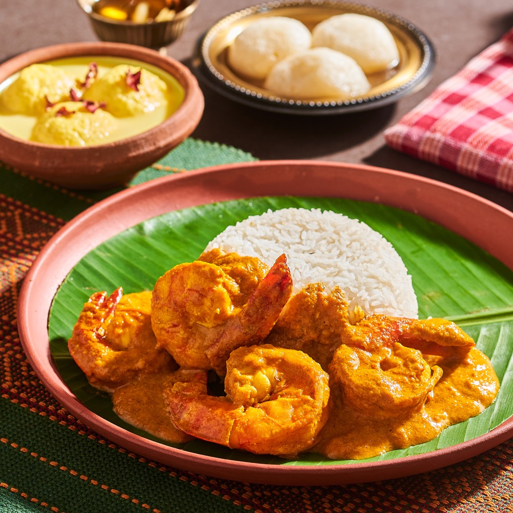

# Chingri Malai Curry

*Pearly prawns curled in a pale golden coconut gravy, scented with bay, cardamom and a whisper of ghee. The dish gleams on the plate, sweet and gently spiced, and is the showpiece of any Bengali wedding banquet or Bijoya Dashami feast.*

**Serves:** 4

**Prep Time:** 20 minutes

**Cook Time:** 30 minutes

## Overview
Chingri malai curry is one of those rare Bengali dishes that crosses the river: equally beloved in Kolkata's bonedi households and in the coastal kitchens of Khulna and Chittagong. The name is often misread as a reference to Malaysia (Malay), and there is a folk tradition that the dish came back with Bengali traders from the Malay Peninsula, but in practice malai here simply means cream, in this case the rich first-pressed coconut milk that gives the gravy its body. The prawns must be large, ideally tiger prawns or the freshwater bagda chingri, kept whole with heads and tails on for maximum flavour. The cooking is short and the spice profile delicate: a tempering of whole garam masala in ghee and a little mustard oil, a base of finely ground onion paste rather than chopped onion, a gentle bloom of ginger and turmeric, and then the prawns barely poached in coconut milk so they remain juicy. Sugar plays a quiet but important role, just enough to round the salt and amplify the coconut's sweetness. The result is a curry that is luxurious without being heavy, fragrant without being sharp. It is rich enough to be served with plain basmati or gobindobhog rice and nothing else, though a small wedge of lime on the side is welcome. Overcooked prawns are the only real danger; once you have mastered the timing, this is one of the easier showstoppers in the Bengali repertoire.

## Ingredients

### Prawns and marinade
- 500 g large prawns, shelled and deveined with tails on (or whole tiger prawns)
- 1 tsp turmeric
- ½ tsp salt
- 1 tsp Kashmiri chilli powder

### Curry
- 2 tbsp mustard oil
- 2 tbsp ghee
- 2 bay leaves
- 4 green cardamom pods, lightly crushed
- 1 cinnamon stick (4 cm)
- 4 cloves
- 1 onion (large), pureed to a smooth paste
- 1 tbsp ginger paste
- 1 tsp Kashmiri chilli powder
- ½ tsp turmeric
- 2 green chillies, slit
- 1 tsp sugar
- 1 tsp salt, or to taste
- 400 ml thick coconut milk
- 100 ml warm water
- ½ tsp [Garam Masala](../indian/Spice-Mixes/garam-masala.md)
- 1 tsp ghee, to finish

## Method

### Stage 1 - Marinate and seal the prawns
1. Rinse the prawns and pat dry.
1. Rub with turmeric, salt and Kashmiri chilli powder. Rest for 10 minutes.
1. Heat the mustard oil in a kadai until smoking, then lower the heat.
1. Sear the prawns for 30 seconds a side, just until they turn pink at the edges; do not cook through. Lift out and set aside.

### Stage 2 - Build the gravy
1. Add the ghee to the same pan.
1. Drop in the bay leaves, cardamom, cinnamon and cloves; let them perfume for 20 seconds.
1. Add the onion paste and fry over medium heat for 8 to 10 minutes, stirring often, until pale gold. Do not let it brown.
1. Add the ginger paste, Kashmiri chilli and turmeric; cook for 2 minutes until the raw smell lifts and the oil separates.
1. Stir in the slit green chillies, sugar and salt.

### Stage 3 - Finish in coconut milk
1. Pour in the coconut milk and warm water; bring to a gentle simmer. Do not boil hard or the coconut milk will split.
1. Slide the seared prawns back into the pan and simmer for 4 to 5 minutes until just cooked through and the gravy has thickened to a light cream.
1. Sprinkle the garam masala and drizzle the finishing ghee.
1. Rest off the heat, covered, for 5 minutes before serving with steamed rice.

## Notes
- **Prawn size:** Big prawns are essential; small prawns toughen instantly in the hot gravy. Tiger prawns or langoustines work well as a substitute.
- **Coconut milk:** Use thick, first-pressing coconut milk for authenticity. Avoid low-fat versions; the curry needs the richness.
- **No tomato:** Authentic chingri malai curry never contains tomato. The colour should be a pale buttery gold, not orange.
- **A pinch of nutmeg:** Some Kolkata kitchens add a tiny grating of nutmeg with the garam masala at the end. It is optional but lovely.

## Storage
- Best eaten the day it is cooked; prawns continue to cook in the warm gravy.
- Refrigerate leftovers in a sealed container for 1 day only. Reheat very gently over low heat.
- Not suitable for freezing.
