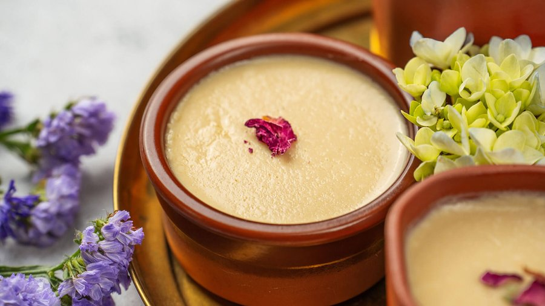

# Mishti Doi

*Bengal's defining Sunday dessert: thick set yoghurt the colour of pale caramel, sweetened with melted jaggery, served cold in unglazed clay pots.*

**Serves:** 6

**Prep Time:** 20 minutes (plus 8-12 hours fermentation and 4 hours chilling)

**Cook Time:** 30 minutes

## Overview
Mishti doi (literally "sweet yoghurt") is the great quiet sweet of Bengal: not as showy as rasgulla, not as rich as sandesh, but possibly the most loved of all. Yoghurt thick enough to hold a spoon upright, the colour of pale caramel, sweetened not with sugar but with melted and further-caramelised jaggery so the toffee notes and the deep amber colour come entirely from that caramel. Set in porous unglazed clay pots (matka or bhar) which absorb whey through their walls and cool the doi by evaporation, giving a denser set than glass or plastic ever can. The closer to a Bengali feast, after fish, after rice, after rasgulla even, eaten with a small spoon directly from the pot. The winter speciality made with nolen gur, the fragrant first-tap date palm jaggery that arrives in Bengal markets in December and disappears by February, is one of the great seasonal sweets of the subcontinent.

## Ingredients

- 1 ½ litres whole milk (full fat)
- 200 g jaggery (gur), preferably date palm jaggery (nolen gur), broken into pieces
- 50 g sugar (white or palm)
- 3 tbsp live full-fat plain yoghurt (the starter culture; must be fresh and active)
- 2 green cardamom pods (small, lightly crushed, optional)

## Method

### Stage 1 - Reduce the milk
1. Pour the milk into a heavy-bottomed wide pan.
1. Bring to a gentle boil over medium heat, then reduce to a steady simmer.
1. Cook 25-30 minutes, stirring frequently and scraping the bottom and sides, until the milk is reduced by roughly one-third and has a faint cream colour and a thicker texture. Add the cardamom pods in the last 5 minutes if using.
1. Turn off the heat.

### Stage 2 - Caramelise the jaggery
1. In a small heavy pan combine the jaggery and sugar with 2 tbsp water.
1. Melt over low-medium heat, stirring, until the jaggery dissolves into a syrup.
1. Continue cooking 3-5 minutes until it darkens noticeably and smells strongly of caramel. Do not let it burn; pull it off the heat as soon as it goes deep amber.

### Stage 3 - Combine
1. Pour the caramelised jaggery slowly into the warm reduced milk in a thin stream, stirring constantly. The milk should turn a pale toffee colour.
1. Strain through a fine sieve into a jug to remove cardamom husks and any caramel solids.
1. Let cool until the mixture is just warm to the touch, around 40-45 C. This is critical: hotter and you will kill the yoghurt culture; cooler and the doi will not set.

### Stage 4 - Inoculate
1. Whisk the live yoghurt smooth in a small bowl.
1. Stir 2-3 tbsp of the warm sweetened milk into the yoghurt to thin it, then pour the yoghurt mixture back into the warm milk. Stir gently for 20 seconds.

### Stage 5 - Set
1. Pour into unglazed terracotta pots (matka), small ramekins or a single shallow earthenware dish.
1. Cover with a lid or plate.
1. Leave undisturbed in a warm draught-free place for 8-12 hours. In summer 8 hours is usually enough; in winter wrap the pots in a tea towel or place inside an oven (off, with the light on) overnight.
1. The doi is set when it holds the impression of a spoon and the surface is just slightly domed.

### Stage 6 - Chill and serve
1. Refrigerate the set pots for at least 4 hours, ideally overnight.
1. Serve very cold, straight from the pot, with a small spoon. The top will be the colour of light coffee; the texture should be like creamy custard.

## Notes
- **Reduction matters:** unreduced milk gives thin, watery doi. The 30-minute simmer is the work that gives mishti doi its body.
- **Caramelise the jaggery, don't just melt it:** the deep toffee notes come from cooking the syrup past dissolved. Pull it off the moment it darkens to a rich amber; burnt jaggery is bitter.
- **Temperature for setting:** the warm milk must be around 40-45 C when the starter goes in. Too hot kills the culture; too cool and it won't activate. Roughly: warm enough to be comfortable on the back of your wrist for several seconds.
- **Clay pots if you can:** unglazed terracotta gives the authentic dense set and the cool finish. Glass or ceramic ramekins will work but the doi will be slightly softer.
- **Nolen gur:** if you can source date palm jaggery (sometimes labelled "patali gur" in solid form), the winter version is extraordinary. Use it in place of regular jaggery 1:1.
- **Live yoghurt:** the starter must be live, full fat and recent. Long-life or strained Greek yoghurt often will not work as a starter.

## Storage
- Keeps 3-4 days refrigerated. The flavour deepens slightly after the first 24 hours.
- Do not freeze; the texture breaks.
